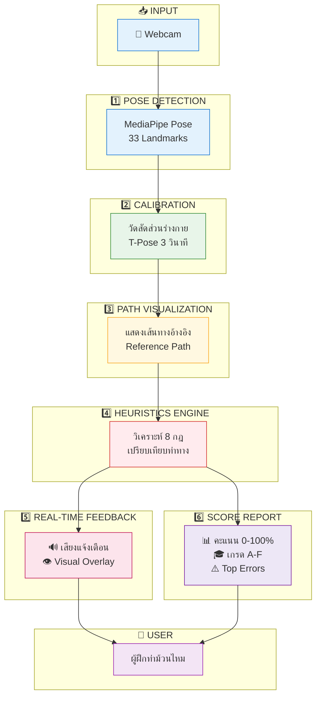
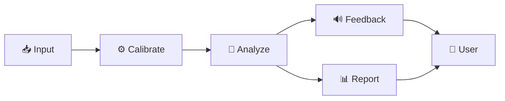
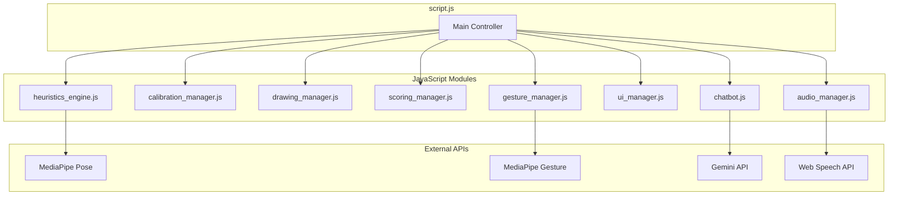

# TaijiFlow AI - System Architecture

## 📊 Core Features Data Flow

แผนภาพแสดงการไหลของข้อมูลผ่าน 6 Core Features ของระบบ

---

## 🔄 Simplified Flow

---

## 📋 Core Features Summary

| # | Feature | Input | Output |
|---|---------|-------|--------|
| 1 | Pose Detection | Video Frame | 33 Landmarks |
| 2 | Calibration | Landmarks | Body Metrics |
| 3 | Path Visualization | Reference JSON | Canvas Drawing |
| 4 | Heuristics Engine | Landmarks + Metrics | Error Flags |
| 5 | Real-time Feedback | Error Flags | Voice + Visual |
| 6 | Score Report | Session Logs | Score + Grade |

---

## 🧩 Module Dependencies

