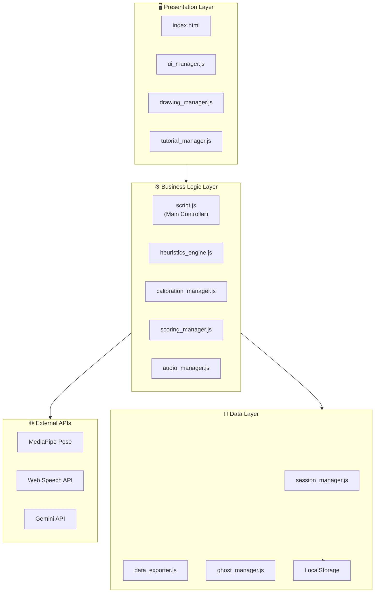
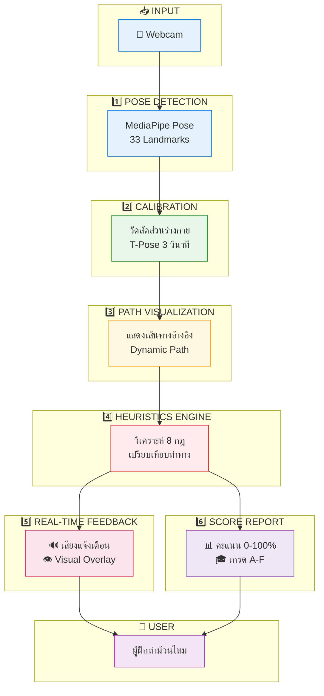
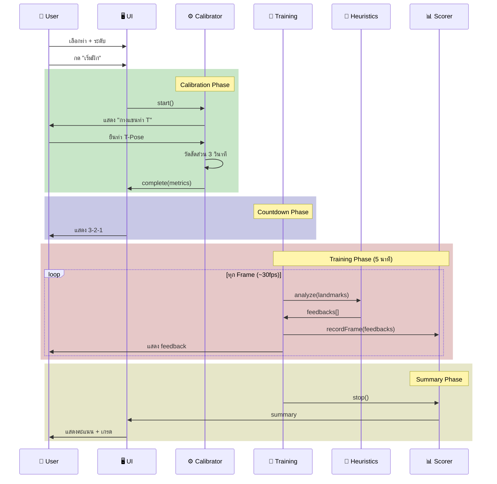
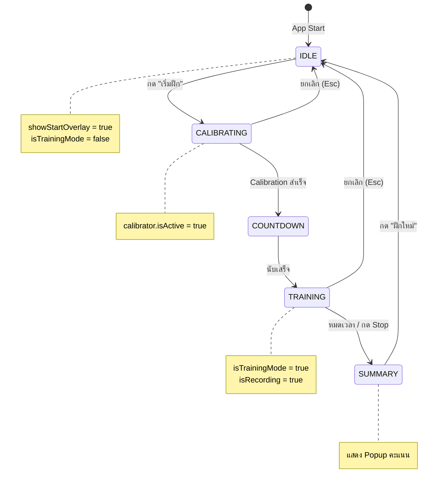
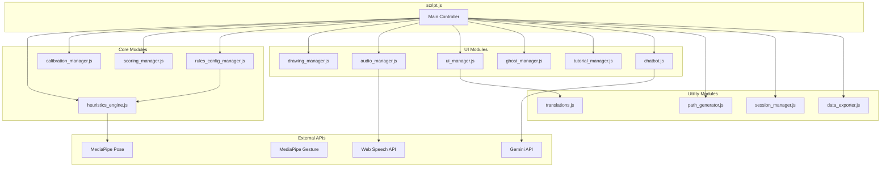

# TaijiFlow AI - System Architecture

**Version:** 0.6.0  
**Last Updated:** 2024-12-26

---

## 📋 สารบัญ

1. [Layer Architecture](#1-layer-architecture)
2. [Core Features Data Flow](#2-core-features-data-flow)
3. [Training Flow Sequence](#3-training-flow-sequence)
4. [State Management](#4-state-management)
5. [Module Dependencies](#5-module-dependencies)
6. [File Structure](#6-file-structure)
7. [Technology Stack](#7-technology-stack)

---

## 1. Layer Architecture

### แผนภาพ



### คำอธิบาย

| Layer | หน้าที่ | ไฟล์หลัก |
|-------|--------|---------|
| **Presentation** | แสดงผล UI, รับ input จากผู้ใช้, วาด Canvas | `index.html`, `ui_manager.js`, `drawing_manager.js` |
| **Business Logic** | ประมวลผลหลัก, วิเคราะห์ท่า, คำนวณคะแนน | `script.js`, `heuristics_engine.js`, `scoring_manager.js` |
| **Data** | จัดการข้อมูล, Session, Export | `session_manager.js`, `data_exporter.js` |
| **External** | APIs ภายนอก (AI, Speech) | MediaPipe, Web Speech, Gemini |

> **💡 หลักการ:** แต่ละ Layer สื่อสารกับ Layer ที่อยู่ติดกันเท่านั้น  
> Presentation ไม่เรียก Data โดยตรง ต้องผ่าน Business Logic

---

## 2. Core Features Data Flow

### แผนภาพ



### คำอธิบายแต่ละขั้นตอน

| # | Feature | Input | Output | คำอธิบาย |
|---|---------|-------|--------|---------|
| 1 | **Pose Detection** | Video Frame | 33 Landmarks | MediaPipe ตรวจจับจุดบนร่างกาย 33 จุด (หัว, ไหล่, ข้อศอก, มือ, สะโพก, เข่า, เท้า) |
| 2 | **Calibration** | Landmarks | Body Metrics | วัดสัดส่วน: ความสูงลำตัว, ความกว้างไหล่, ความยาวแขน |
| 3 | **Path Visualization** | Metrics | Canvas Drawing | สร้างวงกลมนำทางขนาดพอดีกับแขนผู้ฝึก |
| 4 | **Heuristics Engine** | Landmarks + Metrics | Error Flags | ตรวจสอบ 8 กฎไทเก๊ก: Path Shape, Elbow, Waist, etc. |
| 5 | **Real-time Feedback** | Error Flags | Voice + Visual | พูดแจ้งเตือน + แสดงข้อความบนหน้าจอ |
| 6 | **Score Report** | Session Logs | Score + Grade | คำนวณคะแนน: CorrectFrames / TotalFrames × 100 |

---

## 3. Training Flow Sequence

### Sequence Diagram



### คำอธิบาย

1. **เลือกท่า + ระดับ** - ผู้ใช้เลือกท่าฝึก (4 ท่า) และระดับ (L1-L3)
2. **Calibration** - ระบบวัดสัดส่วนร่างกายจากท่า T-Pose (3 วินาที)
3. **Countdown** - นับถอยหลัง 3-2-1 ให้เตรียมตัว
4. **Training Loop** - วิเคราะห์ท่าทุก frame (~30fps) เป็นเวลา 5 นาที
5. **Summary** - แสดงคะแนนและเกรดเมื่อจบ session

---

## 4. State Management

### State Diagram



### Global State Variables

| Variable | Type | คำอธิบาย |
|----------|------|---------|
| `isTrainingMode` | boolean | กำลังฝึกอยู่หรือไม่ |
| `isRecording` | boolean | กำลังบันทึกข้อมูลหรือไม่ |
| `calibrator.isActive` | boolean | กำลัง calibrate อยู่หรือไม่ |
| `currentExercise` | string | ท่าที่เลือก (rh_cw, lh_ccw, ...) |
| `currentLevel` | string | ระดับที่เลือก (L1, L2, L3) |
| `referencePath` | array | เส้นทางวงกลมที่สร้างจาก calibration |

### Display State Variables

| Variable | Type | Default | คำอธิบาย |
|----------|------|---------|---------|
| `showGhostOverlay` | boolean | false | แสดง Ghost บนวิดีโอ |
| `showInstructor` | boolean | true | แสดง Instructor Thumbnail |
| `showPath` | boolean | true | แสดง Dynamic Path |
| `showSkeleton` | boolean | true | แสดง Skeleton ผู้ฝึก |
| `showSilhouette` | boolean | false | แสดง Silhouette ผู้ฝึก |

> **💡 หมายเหตุ:** State ทั้งหมดเก็บใน `script.js` เป็น global variables  
> ไม่ได้ใช้ State Management Library (เช่น Redux) เพื่อความเรียบง่าย

---

## 5. Module Dependencies

### แผนภาพ



### Dependency Table

| Module | Dependencies | หน้าที่ |
|--------|--------------|--------|
| `script.js` | ทุก module | Main controller, glue code |
| `heuristics_engine.js` | MediaPipe | วิเคราะห์ท่า 8 กฎ |
| `rules_config_manager.js` | heuristics_engine | UI ปรับ Threshold กฎ |
| `calibration_manager.js` | - | วัดสัดส่วนร่างกาย |
| `scoring_manager.js` | - | คำนวณคะแนน |
| `ui_manager.js` | translations.js | จัดการ UI, i18n |
| `audio_manager.js` | Web Speech API | Text-to-Speech |
| `drawing_manager.js` | - | วาด Canvas |
| `tutorial_manager.js` | - | Tutorial Popup |
| `chatbot.js` | Gemini API | AI Chatbot |
| `data_exporter.js` | - | Export JSON/CSV |

> **💡 หลักการ:** Core modules ไม่มี dependencies ระหว่างกัน  
> ทุก module สื่อสารผ่าน `script.js` (Main Controller)

### Modules ที่ไม่แสดงใน Diagram (เล็ก/Optional)

| Module | เหตุผลที่ไม่แสดง |
|--------|----------------|
| `gesture_manager.js` | Feature เสริม, optional |
| `feedback_manager.js` | UI เล็กมาก (~50 lines) |
| `silhouette_manager.js` | Sub-module ของ ghost_manager |

---

## 6. File Structure

```
TaijiFlow/
├── 📄 index.html              # Entry Point
├── 📁 css/
│   ├── styles.css             # Main Styles
│   └── chatbot.css            # Chatbot Styles
├── 📁 js/
│   ├── script.js              # Main Controller (1,723 lines)
│   ├── heuristics_engine.js   # Pose Analysis (973 lines)
│   ├── calibration_manager.js # Calibration (362 lines)
│   ├── scoring_manager.js     # Scoring (270 lines)
│   ├── ui_manager.js          # UI Management (1,091 lines)
│   ├── audio_manager.js       # Audio Feedback (584 lines)
│   ├── drawing_manager.js     # Canvas Drawing (430 lines)
│   ├── ghost_manager.js       # Ghost Overlay (261 lines)
│   ├── path_generator.js      # Dynamic Path (85 lines)
│   ├── session_manager.js     # Session/User ID (115 lines)
│   ├── translations.js        # i18n Strings (~500 lines)
│   ├── tutorial_manager.js    # Tutorial Popup
│   ├── chatbot.js             # Gemini Chatbot
│   └── ...
├── 📁 data/
│   └── *.json                 # Reference Data (Ghost, Path)
├── 📁 audio/
│   └── *.mp3                  # Sound Effects
└── 📁 docs/
    ├── ARCHITECTURE.md        # This file
    ├── SYSTEM_OVERVIEW.md     # System Overview
    ├── CHANGELOG.md           # Version History
    └── code/                  # Code Documentation
```

### File Size Statistics

| Category | Files | Total Lines |
|----------|-------|-------------|
| Core Logic | 4 | ~3,300 |
| UI/Display | 5 | ~2,800 |
| Utilities | 5 | ~1,200 |
| **Total** | **18** | **~8,500** |

---

## 7. Technology Stack

### Frontend

| Technology | Version | Purpose |
|------------|---------|---------|
| HTML5 | - | Structure |
| CSS3 | - | Styling |
| JavaScript (ES6+) | - | Logic |
| TailwindCSS | 3.x | Utility Styling |
| Google Fonts | - | Sarabun Font |

### AI/ML

| Technology | Version | Purpose |
|------------|---------|---------|
| MediaPipe Pose | 0.5 | Pose Detection (33 landmarks) |
| MediaPipe Gesture | 0.1 | Gesture Recognition (optional) |
| Gemini API | - | Chatbot (optional) |

### Browser APIs

| API | Purpose |
|-----|---------|
| Web Speech API | Text-to-Speech feedback |
| Canvas API | Drawing skeleton, path |
| LocalStorage API | Save calibration, settings |
| Fullscreen API | Fullscreen mode |

### Design Patterns Used

| Pattern | Where | Purpose |
|---------|-------|---------|
| **Module Pattern** | All managers | Encapsulation |
| **Singleton** | ghostManager, uiManager | Single instance |
| **Observer** | Event listeners | UI updates |
| **Facade** | script.js | Simplify module access |

---

*เอกสารนี้อัปเดตอัตโนมัติเมื่อมีการเปลี่ยนแปลงสถาปัตยกรรม*

