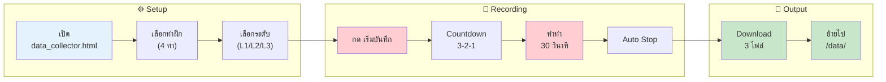

# TaijiFlow AI - Data Collector Guide

**Version:** 0.4  
**Last Updated:** 2024-12-26  
**File:** `data_collector.html`

---

## 📋 สารบัญ

1. [ภาพรวม](#1-ภาพรวม)
2. [การใช้งาน](#2-การใช้งาน)
3. [Output Files](#3-output-files)
4. [Technical Details](#4-technical-details)

---

## 1. ภาพรวม

`data_collector.html` เป็นเครื่องมือสำหรับ **บันทึกข้อมูลท่าต้นแบบ** จากผู้เชี่ยวชาญ

### 🎯 วัตถุประสงค์

| หน้าที่ | คำอธิบาย |
|---------|---------|
| บันทึกท่าต้นแบบ | จากอาจารย์/ผู้เชี่ยวชาญไทเก๊ก |
| สร้าง Reference Data | JSON สำหรับใช้ใน Ghost Overlay |
| บันทึกวิดีโอ | WebM สำหรับ Silhouette |

### 👤 ผู้ใช้งาน

- **Admin/ผู้พัฒนา** เท่านั้น
- ไม่ใช่สำหรับผู้ใช้ทั่วไป

---

## 2. การใช้งาน

### ขั้นตอน

```
1. เปิด data_collector.html ในเบราว์เซอร์
2. เลือกท่าฝึก (rh_cw, rh_ccw, lh_cw, lh_ccw)
3. เลือกระดับ (L1: นั่ง, L2: ยืน, L3: ยืนย่อ)
4. กด "เริ่มบันทึก" → นับถอยหลัง 3-2-1
5. ทำท่าให้สมบูรณ์แบบ (30 วินาที)
6. ไฟล์ถูกดาวน์โหลดอัตโนมัติ
7. ย้ายไฟล์ JSON ไปที่ /data/
```

### Flow Diagram



### ขั้นตอนละเอียด

| # | ขั้นตอน | รายละเอียด |
|---|---------|-----------|
| 1 | เปิดไฟล์ | `data_collector.html` ในเบราว์เซอร์ |
| 2 | เลือกท่า | rh_cw, rh_ccw, lh_cw, lh_ccw |
| 3 | เลือกระดับ | L1 (นั่ง), L2 (ยืน), L3 (ยืนย่อ) |
| 4 | กดบันทึก | ปุ่ม "🔴 เริ่มบันทึก (3-2-1)" |
| 5 | Countdown | ระบบนับถอยหลัง 3-2-1 |
| 6 | ทำท่า | บันทึก 30 วินาที (หยุดอัตโนมัติ) |
| 7 | Download | ไฟล์ JSON + WebM ดาวน์โหลดอัตโนมัติ |
| 8 | ย้ายไฟล์ | ย้าย JSON ไปที่ `/data/` |

### 💡 Tips

- ยืนห่างจากกล้อง 2-3 เมตร (เห็นเต็มตัว)
- ทำท่าให้ **สมบูรณ์แบบ** เพราะจะใช้เป็นต้นแบบ
- ตรวจสอบ skeleton overlay ว่าตรวจจับถูกต้อง

---

## 3. Output Files

### ไฟล์ที่สร้าง (3 ไฟล์/ท่า)

| ไฟล์ | ตัวอย่าง | ใช้งาน |
|------|---------|--------|
| **JSON** | `rh_cw_L1.json` | Ghost Skeleton ใน main app |
| **WebM** | `rh_cw_L1.webm` | Video backup |
| **Silhouette** | `rh_cw_L1_silhouette.webm` | Instructor Thumbnail |

### โครงสร้าง JSON

```json
[
  {
    "timestamp": 0,
    "landmarks": [
      { "x": 0.523, "y": 0.412, "z": -0.123, "visibility": 0.998 },
      // ... 33 landmarks
    ]
  },
  // ... ทุก 3 frames (10fps)
]
```

### ที่เก็บไฟล์

```
TaijiFlow/
└── data/
    ├── rh_cw_L1.json
    ├── rh_cw_L2.json
    ├── rh_cw_L3.json
    ├── rh_ccw_L1.json
    └── ... (รวม 12 ไฟล์)
```

---

## 4. Technical Details

### Optimizations

| เทคนิค | รายละเอียด | ผลลัพธ์ |
|--------|-----------|---------|
| Frame Sampling | บันทึกทุก 3 frames | 30fps → 10fps |
| Decimal Rounding | ทศนิยม 3 ตำแหน่ง | ขนาดไฟล์ลดลง 60% |
| Minified JSON | ไม่มี whitespace | ขนาดเล็กลงอีก |

### Dependencies

- MediaPipe Pose (CDN)
- MediaPipe Camera Utils (CDN)
- TailwindCSS (CDN)

### Recording Settings

```javascript
const MAX_RECORDING_SECONDS = 30;  // ระยะเวลาบันทึก
const COUNTDOWN_SECONDS = 3;       // นับถอยหลัง

// Pose options
modelComplexity: 1,
enableSegmentation: true,  // สำหรับ silhouette
```

---

## 📚 Related

- [ARCHITECTURE.md](ARCHITECTURE.md) - System Architecture
- [data_export_documentation.md](data_export_documentation.md) - Export Format

---

*เอกสารนี้สำหรับผู้พัฒนาเท่านั้น*
