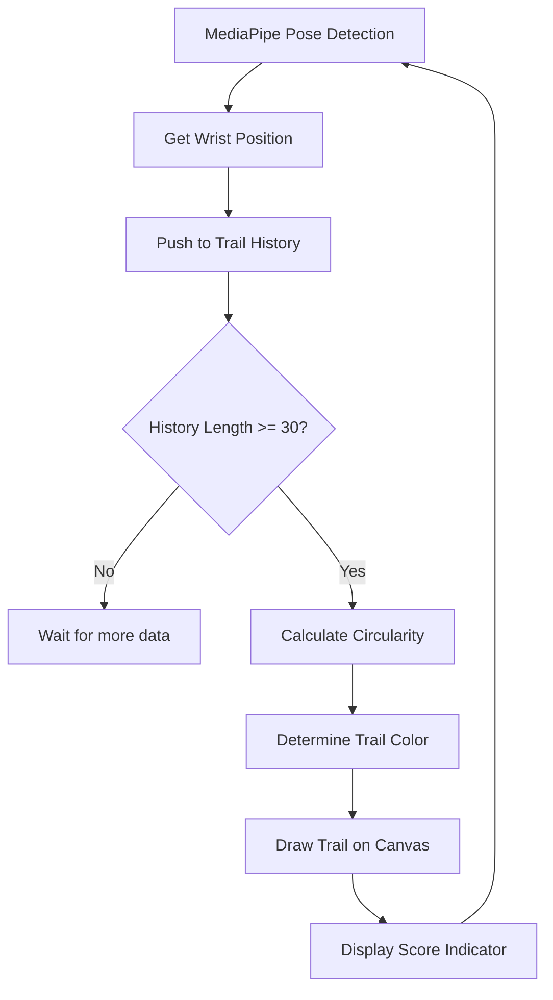

# Wrist Trail Visualization - Feature Specification

**Version:** 1.0  
**Last Updated:** 2024-12-30  
**Status:** Proposed Enhancement

---

## 1. Overview

### 1.1 Feature Name
**Wrist Trail Visualization with Quality Indicator**

### 1.2 Description
แสดงเส้นทางการเคลื่อนไหวของมือ (Trail) แบบ Real-time บนหน้าจอขณะฝึก พร้อมบอกคุณภาพของวงกลมที่ผู้ใช้วาด (Circularity Score)

### 1.3 Objective
- ให้ผู้ฝึกเห็น "ภาพ" ของการเคลื่อนไหวตัวเอง
- บอกคุณภาพวงกลมแบบ Real-time (กลม/เบี้ยว)
- เพิ่ม Visual Feedback ให้ผู้ฝึกปรับปรุงท่าทางได้ทันที

---

## 2. Visual Concept

```
┌─────────────────────────────────────────────────────────────┐
│                                                             │
│     ┌───┐                                                   │
│    /     \   ← Dynamic Path (เส้นนำทาง - สีขาว)              │
│   │       │                                                 │
│    \     /                                                  │
│     └───┘                                                   │
│                                                             │
│     ┌··┐                                                    │
│    ·    ·   ← User Trail (เส้นที่ผู้ใช้วาด - สีตาม Quality)  │
│   ·      ·                                                  │
│    ·    ·                                                   │
│     └··┘                                                    │
│                                                             │
│   ┌─────────────────────────┐                               │
│   │ Circularity: 85% ✅     │  ← Quality Indicator          │
│   └─────────────────────────┘                               │
│                                                             │
└─────────────────────────────────────────────────────────────┘
```

---

## 3. Components

### 3.1 Trail History
เก็บตำแหน่ง Wrist ย้อนหลัง N เฟรม

| Property | Type | Description |
|----------|------|-------------|
| `x` | number | ตำแหน่ง X ของ Wrist (normalized 0-1) |
| `y` | number | ตำแหน่ง Y ของ Wrist (normalized 0-1) |
| `timestamp` | number | เวลาที่เก็บ (ms) |

**Configuration:**
| Setting | Value | Reason |
|---------|-------|--------|
| `TRAIL_LENGTH` | 60-90 จุด | ~2-3 วินาที ที่ 30fps |
| `MIN_POINTS_FOR_ANALYSIS` | 30 จุด | ต้องมีข้อมูลพอสำหรับวิเคราะห์ |

### 3.2 Circularity Score
คะแนนความกลมของ Trail (0-100%)

| Score | Color | Label (TH) | Label (EN) |
|:-----:|:-----:|------------|------------|
| ≥80% | 🟢 #22c55e | วงกลมดีมาก | Excellent Circle |
| 50-79% | 🟡 #eab308 | ปรับปรุงได้ | Can Improve |
| <50% | 🔴 #ef4444 | วงกลมเบี้ยว | Poor Circle |

---

## 4. Algorithm

### 4.1 Circularity Calculation

**Step 1: Find Centroid (จุดศูนย์กลาง)**
```javascript
function findCentroid(points) {
  const sumX = points.reduce((sum, p) => sum + p.x, 0);
  const sumY = points.reduce((sum, p) => sum + p.y, 0);
  return {
    x: sumX / points.length,
    y: sumY / points.length
  };
}
```

**Step 2: Calculate Average Radius (รัศมีเฉลี่ย)**
```javascript
function calculateAverageRadius(points, center) {
  const distances = points.map(p => 
    Math.sqrt(Math.pow(p.x - center.x, 2) + Math.pow(p.y - center.y, 2))
  );
  return distances.reduce((sum, d) => sum + d, 0) / distances.length;
}
```

**Step 3: Calculate Variance (ความเบี่ยงเบน)**
```javascript
function calculateRadiusVariance(points, center, avgRadius) {
  const squaredDiffs = points.map(p => {
    const distance = Math.sqrt(Math.pow(p.x - center.x, 2) + Math.pow(p.y - center.y, 2));
    return Math.pow(distance - avgRadius, 2);
  });
  return Math.sqrt(squaredDiffs.reduce((sum, d) => sum + d, 0) / squaredDiffs.length);
}
```

**Step 4: Convert to Score (แปลงเป็นคะแนน)**
```javascript
function calculateCircularity(trailHistory) {
  if (trailHistory.length < MIN_POINTS_FOR_ANALYSIS) return null;
  
  const center = findCentroid(trailHistory);
  const avgRadius = calculateAverageRadius(trailHistory, center);
  const variance = calculateRadiusVariance(trailHistory, center, avgRadius);
  
  // Normalize variance relative to radius
  const normalizedVariance = variance / avgRadius;
  
  // Convert to score (0-100%)
  // Lower variance = higher score
  const score = Math.max(0, Math.min(100, (1 - normalizedVariance * 2) * 100));
  
  return Math.round(score);
}
```

### 4.2 Trail Drawing

```javascript
function drawTrail(ctx, trailHistory, quality) {
  if (trailHistory.length < 2) return;
  
  // Determine color based on quality
  const color = quality >= 80 ? '#22c55e' :  // Green
                quality >= 50 ? '#eab308' :  // Yellow
                '#ef4444';                    // Red
  
  ctx.beginPath();
  ctx.strokeStyle = color;
  ctx.lineWidth = 3;
  ctx.lineCap = 'round';
  ctx.lineJoin = 'round';
  
  trailHistory.forEach((point, index) => {
    // Convert normalized coords to canvas coords
    const x = point.x * ctx.canvas.width;
    const y = point.y * ctx.canvas.height;
    
    // Fade effect: older points are more transparent
    const opacity = (index / trailHistory.length) * 0.8 + 0.2;
    ctx.globalAlpha = opacity;
    
    if (index === 0) {
      ctx.moveTo(x, y);
    } else {
      ctx.lineTo(x, y);
    }
  });
  
  ctx.stroke();
  ctx.globalAlpha = 1.0; // Reset
}
```

---

## 5. Integration

### 5.1 Files to Modify

| File | Changes |
|------|---------|
| `js/script.js` | เพิ่ม Trail History management, เรียก draw functions |
| `js/drawing_manager.js` | เพิ่ม `drawTrail()` และ `drawCircularityIndicator()` |
| `index.html` | เพิ่ม Toggle checkbox สำหรับ Trail |
| `css/style.css` | (Optional) สไตล์สำหรับ indicator |

### 5.2 Data Flow



### 5.3 Integration Point in script.js

```javascript
// ใน onResults callback (หลังจาก pose detection)
if (isTrainingMode && showTrail) {
  // Get active wrist position
  const activeWrist = isRightHand ? 
    landmarks[16] :  // Right wrist
    landmarks[15];   // Left wrist
  
  // Update trail history
  trailHistory.push({
    x: activeWrist.x,
    y: activeWrist.y,
    timestamp: Date.now()
  });
  
  // Keep only last N points
  while (trailHistory.length > TRAIL_LENGTH) {
    trailHistory.shift();
  }
  
  // Calculate quality
  const circularity = calculateCircularity(trailHistory);
  
  // Draw trail
  drawingManager.drawTrail(canvasCtx, trailHistory, circularity);
  
  // Draw indicator
  if (circularity !== null) {
    drawingManager.drawCircularityIndicator(canvasCtx, circularity);
  }
}
```

---

## 6. UI/UX

### 6.1 Toggle Control

เพิ่มใน Display Options:
```html
<label class="checkbox-label">
  <input type="checkbox" id="checkTrail" />
  <span>Trail</span>
</label>
```

### 6.2 Indicator Position

| Element | Position | Size |
|---------|----------|------|
| Trail | Overlay on video | ตาม Trail points |
| Score Indicator | Bottom-right corner | 150x40 px |

### 6.3 Indicator Design

```
┌─────────────────────────┐
│ 🔵 Circularity: 85%    │
└─────────────────────────┘
```

---

## 7. Performance

### 7.1 Impact Analysis

| Aspect | Impact | Mitigation |
|--------|--------|------------|
| CPU | +1-2% | Limit trail length |
| Memory | +0.5 MB | Fixed-size array |
| FPS | -1-2 fps | Draw only when enabled |

### 7.2 Optimization Tips

1. **Skip frames:** คำนวณ Circularity ทุก 5-10 เฟรม แทนที่จะทุกเฟรม
2. **Limit trail:** เก็บแค่ 60 จุด (~2 วินาที)
3. **Simple drawing:** ใช้ `lineTo` แทน bezier curves

---

## 8. Implementation Plan

### Phase 1: Basic Trail (1-2 ชม.)

| Task | Description | Time |
|------|-------------|------|
| 1.1 | สร้าง `trailHistory` array | 15 min |
| 1.2 | เก็บ Wrist position ทุก frame | 20 min |
| 1.3 | สร้าง `drawTrail()` function | 30 min |
| 1.4 | Test และ debug | 30 min |

### Phase 2: Quality Indicator (1-2 ชม.)

| Task | Description | Time |
|------|-------------|------|
| 2.1 | สร้าง `calculateCircularity()` | 30 min |
| 2.2 | เปลี่ยนสี Trail ตาม score | 20 min |
| 2.3 | สร้าง Score indicator UI | 30 min |
| 2.4 | Test และ debug | 30 min |

### Phase 3: UI/UX Polish (30 นาที)

| Task | Description | Time |
|------|-------------|------|
| 3.1 | เพิ่ม Toggle checkbox | 10 min |
| 3.2 | บันทึก setting ลง LocalStorage | 10 min |
| 3.3 | Final testing | 10 min |

### Total Estimated Time: 3-4 ชั่วโมง

---

## 9. Future Enhancements

| Enhancement | Description | Priority |
|-------------|-------------|----------|
| Comparison Mode | แสดง Trail vs Reference Path | Medium |
| History Playback | เล่นซ้ำ Trail ที่บันทึก | Low |
| Export Trail | บันทึก Trail data ลงไฟล์ | Low |
| 3D Visualization | แสดง Trail ใน 3D space | Low |

---

## 10. Related Documents

- [SRS.md](./srs/SRS.md) - Software Requirements Specification
- [ARCHITECTURE.md](./ARCHITECTURE.md) - System Architecture
- [drawing_manager.js](../js/drawing_manager.js) - Drawing utilities

---

*End of Document*
