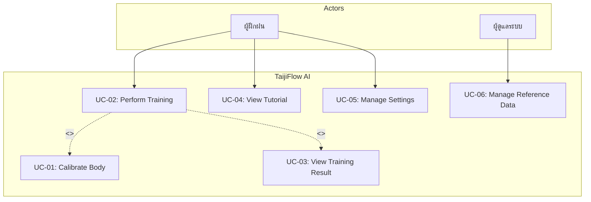

# TaijiFlow AI - Software Requirements Specification (SRS)

**Version:** 3.0  
**Last Updated:** 2026-01-09  
**Status:** Final

---

## สารบัญ

1. [บทนำ (Introduction)](#1-บทนำ-introduction)
2. [รายละเอียดผลิตภัณฑ์ (Product Description)](#2-รายละเอียดผลิตภัณฑ์-product-description)
3. [Use Cases](#3-use-cases)
4. [ข้อกำหนดความต้องการ (Requirements Specification)](#4-ข้อกำหนดความต้องการ-requirements-specification)
5. [ข้อกำหนดที่ไม่ใช่ฟังก์ชัน (Non-Functional Requirements)](#5-ข้อกำหนดที่ไม่ใช่ฟังก์ชัน-non-functional-requirements)
6. [Traceability Matrix](#6-traceability-matrix)
7. [Glossary (คำศัพท์)](#7-glossary-คำศัพท์)
8. [Acceptance Criteria (เกณฑ์การยอมรับ)](#8-acceptance-criteria-เกณฑ์การยอมรับ)
9. [Interface Requirements (ข้อกำหนด Interface)](#9-interface-requirements-ข้อกำหนด-interface)
10. [Assumptions & Dependencies (สมมติฐานและการพึ่งพา)](#10-assumptions--dependencies-สมมติฐานและการพึ่งพา)

---

## 1. บทนำ (Introduction)

### 1.1 วัตถุประสงค์ (Purpose)

เอกสารฉบับนี้ระบุข้อกำหนดความต้องการของระบบ TaijiFlow AI ซึ่งเป็นระบบฝึกท่าม้วนไหม (Silk Reeling) ของไท่จี๋ผ่านเว็บเบราว์เซอร์โดยใช้ AI ตรวจจับท่าทางและให้คำแนะนำแบบ Real-time

### 1.2 ขอบเขต (Scope)

| หัวข้อ | รายละเอียด |
|-------|-----------|
| **ชื่อระบบ** | TaijiFlow AI |
| **ประเภท** | Web Application |
| **กลุ่มผู้ใช้** | ผู้สนใจฝึกไท่จี๋, ผู้ดูแลระบบ |
| **Platform** | Desktop (Chrome, Edge, Safari), Tablet |

### 1.3 ข้อจำกัด (Constraints)

1. **อุปกรณ์:**
   - ต้องมี Webcam ที่ความละเอียด 720p ขึ้นไป
   - CPU: Intel i3 หรือเทียบเท่าขึ้นไป
   - RAM: 4GB ขึ้นไป

2. **สภาพแวดล้อม:**
   - ต้องมีพื้นที่ว่างเพียงพอสำหรับเคลื่อนไหว
   - แสงสว่างเพียงพอ (ไม่มีเงาบดบังร่างกาย)

3. **การเชื่อมต่อ:**
   - ต้องเชื่อมต่ออินเทอร์เน็ตเพื่อโหลด AI Model ครั้งแรก

---

## 2. รายละเอียดผลิตภัณฑ์ (Product Description)

### 2.1 ฟีเจอร์ของระบบ (Product Functions)

#### 2.1.1 ระบบฝั่งผู้ฝึกฝน (Trainee) - 11 ฟีเจอร์

| F-ID | ฟีเจอร์ | คำอธิบาย |
|------|---------|---------|
| F-01 | **Body Calibration** | ปรับเทียบสัดส่วนร่างกายด้วย T-Pose |
| F-02 | **Silk Reeling Training** | ฝึกท่าม้วนไหมพร้อมตรวจจับท่าทางด้วย AI |
| F-03 | **8 Rules Analysis** | ตรวจสอบความถูกต้องตามหลักไท่จี๋ 8 ข้อ |
| F-04 | **Real-time Feedback** | แจ้งเตือนแบบ Real-time (ข้อความ + เสียง TTS) |
| F-05 | **Training Result** | คำนวณคะแนน ตัดเกรด แสดง Top Errors |
| F-06 | **Tutorial** | คู่มือการใช้งานและหลักการฝึก |
| F-07 | **System Settings** | ตั้งค่าภาษา ธีมสี เสียงแจ้งเตือน |
| F-08 | **Display Options** | ปรับการแสดงผล 7 รูปแบบ (Path, Instructor, Ghost, Skeleton, Trail, Silhouette, Debug) |
| F-09 | **Gesture Control** | ควบคุมด้วยท่าทางมือ (👍 เริ่ม, ✊ หยุด) |
| F-10 | **AI Chatbot** | ถาม-ตอบเกี่ยวกับไท่จี๋ (Gemini API) - Optional |
| F-11 | **Feedback Report** | ส่ง feedback/bug report |

#### 2.1.2 ระบบฝั่งผู้ดูแล (Admin) - 1 ฟีเจอร์

| F-ID | ฟีเจอร์ | คำอธิบาย |
|------|---------|---------|
| F-12 | **Reference Data Management** | บันทึกวิดีโอและพิกัดท่าต้นแบบ |

---

### 2.2 กฎการตรวจสอบท่าทาง 8 ข้อ (8 Tai Chi Rules)

| Rule | ชื่อ (EN) | ชื่อ (TH) | หลักการจีน |
|:----:|-----------|-----------|-----------|
| R-01 | Path Shape | เส้นทางเป็นวงกลม | - |
| R-02 | Arm Rotation | หมุนฝ่ามือถูกทิศ | - |
| R-03 | Elbow Sinking | ศอกจม | 沉肩坠肘 |
| R-04 | Waist Initiation | เอวนำ | 以腰为轴 |
| R-05 | Vertical Stability | หัวนิ่ง | 虚领顶劲 |
| R-06 | Smoothness | ลื่นไหล | 如抽丝 |
| R-07 | Continuity | ต่อเนื่อง | 绵绵不断 |
| R-08 | Weight Shift | น้ำหนักในฐาน | 分虚实 |

---

## 3. Use Cases

### 3.1 Use Case Diagram

> **Note:** UC-02 (Perform Training) includes UC-01 (Calibrate Body) ก่อนเริ่มฝึก และ UC-03 (View Result) หลังจบการฝึก

### 3.2 Use Case Descriptions

#### UC-01: Calibrate Body (ปรับเทียบสัดส่วน)

| หัวข้อ | รายละเอียด |
|-------|-----------|
| **Actor** | ผู้ฝึกฝน |
| **Precondition** | มี Webcam และแสงเพียงพอ |
| **Main Flow** | 1. กดปุ่ม Calibration 2. ยืนท่า T-Pose 3. รอระบบตรวจจับ 3 วินาที 4. ระบบบันทึกสัดส่วน |
| **Postcondition** | บันทึกค่าสัดส่วนลง LocalStorage |

#### UC-02: Perform Training (ฝึกฝนท่าม้วนไหม)

| หัวข้อ | รายละเอียด |
|-------|-----------|
| **Actor** | ผู้ฝึกฝน |
| **Precondition** | ผ่าน Calibration แล้ว |
| **Main Flow** | 1. เลือกท่าและระดับ 2. กดเริ่มฝึก (หรือยกนิ้วโป้ง 👍) 3. ระบบแสดง Path และตรวจท่า 4. ระบบแจ้งเตือนเมื่อผิด 5. กดหยุด (หรือกำมือ ✊) หรือหมดเวลา |
| **Alt Flow** | A1: ใช้ Gesture - ยกนิ้วโป้ง 👍 เริ่ม, กำมือ ✊ หยุด |
| **Exception** | E1: Camera Error → แจ้ง Error + คำแนะนำ E2: Reference Not Found → แจ้ง Error E3: Low Light → Warning (Toast + TTS) |
| **Postcondition** | แสดงผลคะแนน |

#### UC-03: View Training Result (ดูผลการฝึก)

| หัวข้อ | รายละเอียด |
|-------|-----------|
| **Actor** | ผู้ฝึกฝน |
| **Precondition** | จบการฝึกแล้ว |
| **Main Flow** | 1. แสดงคะแนนและเกรด 2. แสดง Top Errors 3. ปิดหน้าต่าง |

#### UC-04: View Tutorial (ดูคู่มือ)

| หัวข้อ | รายละเอียด |
|-------|-----------|
| **Actor** | ผู้ฝึกฝน |
| **Main Flow** | 1. กดปุ่ม Tutorial 2. เลือกหัวข้อ (หลักการ/ท่าฝึก/วิธีใช้) 3. อ่านเนื้อหา 4. ปิดหน้าต่าง |

#### UC-05: Manage Settings (ตั้งค่าระบบ)

| หัวข้อ | รายละเอียด |
|-------|-----------|
| **Actor** | ผู้ฝึกฝน |
| **Main Flow** | 1. กดปุ่มตั้งค่า 2. เปลี่ยนภาษา/ธีม/เสียง 3. ระบบบันทึกอัตโนมัติ |

#### UC-06: Manage Reference Data (จัดการท่าต้นแบบ)

| หัวข้อ | รายละเอียด |
|-------|-----------|
| **Actor** | ผู้ดูแลระบบ |
| **Main Flow** | 1. เปิด data_collector.html 2. เลือกท่าและระดับ 3. กดบันทึก 4. ทำท่าจนหมดเวลา 5. ดาวน์โหลดไฟล์ JSON/WebM |

---

## 4. ข้อกำหนดความต้องการ (Requirements Specification)

### 4.1 UC-01: Calibrate Body

#### User Requirements (URS)

| ID | Requirement |
|----|-------------|
| URS-01 | ผู้ใช้ต้องสามารถกดปุ่มเริ่ม Calibration ได้ |
| URS-02 | ผู้ใช้ต้องได้รับคำแนะนำการจัดท่า T-Pose |
| URS-03 | ผู้ใช้ต้องทราบผลการปรับเทียบ (สำเร็จ/ไม่สำเร็จ) |

#### System Requirements (SRS)

| ID | Requirement |
|----|-------------|
| SRS-01-01 | ระบบต้องแสดง Overlay รูปโครงร่างเพื่อแนะนำท่า T-Pose |
| SRS-01-02 | ระบบต้องตรวจสอบว่ามองเห็น Keypoints ครบตามระดับ: L1/L2 (ไหล่, สะโพก), L3 (ไหล่, สะโพก, ข้อเท้า) |
| SRS-01-03 | ระบบต้องตรวจสอบว่าข้อมืออยู่ระดับเดียวกับไหล่ (±tolerance) |
| SRS-01-04 | ระบบต้องจับเวลายืนนิ่ง 3 วินาที ก่อนบันทึก |
| SRS-01-05 | ระบบต้องบันทึกค่าสัดส่วน (ลำตัว, แขน, ไหล่) ลง LocalStorage |

---

### 4.2 UC-02: Perform Training

#### User Requirements (URS)

| ID | Requirement |
|----|-------------|
| URS-04 | ผู้ใช้ต้องสามารถเลือกท่าและระดับได้ |
| URS-05 | ผู้ใช้ต้องมองเห็นภาพ Mirror พร้อมเส้นนำทาง |
| URS-06 | ผู้ใช้ต้องได้รับ Feedback ทันทีเมื่อทำผิด |

#### System Requirements (SRS)

| ID | Requirement |
|----|-------------|
| SRS-02-01 | ระบบต้องขอ Camera Permission และแสดง Mirrored Video |
| SRS-02-02 | ระบบต้องโหลด Reference JSON ตามท่าที่เลือก |
| SRS-02-03 | ระบบต้องตรวจจับ 33 Landmarks ด้วย MediaPipe Real-time |
| SRS-02-04 | ระบบต้องตรวจสอบตาม 8 กฎของไท่จี๋ |
| SRS-02-05 | ระบบต้องแสดง Feedback บนหน้าจอและเสียง TTS |
| SRS-02-06 | ระบบต้องบันทึกจำนวน Frame ถูก/ผิด |
| SRS-02-07 | ระบบต้องแสดง Dynamic Path ตามขนาดแขนผู้ใช้ |
| SRS-02-08 | ระบบต้องแสดง Instructor Reference (thumbnail/overlay) |
| SRS-02-09 | ระบบต้องเข้าสู่โหมด Fullscreen เมื่อเริ่มฝึกและออกเมื่อหยุด |
| SRS-02-10 | ระบบต้องแสดง Ghost Skeleton/Video overlay (ถ้าเปิด) |
| SRS-02-11 | ระบบต้องแสดง Trail ของข้อมือ (wrist movement history) |
| SRS-02-12 | ระบบต้องแสดง Silhouette ของผู้ฝึก (ถ้าเปิด) |
| SRS-02-13 | ระบบต้องตรวจจับ Low Light (avgVisibility < 0.5) และแจ้งเตือน |
| SRS-02-14 | ระบบต้องจัดการ Camera Error และแสดงข้อความตามประเภท (4 ประเภท) |
| SRS-02-15 | ระบบต้องตรวจจับ Thumbs Up gesture เพื่อเริ่มฝึก |
| SRS-02-16 | ระบบต้องตรวจจับ Fist gesture เพื่อหยุดฝึก |

---

### 4.3 UC-03: View Training Result

#### User Requirements (URS)

| ID | Requirement |
|----|-------------|
| URS-07 | ผู้ใช้ต้องดูคะแนนและเกรดได้ |
| URS-08 | ผู้ใช้ต้องดู Top Errors ได้ |

#### System Requirements (SRS)

| ID | Requirement |
|----|-------------|
| SRS-03-01 | ระบบต้องคำนวณคะแนน = (Correct/Total) × 100 และแปลงเป็นเกรด: A(≥85), B(≥70), C(≥55), D(≥40), F(<40) |
| SRS-03-02 | ระบบต้องจัดลำดับ Error และแสดง 3 อันดับแรก |
| SRS-03-03 | ระบบต้องสร้าง JSON สำหรับ Export ข้อมูล |

---

### 4.4 UC-04: View Tutorial

#### User Requirements (URS)

| ID | Requirement |
|----|-------------|
| URS-09 | ผู้ใช้ต้องเปิดดูคู่มือได้ตลอดเวลา |
| URS-10 | ผู้ใช้ต้องเลือกหัวข้อเนื้อหาได้ |
| URS-11 | ผู้ใช้ต้องปิดหน้าต่างคู่มือได้ |

#### System Requirements (SRS)

| ID | Requirement |
|----|-------------|
| SRS-04-01 | ระบบต้องแสดง Modal โดยไม่เปลี่ยนหน้า |
| SRS-04-02 | ระบบต้องโหลดเนื้อหาตามภาษาที่เลือก |
| SRS-04-03 | ระบบต้องเปลี่ยนเนื้อหาทันทีเมื่อคลิกแท็บ |

---

### 4.5 UC-05: Manage Settings

#### User Requirements (URS)

| ID | Requirement |
|----|-------------|
| URS-12 | ผู้ใช้ต้องเปลี่ยนภาษา (TH/EN) ได้ |
| URS-13 | ผู้ใช้ต้องเปลี่ยนธีมสี (Light/Dark) ได้ |
| URS-14 | ผู้ใช้ต้องเปิด-ปิดเสียงแจ้งเตือนได้ |

#### System Requirements (SRS)

| ID | Requirement |
|----|-------------|
| SRS-05-01 | ระบบต้องเปลี่ยน Text และ Audio ให้ตรงกับภาษาทันที |
| SRS-05-02 | ระบบต้องสลับ CSS เพื่อเปลี่ยนธีมสีทันที |
| SRS-05-03 | ระบบต้องบันทึกค่าตั้งค่าลง LocalStorage |

---

### 4.6 UC-06: Manage Reference Data

#### User Requirements (URS)

| ID | Requirement |
|----|-------------|
| URS-15 | ผู้ดูแลต้องระบุชื่อท่าและระดับได้ |
| URS-16 | ผู้ดูแลต้องบันทึกวิดีโอและพิกัดพร้อมกันได้ |
| URS-17 | ผู้ดูแลต้องได้รับไฟล์ JSON/WebM |

#### System Requirements (SRS)

| ID | Requirement |
|----|-------------|
| SRS-06-01 | ระบบต้องบันทึกวิดีโอ WebM พร้อมเก็บ Landmarks ทุกเฟรม |
| SRS-06-02 | ระบบต้องแสดง Timer และสถานะการบันทึก |
| SRS-06-03 | ระบบต้องสร้างไฟล์และสั่งดาวน์โหลดอัตโนมัติ |

---

## 5. ข้อกำหนดที่ไม่ใช่ฟังก์ชัน (Non-Functional Requirements)

### 5.1 Performance

| ID | Requirement |
|----|-------------|
| NFR-01 | ระบบต้องประมวลผล Pose ≥15 FPS บนอุปกรณ์ที่กำหนด |
| NFR-02 | ระบบต้องตอบสนองต่อการกดปุ่ม ≤2 วินาที |

### 5.2 Accuracy

| ID | Requirement |
|----|-------------|
| NFR-03 | ระบบต้องมีความถูกต้องในการตรวจท่า ≥80% เทียบกับผู้เชี่ยวชาญ |

### 5.3 Usability

| ID | Requirement |
|----|-------------|
| NFR-04 | ผู้ใช้ใหม่ต้องเรียนรู้การใช้งานได้ภายใน 5 นาที |
| NFR-05 | ระบบต้องมี Error Message ที่ชัดเจนและเข้าใจง่าย |

### 5.4 Reliability

| ID | Requirement |
|----|-------------|
| NFR-06 | ระบบต้องทำงานต่อเนื่องได้ 5 นาทีโดยไม่ crash |

### 5.5 Privacy & Safety

| ID | Requirement |
|----|-------------|
| NFR-07 | ระบบต้องขอ Permission กล้องทุกครั้งและไม่ส่งข้อมูลออกนอก |
| NFR-08 | ระบบต้องแสดงคำเตือนความเป็นส่วนตัวก่อนใช้งาน |

### 5.6 Internationalization & Accessibility

| ID | Requirement |
|----|-------------|
| NFR-09 | ระบบต้องรองรับ 2 ภาษา (TH/EN) พร้อมเปลี่ยนได้ทันที |
| NFR-10 | ระบบต้องรองรับ Dark/Light Theme |

---

## 6. Traceability Matrix

### 6.1 Feature → Use Case

| Feature | UC-01 | UC-02 | UC-03 | UC-04 | UC-05 | UC-06 |
|---------|:-----:|:-----:|:-----:|:-----:|:-----:|:-----:|
| F-01 Calibration | ✓ | | | | | |
| F-02 Training | | ✓ | | | | |
| F-03 8 Rules | | ✓ | | | | |
| F-04 Feedback | | ✓ | | | | |
| F-05 Result | | | ✓ | | | |
| F-06 Tutorial | | | | ✓ | | |
| F-07 Settings | | | | | ✓ | |
| F-08 Display | | ✓ | | | ✓ | |
| F-09 Gesture | | ✓ | | | | |
| F-10 Chatbot | | ✓ | | | | |
| F-11 Feedback Report | | | | | ✓ | |
| F-12 Ref Data | | | | | | ✓ |

### 6.2 URS → SRS

| URS | SRS |
|-----|-----|
| URS-01 | SRS-01-01 |
| URS-02 | SRS-01-01, SRS-01-02 |
| URS-03 | SRS-01-04, SRS-01-05 |
| URS-04 | SRS-02-02 |
| URS-05 | SRS-02-01, SRS-02-07, SRS-02-08, SRS-02-10, SRS-02-11, SRS-02-12 |
| URS-06 | SRS-02-04, SRS-02-05 |
| URS-07 | SRS-03-01 |
| URS-08 | SRS-03-02 |

### 6.3 SRS → Test Case

| SRS | Test Case |
|-----|-----------|
| SRS-02-04 | TC-Heuristics-01 ~ TC-Heuristics-16 |
| SRS-02-14 | TC-Camera-Error-01 ~ TC-Camera-Error-04 |
| SRS-02-15 | TC-Gesture-01 |
| SRS-02-16 | TC-Gesture-02 |
| SRS-03-01 | TC-Scoring-01 ~ TC-Scoring-10 |

---

## Revision History

| Version | Date | Author | Changes |
|---------|------|--------|---------|
| 1.0 | 2024-12 | - | Initial draft |
| 2.0 | 2024-12-28 | - | เพิ่ม 8 Rules, Display Options, Traceability |
| 3.0 | 2026-01-09 | - | เพิ่ม F-09~F-11 (Gesture, Chatbot, Feedback), Exception Flows, SRS-02-10~16, NFR-09~10, Glossary, Acceptance Criteria |

---

## 7. Glossary (คำศัพท์)

### 7.1 คำศัพท์ไท่จี๋

| คำศัพท์ | ภาษาจีน | คำอธิบาย |
|--------|--------|---------|
| **Silk Reeling** | 纏絲勁 (Chán Sī Jìn) | ท่าม้วนไหม - การเคลื่อนไหวพื้นฐานของมวยไท้เก๊กตระกูลเฉิน เน้นการหมุนเกลียวของแขน |
| **T-Pose** | - | ท่ายืนกางแขนระดับไหล่ ใช้สำหรับ Calibration สัดส่วนร่างกาย |
| **Elbow Sinking** | 沉肩坠肘 | ผ่อนไหล่ลง ศอกตก - หลักการให้ศอกอยู่ต่ำกว่าข้อมือเสมอ |
| **Waist Initiation** | 腰为轴 | เอวเป็นเพลากลาง - ทุกการเคลื่อนไหวต้องเริ่มจากเอว |
| **Vertical Stability** | 虚领顶劲 | โปรงกระหม่อมเบา - ศีรษะตั้งตรงนิ่ง ไม่กระดก |
| **Weight Shift** | 分虚实 | แยกเต็มว่าง - ถ่ายน้ำหนักโดยไม่เสียสมดุล |
| **Smoothness** | 如抽丝 | ดังดึงเส้นไหม - เคลื่อนไหวนุ่มนวลสม่ำเสมอ |
| **Continuity** | 绵绵不断 | ต่อเนื่องไม่ขาด - ไม่หยุดนิ่งระหว่างฝึก |

### 7.2 คำศัพท์ระบบ

| คำศัพท์ | คำอธิบาย |
|--------|---------|
| **Landmark** | จุดพิกัดบนร่างกาย จาก MediaPipe Pose มี 33 จุด (เช่น ไหล่, ข้อมือ, สะโพก) |
| **Calibration** | กระบวนการปรับเทียบสัดส่วนร่างกายผู้ใช้ ด้วยท่า T-Pose |
| **Heuristics** | กฎการตรวจสอบท่าทาง 8 ข้อ ตามหลักไท่จี๋ |
| **Reference Path** | เส้นทางท่าต้นแบบจากผู้เชี่ยวชาญ (เก็บเป็น JSON) |
| **Ghost** | เงาครูผู้สอน - แสดงท่าต้นแบบซ้อนบนหน้าจอ |
| **Silhouette** | เงาผู้ฝึก - แสดงเฉพาะโครงร่างของผู้ฝึก |
| **Trail** | เส้นทางที่ข้อมือเคลื่อนที่ผ่าน (wrist history) |
| **Threshold** | ค่าขีดจำกัดสำหรับตัดสินว่าผิดหรือถูก |
| **Feedback** | ข้อความแจ้งเตือนเมื่อทำท่าผิด (แสดงบนหน้าจอ + เสียง TTS) |
| **Score** | คะแนน 0-100% คำนวณจาก (เฟรมถูก / เฟรมทั้งหมด) × 100 |
| **Grade** | เกรด A-F แปลงจากคะแนน (A≥85, B≥70, C≥55, D≥40, F<40) |

### 7.3 คำศัพท์เทคนิค

| คำศัพท์ | คำอธิบาย |
|--------|---------|
| **MediaPipe Pose** | Library ของ Google สำหรับตรวจจับท่าทาง (33 Landmarks) |
| **MediaPipe Gesture** | Library สำหรับจับท่าทางมือ (Thumbs Up, Fist) |
| **Gemini API** | AI API ของ Google สำหรับ Chatbot |
| **TTS (Text-to-Speech)** | Web Speech API สำหรับอ่านข้อความเป็นเสียง |
| **LocalStorage** | ที่เก็บข้อมูลในเบราว์เซอร์ (Calibration, Settings) |
| **Frame** | หนึ่งภาพจากกล้อง (~30 fps) |
| **Visibility** | ค่าความมั่นใจว่าเห็น Landmark (0-1) |

---

## 8. Acceptance Criteria (เกณฑ์การยอมรับ)

### 8.1 เกณฑ์ระดับ Feature

| Feature | Acceptance Criteria | ค่าอ้างอิงจาก Code |
|---------|---------------------|-------------------|
| **F-01 Calibration** | ระบบต้อง Calibrate สำเร็จเมื่อผู้ใช้ยืน T-Pose นิ่ง 3 วินาที | `REQUIRED_STABLE_FRAMES = 90` (90 frames ÷ 30fps = 3s) |
| **F-02 Training** | ระบบต้องแสดง Feedback ภายใน 1 วินาทีหลังตรวจพบความผิดพลาด | `FEEDBACK_HOLD_TIME_MS = 1000` |
| **F-03 8 Rules** | ระบบต้องตรวจสอบกฎ 8 ข้อครบถ้วนตาม Level ที่เลือก | Rules 1-8 ใน `heuristics_engine.js` |
| **F-04 Feedback** | ระบบต้องแสดง Feedback ทั้งภาพและเสียง TTS | `showFeedback()` + `speakThai()` |
| **F-05 Result** | คะแนนต้องคำนวณจาก (ถูก/ทั้งหมด)×100 และตัดเกรดถูกต้อง | เกรด: A≥85, B≥70, C≥55, D≥40, F<40 |
| **F-08 Display** | ต้องมี 7 Display Options ที่เปิด/ปิดได้ | Path, Instructor, Ghost, Skeleton, Trail, Silhouette, Debug |
| **F-09 Gesture** | ระบบต้องตรวจจับ Thumbs Up และ Fist gesture ได้ | MediaPipe Gesture Recognizer |
| **F-10 Chatbot** | ระบบต้องตอบคำถามเกี่ยวกับไท่จี๋ผ่าน Gemini API | `chatbot.js` → Gemini API |

### 8.2 เกณฑ์ระดับกฎ (8 Heuristics Rules)

| Rule | ชื่อกฎ | เกณฑ์การตัดสิน | ค่า Threshold |
|:----:|--------|---------------|--------------|
| R-01 | Path Shape | Shape Consistency ≥ 60% = ผ่าน | `SHAPE_CONSISTENCY_THRESHOLD = 0.6` |
| R-02 | Arm Rotation | ตรวจเมื่อแขนขยับ ≥ 1.5% | `ARM_MOTION_THRESHOLD = 0.015` |
| R-03 | Elbow Sinking | ศอกต้องต่ำกว่า/เท่ากับข้อมือ (±1% tolerance) | `ELBOW_TOLERANCE_DEFAULT = 0.01` |
| R-04 | Waist Initiation | สะโพกต้องหมุน ≥ 2°/วินาที, ไหล่ไม่เกิน 3× สะโพก | `MIN_HIP_VELOCITY = 2.0`, `SHOULDER_HIP_RATIO = 3.0` |
| R-05 | Vertical Stability | ศีรษะขยับไม่เกิน 5% ของหน้าจอ | `STABILITY_THRESHOLD_DEFAULT = 0.05` |
| R-06 | Smoothness | Acceleration ไม่เกิน 0.05 units/sec² | `SMOOTHNESS_THRESHOLD_DEFAULT = 0.05` |
| R-07 | Continuity | หยุดนิ่งไม่เกิน 15 frames (~0.5 วินาที) | `PAUSE_FRAME_THRESHOLD = 15` |
| R-08 | Weight Shift | น้ำหนักต้องอยู่ในฐาน (±10% buffer) | `WEIGHT_BUFFER_RATIO = 0.1` |

### 8.3 เกณฑ์ระดับระบบ

| หมวด | เกณฑ์ | ค่าอ้างอิง |
|------|------|-----------|
| **Low Light Detection** | เตือนเมื่อ visibility < 50% | `LOW_LIGHT_THRESHOLD = 0.5` |
| **Camera Error** | แจ้งเตือน 4 ประเภท: not_allowed, not_found, not_readable, unknown | `showCameraError()` |
| **Scoring Accuracy** | คะแนน = (Correct / Total) × 100 | `ScoringManager.getCurrentScore()` |
| **Grading Scale** | A≥85, B≥70, C≥55, D≥40, F<40 | `ScoringManager.getGrade()` |
| **Calibration Time** | 90 frames @ 30fps = 3 วินาที | `REQUIRED_STABLE_FRAMES = 90` |
| **Feedback Display** | แสดง 1 วินาที | `FEEDBACK_HOLD_TIME_MS = 1000` |

### 8.4 เกณฑ์ Non-Functional

| NFR-ID | เกณฑ์ | วิธีทดสอบ |
|--------|------|----------|
| NFR-01 | FPS ≥ 15 | ตรวจสอบจาก Console หรือ FPS Counter |
| NFR-02 | Response Time ≤ 2 วินาที | วัดเวลาตอบสนองหลังกดปุ่ม |
| NFR-03 | Accuracy ≥ 80% เทียบกับผู้เชี่ยวชาญ | เปรียบเทียบผลการตัดสินกับผู้เชี่ยวชาญ |
| NFR-04 | Learning Time ≤ 5 นาที | User Testing กับผู้ใช้ใหม่ |
| NFR-06 | ทำงานต่อเนื่อง ≥ 5 นาที | ทดสอบฝึกต่อเนื่องโดยไม่ crash |

---

## 9. Interface Requirements (ข้อกำหนด Interface)

### 9.1 External Interfaces

| Interface | Type | Version | Description | Required |
|-----------|------|---------|-------------|:--------:|
| **MediaPipe Pose** | JavaScript Library | @latest | ตรวจจับ 33 Landmarks บนร่างกาย | ✓ |
| **MediaPipe Tasks Vision** | JavaScript Library (ES Module) | @0.10.8 | ตรวจจับท่ามือ (Thumbs Up, Fist) | ✓ |
| **MediaPipe Selfie Segmentation** | JavaScript Library | @latest | แยกตัวคนออกจากพื้นหลัง (Silhouette) | Optional |
| **MediaPipe Camera Utils** | JavaScript Library | @latest | Camera Wrapper | ✓ |
| **MediaPipe Drawing Utils** | JavaScript Library | @latest | Canvas Drawing | ✓ |
| **Web Speech API** | Browser API | - | Text-to-Speech สำหรับ Feedback เสียง | ✓ |
| **Gemini API** | REST API | gemini-2.0-flash-exp | AI Chatbot ถาม-ตอบไท่จี๋ | Optional |
| **WebRTC (getUserMedia)** | Browser API | - | เข้าถึง Webcam | ✓ |
| **LocalStorage API** | Browser API | - | เก็บ Settings, Calibration Data | ✓ |

### 9.2 User Interfaces

| Component | Description | Input | Output |
|-----------|-------------|-------|--------|
| **Video Canvas** | แสดงภาพจาก Webcam พร้อม Overlay | Webcam Stream | Mirrored Video + Skeleton |
| **Control Panel** | ปุ่มเลือกท่า/ระดับ, Settings | User Click | State Change |
| **Feedback Overlay** | แสดงข้อความแจ้งเตือน | Heuristics Result | Text + Color |
| **Score Popup** | แสดงผลคะแนนหลังฝึก | Scoring Data | Grade + Stats |
| **Chatbot Widget** | พูดคุยกับ AI | User Message | AI Response |

### 9.3 Hardware Interfaces

| Hardware | Requirement | Minimum Spec |
|----------|-------------|--------------|
| **Webcam** | กล้องถ่ายภาพเคลื่อนไหว | 720p, 30fps |
| **Display** | หน้าจอแสดงผล | 1280×720 pixels |
| **Speaker/Headphone** | ลำโพงหรือหูฟัง (สำหรับ TTS) | Stereo |
| **CPU** | ประมวลผล MediaPipe | Modern x64/ARM |
| **GPU** | เร่งความเร็ว WebGL | WebGL 2.0 compatible |

### 9.4 Data Interfaces

| Data | Format | Storage | Description |
|------|--------|---------|-------------|
| **Reference Path** | JSON | Server (/data) | พิกัดท่าต้นแบบ x, y ตาม frame |
| **Reference Video** | MP4 | Server (/video) | วิดีโอครูผู้สอน |
| **Calibration Data** | JSON | LocalStorage | สัดส่วนร่างกายผู้ใช้ |
| **User Settings** | JSON | LocalStorage | ภาษา, ธีม, เสียง |
| **Landmarks** | Array[33] | Memory | พิกัด x, y, z, visibility |

---

## 10. Assumptions & Dependencies (สมมติฐานและการพึ่งพา)

### 10.1 Assumptions (สมมติฐาน)

| ID | สมมติฐาน |
|----|----------|
| A-01 | ผู้ใช้มี Webcam ความละเอียดอย่างน้อย 720p |
| A-02 | แสงสว่างเพียงพอ ไม่มีเงาบดบังร่างกาย |
| A-03 | ผู้ใช้ยืนห่างจากกล้องประมาณ 1.5-3 เมตร |
| A-04 | ผู้ใช้สวมเสื้อผ้าที่ตัดกับพื้นหลัง (ไม่กลมกลืน) |
| A-05 | เบราว์เซอร์รองรับ MediaPipe และ WebRTC |
| A-06 | มีการเชื่อมต่อ Internet สำหรับโหลด AI Model ครั้งแรก |
| A-07 | Gemini API Key ถูกต้อง (สำหรับ Chatbot) |

### 10.2 Dependencies (การพึ่งพา)

#### External Libraries (CDN)

| Library | CDN | Version | Usage |
|---------|-----|---------|-------|
| MediaPipe Pose | cdn.jsdelivr.net | @latest | Pose Detection (33 Landmarks) |
| MediaPipe Tasks Vision | cdn.jsdelivr.net | **@0.10.8** | Hand Gesture (ES Module) |
| MediaPipe Camera Utils | cdn.jsdelivr.net | @latest | Camera Wrapper |
| MediaPipe Drawing Utils | cdn.jsdelivr.net | @latest | Canvas Drawing |
| MediaPipe Selfie Segmentation | cdn.jsdelivr.net | @latest | Background Removal |
| TailwindCSS | cdn.tailwindcss.com | @latest | Styling |
| Google Fonts (Sarabun) | fonts.googleapis.com | - | Typography (300, 400, 700) |

#### Browser APIs

| API | Fallback | Required |
|-----|----------|:--------:|
| getUserMedia | ไม่มี (Camera Required) | ✓ |
| Web Speech API (TTS) | Audio disabled | Optional |
| LocalStorage | Memory fallback | ✓ |
| Fullscreen API | Normal mode | Optional |
| WebGL 2.0 | ช้าลง (Software render) | ✓ |

#### Server Resources

| Resource | Path | Type |
|----------|------|------|
| Reference JSON | `/data/{exercise}_{level}.json` | Static File |
| Reference Video | `/video/{exercise}_{level}.mp4` | Static File |
| CSS Stylesheets | `/css/*.css` | Static File |
| JavaScript Modules | `/js/*.js` | Static File |

### 10.3 Constraints (ข้อจำกัด)

| ID | ข้อจำกัด |
|----|----------|
| C-01 | ใช้ได้เฉพาะ Desktop Browser (Chrome 88+, Firefox 85+, Edge 88+) |
| C-02 | ไม่รองรับ Mobile Browser เนื่องจากขนาดหน้าจอ |
| C-03 | Gemini API ต้องมี API Key ซึ่งมี Rate Limit |
| C-04 | ประมวลผลบนเครื่อง Client ไม่มี Server-side Processing |
| C-05 | ไม่บันทึกวิดีโอหรือภาพของผู้ใช้ (Privacy by Design) |

---

*End of Document*
