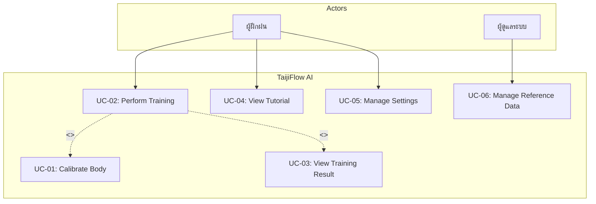

# TaijiFlow AI - Software Requirements Specification (SRS)

**Version:** 2.0  
**Last Updated:** 2024-12-28  
**Status:** Draft

---

## สารบัญ

1. [บทนำ (Introduction)](#1-บทนำ-introduction)
2. [รายละเอียดผลิตภัณฑ์ (Product Description)](#2-รายละเอียดผลิตภัณฑ์-product-description)
3. [Use Cases](#3-use-cases)
4. [ข้อกำหนดความต้องการ (Requirements Specification)](#4-ข้อกำหนดความต้องการ-requirements-specification)
5. [ข้อกำหนดที่ไม่ใช่ฟังก์ชัน (Non-Functional Requirements)](#5-ข้อกำหนดที่ไม่ใช่ฟังก์ชัน-non-functional-requirements)
6. [Traceability Matrix](#6-traceability-matrix)

---

## 1. บทนำ (Introduction)

### 1.1 วัตถุประสงค์ (Purpose)

เอกสารฉบับนี้ระบุข้อกำหนดความต้องการของระบบ TaijiFlow AI ซึ่งเป็นระบบฝึกท่าม้วนไหม (Silk Reeling) ของไท่จี๋ผ่านเว็บเบราว์เซอร์โดยใช้ AI ตรวจจับท่าทางและให้คำแนะนำแบบ Real-time

### 1.2 ขอบเขต (Scope)

| หัวข้อ | รายละเอียด |
|-------|-----------|
| **ชื่อระบบ** | TaijiFlow AI |
| **ประเภท** | Web Application |
| **กลุ่มผู้ใช้** | ผู้สนใจฝึกไท่จี๋, ผู้ดูแลระบบ |
| **Platform** | Desktop (Chrome, Edge, Safari), Tablet |

### 1.3 ข้อจำกัด (Constraints)

1. **อุปกรณ์:**
   - ต้องมี Webcam ที่ความละเอียด 720p ขึ้นไป
   - CPU: Intel i3 หรือเทียบเท่าขึ้นไป
   - RAM: 4GB ขึ้นไป

2. **สภาพแวดล้อม:**
   - ต้องมีพื้นที่ว่างเพียงพอสำหรับเคลื่อนไหว
   - แสงสว่างเพียงพอ (ไม่มีเงาบดบังร่างกาย)

3. **การเชื่อมต่อ:**
   - ต้องเชื่อมต่ออินเทอร์เน็ตเพื่อโหลด AI Model ครั้งแรก

---

## 2. รายละเอียดผลิตภัณฑ์ (Product Description)

### 2.1 ฟีเจอร์ของระบบ (Product Functions)

#### 2.1.1 ระบบฝั่งผู้ฝึกฝน (Trainee) - 8 ฟีเจอร์

| F-ID | ฟีเจอร์ | คำอธิบาย |
|------|---------|---------|
| F-01 | **Body Calibration** | ปรับเทียบสัดส่วนร่างกายด้วย T-Pose |
| F-02 | **Silk Reeling Training** | ฝึกท่าม้วนไหมพร้อมตรวจจับท่าทางด้วย AI |
| F-03 | **8 Rules Analysis** | ตรวจสอบความถูกต้องตามหลักไท่จี๋ 8 ข้อ |
| F-04 | **Real-time Feedback** | แจ้งเตือนแบบ Real-time (ข้อความ + เสียง TTS) |
| F-05 | **Training Result** | คำนวณคะแนน ตัดเกรด แสดง Top Errors |
| F-06 | **Tutorial** | คู่มือการใช้งานและหลักการฝึก |
| F-07 | **System Settings** | ตั้งค่าภาษา ธีมสี เสียงแจ้งเตือน |
| F-08 | **Display Options** | ปรับการแสดงผล (Path, Skeleton, Ghost) |

#### 2.1.2 ระบบฝั่งผู้ดูแล (Admin) - 1 ฟีเจอร์

| F-ID | ฟีเจอร์ | คำอธิบาย |
|------|---------|---------|
| F-09 | **Reference Data Management** | บันทึกวิดีโอและพิกัดท่าต้นแบบ |

---

### 2.2 กฎการตรวจสอบท่าทาง 8 ข้อ (8 Tai Chi Rules)

| Rule | ชื่อ (EN) | ชื่อ (TH) | หลักการจีน |
|:----:|-----------|-----------|-----------|
| R-01 | Path Shape | เส้นทางเป็นวงกลม | - |
| R-02 | Arm Rotation | หมุนฝ่ามือถูกทิศ | - |
| R-03 | Elbow Sinking | ศอกจม | 沉肩坠肘 |
| R-04 | Waist Initiation | เอวนำ | 以腰为轴 |
| R-05 | Vertical Stability | หัวนิ่ง | 虚领顶劲 |
| R-06 | Smoothness | ลื่นไหล | 如抽丝 |
| R-07 | Continuity | ต่อเนื่อง | 绵绵不断 |
| R-08 | Weight Shift | น้ำหนักในฐาน | 分虚实 |

---

## 3. Use Cases

### 3.1 Use Case Diagram

> **Note:** UC-02 (Perform Training) includes UC-01 (Calibrate Body) ก่อนเริ่มฝึก และ UC-03 (View Result) หลังจบการฝึก

### 3.2 Use Case Descriptions

#### UC-01: Calibrate Body (ปรับเทียบสัดส่วน)

| หัวข้อ | รายละเอียด |
|-------|-----------|
| **Actor** | ผู้ฝึกฝน |
| **Precondition** | มี Webcam และแสงเพียงพอ |
| **Main Flow** | 1. กดปุ่ม Calibration 2. ยืนท่า T-Pose 3. รอระบบตรวจจับ 3 วินาที 4. ระบบบันทึกสัดส่วน |
| **Postcondition** | บันทึกค่าสัดส่วนลง LocalStorage |

#### UC-02: Perform Training (ฝึกฝนท่าม้วนไหม)

| หัวข้อ | รายละเอียด |
|-------|-----------|
| **Actor** | ผู้ฝึกฝน |
| **Precondition** | ผ่าน Calibration แล้ว |
| **Main Flow** | 1. เลือกท่าและระดับ 2. กดเริ่มฝึก 3. ระบบแสดง Path และตรวจท่า 4. ระบบแจ้งเตือนเมื่อผิด 5. กดหยุดหรือหมดเวลา |
| **Postcondition** | แสดงผลคะแนน |

#### UC-03: View Training Result (ดูผลการฝึก)

| หัวข้อ | รายละเอียด |
|-------|-----------|
| **Actor** | ผู้ฝึกฝน |
| **Precondition** | จบการฝึกแล้ว |
| **Main Flow** | 1. แสดงคะแนนและเกรด 2. แสดง Top Errors 3. ปิดหน้าต่าง |

#### UC-04: View Tutorial (ดูคู่มือ)

| หัวข้อ | รายละเอียด |
|-------|-----------|
| **Actor** | ผู้ฝึกฝน |
| **Main Flow** | 1. กดปุ่ม Tutorial 2. เลือกหัวข้อ (หลักการ/ท่าฝึก/วิธีใช้) 3. อ่านเนื้อหา 4. ปิดหน้าต่าง |

#### UC-05: Manage Settings (ตั้งค่าระบบ)

| หัวข้อ | รายละเอียด |
|-------|-----------|
| **Actor** | ผู้ฝึกฝน |
| **Main Flow** | 1. กดปุ่มตั้งค่า 2. เปลี่ยนภาษา/ธีม/เสียง 3. ระบบบันทึกอัตโนมัติ |

#### UC-06: Manage Reference Data (จัดการท่าต้นแบบ)

| หัวข้อ | รายละเอียด |
|-------|-----------|
| **Actor** | ผู้ดูแลระบบ |
| **Main Flow** | 1. เปิด data_collector.html 2. เลือกท่าและระดับ 3. กดบันทึก 4. ทำท่าจนหมดเวลา 5. ดาวน์โหลดไฟล์ JSON/WebM |

---

## 4. ข้อกำหนดความต้องการ (Requirements Specification)

### 4.1 UC-01: Calibrate Body

#### User Requirements (URS)

| ID | Requirement |
|----|-------------|
| URS-01 | ผู้ใช้ต้องสามารถกดปุ่มเริ่ม Calibration ได้ |
| URS-02 | ผู้ใช้ต้องได้รับคำแนะนำการจัดท่า T-Pose |
| URS-03 | ผู้ใช้ต้องทราบผลการปรับเทียบ (สำเร็จ/ไม่สำเร็จ) |

#### System Requirements (SRS)

| ID | Requirement |
|----|-------------|
| SRS-01-01 | ระบบต้องแสดง Overlay รูปโครงร่างเพื่อแนะนำท่า T-Pose |
| SRS-01-02 | ระบบต้องตรวจสอบว่ามองเห็น Keypoints ครบตามระดับ: L1/L2 (ไหล่, สะโพก), L3 (ไหล่, สะโพก, ข้อเท้า) |
| SRS-01-03 | ระบบต้องตรวจสอบว่าข้อมืออยู่ระดับเดียวกับไหล่ (±tolerance) |
| SRS-01-04 | ระบบต้องจับเวลายืนนิ่ง 3 วินาที ก่อนบันทึก |
| SRS-01-05 | ระบบต้องบันทึกค่าสัดส่วน (ลำตัว, แขน, ไหล่) ลง LocalStorage |

---

### 4.2 UC-02: Perform Training

#### User Requirements (URS)

| ID | Requirement |
|----|-------------|
| URS-04 | ผู้ใช้ต้องสามารถเลือกท่าและระดับได้ |
| URS-05 | ผู้ใช้ต้องมองเห็นภาพ Mirror พร้อมเส้นนำทาง |
| URS-06 | ผู้ใช้ต้องได้รับ Feedback ทันทีเมื่อทำผิด |

#### System Requirements (SRS)

| ID | Requirement |
|----|-------------|
| SRS-02-01 | ระบบต้องขอ Camera Permission และแสดง Mirrored Video |
| SRS-02-02 | ระบบต้องโหลด Reference JSON ตามท่าที่เลือก |
| SRS-02-03 | ระบบต้องตรวจจับ 33 Landmarks ด้วย MediaPipe Real-time |
| SRS-02-04 | ระบบต้องตรวจสอบตาม 8 กฎของไท่จี๋ |
| SRS-02-05 | ระบบต้องแสดง Feedback บนหน้าจอและเสียง TTS |
| SRS-02-06 | ระบบต้องบันทึกจำนวน Frame ถูก/ผิด |
| SRS-02-07 | ระบบต้องแสดง Dynamic Path ตามขนาดแขนผู้ใช้ |
| SRS-02-08 | ระบบต้องแสดง Instructor Reference (thumbnail/overlay) |
| SRS-02-09 | ระบบต้องเข้าสู่โหมด Fullscreen เมื่อเริ่มฝึกและออกเมื่อหยุด |

---

### 4.3 UC-03: View Training Result

#### User Requirements (URS)

| ID | Requirement |
|----|-------------|
| URS-07 | ผู้ใช้ต้องดูคะแนนและเกรดได้ |
| URS-08 | ผู้ใช้ต้องดู Top Errors ได้ |

#### System Requirements (SRS)

| ID | Requirement |
|----|-------------|
| SRS-03-01 | ระบบต้องคำนวณคะแนน = (Correct/Total) × 100 และแปลงเป็นเกรด: A(≥85), B(≥70), C(≥55), D(≥40), F(<40) |
| SRS-03-02 | ระบบต้องจัดลำดับ Error และแสดง 3 อันดับแรก |
| SRS-03-03 | ระบบต้องสร้าง JSON สำหรับ Export ข้อมูล |

---

### 4.4 UC-04: View Tutorial

#### User Requirements (URS)

| ID | Requirement |
|----|-------------|
| URS-09 | ผู้ใช้ต้องเปิดดูคู่มือได้ตลอดเวลา |
| URS-10 | ผู้ใช้ต้องเลือกหัวข้อเนื้อหาได้ |
| URS-11 | ผู้ใช้ต้องปิดหน้าต่างคู่มือได้ |

#### System Requirements (SRS)

| ID | Requirement |
|----|-------------|
| SRS-04-01 | ระบบต้องแสดง Modal โดยไม่เปลี่ยนหน้า |
| SRS-04-02 | ระบบต้องโหลดเนื้อหาตามภาษาที่เลือก |
| SRS-04-03 | ระบบต้องเปลี่ยนเนื้อหาทันทีเมื่อคลิกแท็บ |

---

### 4.5 UC-05: Manage Settings

#### User Requirements (URS)

| ID | Requirement |
|----|-------------|
| URS-12 | ผู้ใช้ต้องเปลี่ยนภาษา (TH/EN) ได้ |
| URS-13 | ผู้ใช้ต้องเปลี่ยนธีมสี (Light/Dark) ได้ |
| URS-14 | ผู้ใช้ต้องเปิด-ปิดเสียงแจ้งเตือนได้ |

#### System Requirements (SRS)

| ID | Requirement |
|----|-------------|
| SRS-05-01 | ระบบต้องเปลี่ยน Text และ Audio ให้ตรงกับภาษาทันที |
| SRS-05-02 | ระบบต้องสลับ CSS เพื่อเปลี่ยนธีมสีทันที |
| SRS-05-03 | ระบบต้องบันทึกค่าตั้งค่าลง LocalStorage |

---

### 4.6 UC-06: Manage Reference Data

#### User Requirements (URS)

| ID | Requirement |
|----|-------------|
| URS-15 | ผู้ดูแลต้องระบุชื่อท่าและระดับได้ |
| URS-16 | ผู้ดูแลต้องบันทึกวิดีโอและพิกัดพร้อมกันได้ |
| URS-17 | ผู้ดูแลต้องได้รับไฟล์ JSON/WebM |

#### System Requirements (SRS)

| ID | Requirement |
|----|-------------|
| SRS-06-01 | ระบบต้องบันทึกวิดีโอ WebM พร้อมเก็บ Landmarks ทุกเฟรม |
| SRS-06-02 | ระบบต้องแสดง Timer และสถานะการบันทึก |
| SRS-06-03 | ระบบต้องสร้างไฟล์และสั่งดาวน์โหลดอัตโนมัติ |

---

## 5. ข้อกำหนดที่ไม่ใช่ฟังก์ชัน (Non-Functional Requirements)

### 5.1 Performance

| ID | Requirement |
|----|-------------|
| NFR-01 | ระบบต้องประมวลผล Pose ≥15 FPS บนอุปกรณ์ที่กำหนด |
| NFR-02 | ระบบต้องตอบสนองต่อการกดปุ่ม ≤2 วินาที |

### 5.2 Accuracy

| ID | Requirement |
|----|-------------|
| NFR-03 | ระบบต้องมีความถูกต้องในการตรวจท่า ≥80% เทียบกับผู้เชี่ยวชาญ |

### 5.3 Usability

| ID | Requirement |
|----|-------------|
| NFR-04 | ผู้ใช้ใหม่ต้องเรียนรู้การใช้งานได้ภายใน 5 นาที |
| NFR-05 | ระบบต้องมี Error Message ที่ชัดเจนและเข้าใจง่าย |

### 5.4 Reliability

| ID | Requirement |
|----|-------------|
| NFR-06 | ระบบต้องทำงานต่อเนื่องได้ 5 นาทีโดยไม่ crash |

### 5.5 Privacy & Safety

| ID | Requirement |
|----|-------------|
| NFR-07 | ระบบต้องขอ Permission กล้องทุกครั้งและไม่ส่งข้อมูลออกนอก |
| NFR-08 | ระบบต้องแสดงคำเตือนความปลอดภัยก่อนฝึก |

---

## 6. Traceability Matrix

### 6.1 Feature → Use Case

| Feature | UC-01 | UC-02 | UC-03 | UC-04 | UC-05 | UC-06 |
|---------|:-----:|:-----:|:-----:|:-----:|:-----:|:-----:|
| F-01 Calibration | ✓ | | | | | |
| F-02 Training | | ✓ | | | | |
| F-03 8 Rules | | ✓ | | | | |
| F-04 Feedback | | ✓ | | | | |
| F-05 Result | | | ✓ | | | |
| F-06 Tutorial | | | | ✓ | | |
| F-07 Settings | | | | | ✓ | |
| F-08 Display | | ✓ | | | | |
| F-09 Ref Data | | | | | | ✓ |

### 6.2 URS → SRS

| URS | SRS |
|-----|-----|
| URS-01 | SRS-01-01 |
| URS-02 | SRS-01-01, SRS-01-02 |
| URS-03 | SRS-01-04, SRS-01-05 |
| URS-04 | SRS-02-02 |
| URS-05 | SRS-02-01, SRS-02-07, SRS-02-08 |
| URS-06 | SRS-02-04, SRS-02-05 |
| URS-07 | SRS-03-01 |
| URS-08 | SRS-03-02 |
| ... | ... |

### 6.3 SRS → Test Case

| SRS | Test Case |
|-----|-----------|
| SRS-02-04 | TC-Heuristics-01 ~ TC-Heuristics-16 |
| SRS-03-01 | TC-Scoring-01 ~ TC-Scoring-10 |
| ... | ... |

---

## Revision History

| Version | Date | Author | Changes |
|---------|------|--------|---------|
| 1.0 | 2024-12 | - | Initial draft |
| 2.0 | 2024-12-28 | - | เพิ่ม 8 Rules, Display Options, Traceability |

---

*End of Document*
