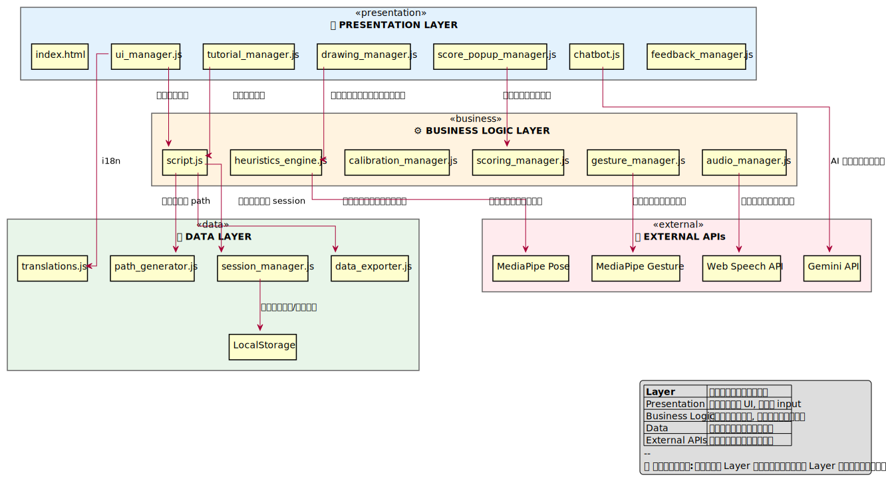

# TaijiFlow AI - System Architecture

**Version:** 0.7.0  
**Last Updated:** 2026-01-10

---

## 📋 สารบัญ

1. [File Structure](#1-file-structure)
2. [Technology Stack](#2-technology-stack)
3. [Design Patterns](#3-design-patterns)
4. [Module Dependencies](#4-module-dependencies)
5. [Layer Architecture](#5-layer-architecture)
6. [Error Handling](#6-error-handling)

---

## 1. File Structure

```text
TaijiFlow/
├── 📄 index.html                    # Landing Page (Entry Point)
├── 📄 app.html                      # Training Application (Main App)
├── 📄 data_collector.html           # เครื่องมือเก็บข้อมูล Reference
│
├── 📁 css/                          # Stylesheets (5 files)
│   ├── base.css                     # Shared Styles (Variables, Reset, Components)
│   ├── styles.css                   # App Styles (app.html)
│   ├── landing.css                  # Landing Page Styles
│   ├── chatbot.css                  # Chatbot Popup Styles
│   └── feedback.css                 # Feedback Modal Styles
│
├── 📁 js/                           # JavaScript Modules (22 files)
│   │
│   │   # ═══════════════════════════════════════════════════════
│   │   # CORE MANAGERS (ไม่พึ่งพา Module อื่น)
│   │   # ═══════════════════════════════════════════════════════
│   ├── heuristics_engine.js         # วิเคราะห์ท่า 8 กฎ (~51KB)
│   ├── calibration_manager.js       # ปรับเทียบ T-Pose (~15KB)
│   ├── scoring_manager.js           # คำนวณคะแนน (~11KB)
│   │
│   │   # ═══════════════════════════════════════════════════════
│   │   # DISPLAY MANAGERS (Canvas API)
│   │   # ═══════════════════════════════════════════════════════
│   ├── drawing_manager.js           # วาด Skeleton, Path (~25KB)
│   ├── ghost_manager.js             # เงาครูผู้สอน (~8KB)
│   ├── silhouette_manager.js        # เงาผู้ฝึก (~3KB)
│   │
│   │   # ═══════════════════════════════════════════════════════
│   │   # UI MANAGERS
│   │   # ═══════════════════════════════════════════════════════
│   ├── ui_manager.js                # Theme, Notifications (~41KB)
│   ├── audio_manager.js             # Text-to-Speech (~31KB)
│   ├── score_popup_manager.js       # ผลคะแนน Popup (~7KB)
│   ├── tutorial_manager.js          # Tutorial Popup (~30KB)
│   ├── gesture_manager.js           # ควบคุมด้วยมือ 👍✊ (~14KB)
│   ├── feedback_manager.js          # Bug Report (~4KB)
│   ├── chatbot.js                   # Gemini AI Chatbot (~26KB)
│   ├── rules_config_manager.js      # Settings UI (~12KB)
│   │
│   │   # ═══════════════════════════════════════════════════════
│   │   # CONTROLLERS
│   │   # ═══════════════════════════════════════════════════════
│   ├── display_controller.js        # Display Options (~7KB)
│   ├── keyboard_controller.js       # Keyboard Shortcuts (~9KB)
│   │
│   │   # ═══════════════════════════════════════════════════════
│   │   # UTILITIES (Stateless Helpers)
│   │   # ═══════════════════════════════════════════════════════
│   ├── data_exporter.js             # Export JSON/CSV (~8KB)
│   ├── path_generator.js            # Dynamic Path (~5KB)
│   ├── session_manager.js           # User/Session ID (~5KB)
│   ├── translations.js              # i18n TH/EN (~23KB)
│   │
│   │   # ═══════════════════════════════════════════════════════
│   │   # MAIN CONTROLLER (Entry Point)
│   │   # ═══════════════════════════════════════════════════════
│   ├── script.js                    # Main Controller (~72KB)
│   │
│   │   # ═══════════════════════════════════════════════════════
│   │   # LANDING PAGE (Standalone)
│   │   # ═══════════════════════════════════════════════════════
│   └── silk-animation.js            # Silk Reeling Animation (~7KB)
│
├── 📁 data/                         # Reference Data
│   ├── rh_cw_L1.json                # Ghost landmarks (มือขวา-ตามเข็ม L1)
│   ├── rh_cw_L1.webm                # Video ต้นแบบ
│   ├── rh_cw_L1_silhouette.webm     # Video เงาครู
│   └── ...
│
├── 📁 docs/                         # Documentation
│   ├── diagrams/                    # UML Diagrams (14 files)
│   ├── ARCHITECTURE.md              # This file
│   ├── CHANGELOG.md                 # Version History
│   └── ...
│
└── 📁 tests/                        # Unit Tests
    └── *.test.js
```

### File Statistics

| Category | Files | Total Size |
| -------- | :---: | :--------: |
| Core Managers | 3 | ~77 KB |
| Display Managers | 3 | ~36 KB |
| UI Managers | 8 | ~165 KB |
| Controllers | 2 | ~16 KB |
| Utilities | 4 | ~41 KB |
| Main Controller | 1 | ~72 KB |
| **Total JS** | **21** | **~407 KB** |

---

## 2. Technology Stack

### Frontend

| Technology | Version | Purpose |
| ---------- | :-----: | ------- |
| **HTML5** | - | Page Structure |
| **CSS3** | - | Styling |
| **JavaScript** | ES6+ | Core Logic |
| **TailwindCSS** | 3.x | Utility CSS Framework |
| **Google Fonts** | - | Sarabun Thai Font |

### AI / Machine Learning

| Technology | Version | Purpose |
| ---------- | :-----: | ------- |
| **MediaPipe Pose** | 0.5 | Pose Detection (33 landmarks) |
| **MediaPipe Gesture** | 0.10.8 | Hand Gesture Recognition (👍✊) |
| **Gemini API** | - | AI Chatbot (Optional) |

### Browser APIs

| API | Purpose |
| --- | ------- |
| **Web Speech API** | Text-to-Speech เสียงเตือน |
| **Canvas API** | วาด Skeleton, Path, Trail |
| **LocalStorage API** | บันทึก Calibration, Settings |
| **Fullscreen API** | โหมดเต็มจอ |
| **Fetch API** | ส่ง Bug Report |

### Development Tools

| Tool | Purpose |
| ---- | ------- |
| **Jest** | Unit Testing |
| **PlantUML** | UML Diagrams |
| **Git** | Version Control |
| **VS Code** | IDE |

---

## 3. Design Patterns

| Pattern | Where Used | Purpose |
| ------- | ---------- | ------- |
| **Module Pattern** | ทุก Manager classes | Encapsulation - แยก scope |
| **Singleton** | `ghostManager`, `uiManager` | Single Instance - ป้องกันสร้างซ้ำ |
| **Observer** | Event Listeners | Reactive UI - อัปเดตเมื่อ state เปลี่ยน |
| **Facade** | `script.js` | Simplify Access - รวม dependencies |
| **Factory** | `generateDynamicPath()` | Create Objects - สร้าง path ตามสัดส่วน |
| **Strategy** | `HeuristicsEngine` rules | Swappable Algorithms - เปิด/ปิดกฎได้ |
| **Controller** | `KeyboardController`, `DisplayController` | Separation of Concerns |

### Pattern Examples

```javascript
// Singleton Pattern
const ghostManager = new GhostManager(); // สร้างครั้งเดียวใน script.js
window.ghostManager = ghostManager;      // เข้าถึง global

// Module Pattern
class HeuristicsEngine {
    constructor() {
        this.CONFIG = { ... };  // Private-like config
    }
    analyze() { ... }           // Public method
}

// Observer Pattern
document.addEventListener('languageChange', () => {
    uiManager.updateAllTexts();  // React to state change
});

// Strategy Pattern
this.RULES_CONFIG = {
    L1: { checkPath: true, checkWaist: false },  // Easy
    L3: { checkPath: true, checkWaist: true }    // Hard
};
```

---

## 4. Module Dependencies

### Dependency Diagram


```text
┌─────────────────────────────────────────────────────────────┐
│                     Layer 1: Entry Point                     │
│                        [script.js]                           │
└─────────────────────────┬───────────────────────────────────┘
                          │
┌─────────────────────────┴───────────────────────────────────┐
│                     Layer 2: Controllers                     │
│          [DisplayController]  [KeyboardController]           │
└─────────────────────────┬───────────────────────────────────┘
                          │
┌─────────┬───────────────┴───────────────┬───────────────────┐
│  Core   │           Display             │        UI         │
├─────────┼───────────────────────────────┼───────────────────┤
│Heuristics│      DrawingManager          │    UIManager      │
│Calibration│     GhostManager            │   AudioManager    │
│ Scoring  │    SilhouetteManager         │  GestureManager   │
│          │                              │  ScorePopup...    │
│          │                              │  RulesConfig...   │
└─────────┴───────────────────────────────┴───────────────────┘
                          │
┌─────────────────────────┴───────────────────────────────────┐
│                     Layer 4: Utilities                       │
│    [DataExporter] [PathGenerator] [SessionManager] [i18n]    │
└─────────────────────────┬───────────────────────────────────┘
                          │
┌─────────────────────────┴───────────────────────────────────┐
│                   Layer 5: External APIs                     │
│   [MediaPipe Pose]  [MediaPipe Gesture]  [Web Speech]  [AI]  │
└─────────────────────────────────────────────────────────────┘
```

### Dependency Table

#### Core Managers (ไม่พึ่งพา Module อื่น)

| Module | Dependencies | หน้าที่ |
| ------ | ------------ | ------- |
| `heuristics_engine.js` | MediaPipe Pose | วิเคราะห์ท่า 8 กฎ |
| `calibration_manager.js` | - | ปรับเทียบสัดส่วน T-Pose |
| `scoring_manager.js` | - | คำนวณคะแนน % |

#### Display Managers

| Module | Dependencies | หน้าที่ |
| ------ | ------------ | ------- |
| `drawing_manager.js` | Canvas API | วาด Skeleton, Path, Trail |
| `ghost_manager.js` | - | เงาครูผู้สอน (วิดีโอ/Skeleton) |
| `silhouette_manager.js` | MediaPipe Mask | เงาผู้ฝึก (สีม่วง) |

#### UI Managers

| Module | Dependencies | หน้าที่ |
| ------ | ------------ | ------- |
| `ui_manager.js` | `translations.js` | Theme, Language, Notifications |
| `audio_manager.js` | Web Speech API | Text-to-Speech เสียงเตือน |
| `score_popup_manager.js` | - | แสดง Popup ผลคะแนน |
| `tutorial_manager.js` | - | แสดง Tutorial Popup |
| `gesture_manager.js` | MediaPipe Gesture | ตรวจจับท่ามือ 👍✊ |
| `feedback_manager.js` | Fetch API | ส่ง Bug Report |
| `chatbot.js` | Gemini API | AI ตอบคำถาม |
| `rules_config_manager.js` | `HeuristicsEngine` | Settings UI สำหรับปรับกฎ |

#### Controllers

| Module | Dependencies | หน้าที่ |
| ------ | ------------ | ------- |
| `display_controller.js` | `GhostManager`, `SilhouetteManager` | ควบคุม Display Options |
| `keyboard_controller.js` | `DisplayController`, `TutorialManager` | Keyboard Shortcuts |

#### Utilities (Stateless)

| Module | Dependencies | หน้าที่ |
| ------ | ------------ | ------- |
| `data_exporter.js` | - | Export JSON/CSV |
| `path_generator.js` | - | สร้าง Dynamic Path |
| `session_manager.js` | LocalStorage | User ID, Session ID |
| `translations.js` | - | i18n Data TH/EN |

#### Main Controller

| Module | Dependencies | หน้าที่ |
| ------ | ------------ | ------- |
| `script.js` | **ทุก Module ข้างบน** | Entry Point, MediaPipe Integration |

---

## 5. Layer Architecture



```text
┌────────────────────────────────────────────────────────────────┐
│                    🖥️ PRESENTATION LAYER                       │
│  index.html │ ui_manager.js │ drawing_manager.js │ tutorial... │
├────────────────────────────────────────────────────────────────┤
│                    ⚙️ BUSINESS LOGIC LAYER                      │
│  script.js │ heuristics_engine.js │ calibration │ scoring     │
├────────────────────────────────────────────────────────────────┤
│                    💾 DATA LAYER                                │
│  session_manager.js │ data_exporter.js │ LocalStorage          │
├────────────────────────────────────────────────────────────────┤
│                    🌐 EXTERNAL APIs                             │
│  MediaPipe Pose │ MediaPipe Gesture │ Web Speech │ Gemini      │
└────────────────────────────────────────────────────────────────┘
```

| Layer | หน้าที่ | ไฟล์หลัก |
| ----- | ---- | ------ |
| **Presentation** | แสดงผล UI, รับ input, วาด Canvas | `index.html`, `ui_manager.js`, `drawing_manager.js` |
| **Business Logic** | ประมวลผลหลัก, วิเคราะห์ท่า, คำนวณคะแนน | `script.js`, `heuristics_engine.js`, `scoring_manager.js` |
| **Data** | จัดการข้อมูล, Session, Export | `session_manager.js`, `data_exporter.js` |
| **External** | APIs ภายนอก | MediaPipe, Web Speech, Gemini |

> **💡 หลักการ:** แต่ละ Layer สื่อสารกับ Layer ที่อยู่ติดกันเท่านั้น

---

## 6. Error Handling

### Camera Errors

ระบบจัดการ Camera Error ได้ครบถ้วน โดยจำแนก 4 ประเภท:

| Error Type | สาเหตุ | ข้อความ TH | ข้อความ EN |
| ---------- | ------ | ---------- | ---------- |
| `not_allowed` | ไม่ได้รับอนุญาต | ไม่ได้รับอนุญาตใช้กล้อง | Camera access denied |
| `not_found` | ไม่พบกล้อง | ไม่พบกล้อง | No camera found |
| `not_readable` | กล้องถูกใช้งาน | กล้องถูกใช้งานโดยโปรแกรมอื่น | Camera in use |
| `unknown` | ไม่ทราบสาเหตุ | เกิดข้อผิดพลาด | Camera error |

**การแสดงผล:**

1. ซ่อน Loading Overlay
2. แสดง Toast Notification (สีแดง, 10 วินาที)
3. อัปเดตหัวข้อบน Start Overlay
4. บันทึกลง Console

**อ้างอิง:** `script.js` → `showCameraError()`, `initCamera()`

### Reference Data Errors

| Error Type | สาเหตุ | การจัดการ |
| ---------- | ------ | --------- |
| JSON Not Found | ไม่พบไฟล์ Reference | แจ้งเตือน + หยุดทำงาน |
| Video Load Error | วิดีโอครูโหลดไม่ได้ | ซ่อน Instructor thumbnail |

---

*Document updated: 2026-01-12*
