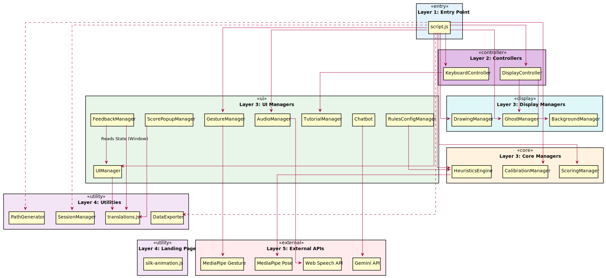

# TaijiFlow AI - Module Dependencies

> อัปเดต: 2026-01-25 | 31 Modules | สำหรับ Master's Thesis SE (v1.1.2)

---

## 📊 Module Dependencies Diagram




```
┌─────────────────────────────────────────────────────────────────────────────┐
│                              script.js                                       │
│                         (Main Controller)                                    │
├─────────────────────────────────────────────────────────────────────────────┤
│                                                                              │
│  ┌──────────────────────────────────────────────────────────────────────┐   │
│  │                        Core Managers                                  │   │
│  │  ┌─────────────────┐ ┌─────────────────┐ ┌─────────────────┐        │   │
│  │  │ HeuristicsEngine│ │CalibrationManager│ │ ScoringManager │        │   │
│  │  └─────────────────┘ └─────────────────┘ └─────────────────┘        │   │
│  │  ┌─────────────────┐ ┌─────────────────┐                            │   │
│  │  │  CameraManager  │ │PerformanceMontr │                            │   │
│  │  │ (MediaPipe/Cam) │ │ (FPS/Quality)   │                            │   │
│  │  └─────────────────┘ └─────────────────┘                            │   │
│  └──────────────────────────────────────────────────────────────────────┘   │
│                                                                              │
│  ┌──────────────────────────────────────────────────────────────────────┐   │
│  │                       Display Managers                                │   │
│  │  ┌─────────────────┐ ┌─────────────────┐ ┌─────────────────┐        │   │
│  │  │ DrawingManager  │ │  GhostManager   │ │BackgroundManager│        │   │
│  │  └─────────────────┘ └─────────────────┘ └─────────────────┘        │   │
│  │  ┌─────────────────┐                                                │   │
│  │  │ WebGLManager    │                                                │   │
│  │  └─────────────────┘                                                │   │
│  └──────────────────────────────────────────────────────────────────────┘   │
│                                                                              │
│  ┌──────────────────────────────────────────────────────────────────────┐   │
│  │                        UI Managers                                    │   │
│  │  ┌─────────────────┐ ┌─────────────────┐ ┌─────────────────┐        │   │
│  │  │   UIManager     │ │ScorePopupManager│ │ TutorialManager │        │   │
│  │  └─────────────────┘ └─────────────────┘ └─────────────────┘        │   │
│  │  ┌─────────────────┐ ┌─────────────────┐ ┌─────────────────┐        │   │
│  │  │  AudioManager   │ │ GestureManager  │ │ FeedbackManager │        │   │
│  │  └─────────────────┘ └─────────────────┘ └─────────────────┘        │   │
│  │  ┌─────────────────┐ ┌─────────────────┐ ┌─────────────────┐        │   │
│  │  │    Chatbot      │ │RulesConfigManager│ │  WisdomManager  │        │   │
│  │  └─────────────────┘ └─────────────────┘ └─────────────────┘        │   │
│  │  ┌─────────────────┐ ┌─────────────────┐                            │   │
│  │  │ LightingManager │ │  DebugManager   │                            │   │
│  │  │ (Auto-Light)    │ │ (Stats Overlay) │                            │   │
│  │  └─────────────────┘ └─────────────────┘                            │   │
│  └──────────────────────────────────────────────────────────────────────┘   │
│                                                                              │
│  ┌──────────────────────────────────────────────────────────────────────┐   │
│  │                          Controllers                                  │   │
│  │  ┌─────────────────┐ ┌─────────────────┐                            │   │
│  │  │DisplayController│ │KeyboardController│                            │   │
│  │  └─────────────────┘ └─────────────────┘                            │   │
│  └──────────────────────────────────────────────────────────────────────┘   │
│                                                                              │
│  ┌──────────────────────────────────────────────────────────────────────┐   │
│  │                          Utilities                                    │   │
│  │  ┌─────────────────┐ ┌─────────────────┐ ┌─────────────────┐        │   │
│  │  │  DataExporter   │ │  PathGenerator  │ │ SessionManager  │        │   │
│  │  └─────────────────┘ └─────────────────┘ └─────────────────┘        │   │
│  │  ┌─────────────────┐ ┌─────────────────┐                            │   │
│  │  │  translations   │ │   time_utils    │                            │   │
│  │  └─────────────────┘ └─────────────────┘                            │   │
│  └──────────────────────────────────────────────────────────────────────┘   │
│                                                                              │
└─────────────────────────────────────────────────────────────────────────────┘
                                    │
                                    ▼
┌─────────────────────────────────────────────────────────────────────────────┐
│                         External APIs (CDN)                                  │
├──────────────────────┬──────────────────────┬──────────────────────────────┤
│   MediaPipe Pose     │  MediaPipe Gesture   │      Gemini API              │
└──────────────────────┴──────────────────────┴──────────────────────────────┘
```

---

## 📋 Dependency Table

### 1. Core Managers (Business Logic)

| Module | Dependencies | หน้าที่ |
|--------|--------------|---------|
| `heuristics_engine.js` | MediaPipe Pose | วิเคราะห์ท่าทาง 8 กฎ |
| `calibration_manager.js` | - | ปรับเทียบสัดส่วน T-Pose |
| `scoring_manager.js` | - | คำนวณคะแนน % |
| `camera_manager.js` | MediaPipe Pose | [NEW] จัดการกล้อง & Initializer |
| `performance_monitor.js` | - | [NEW] ตรวจสอบ FPS & ปรับ Quality |

### 2. Display Managers (พึ่งพา Canvas API)

| Module | Dependencies | หน้าที่ |
|--------|--------------|---------|
| `drawing_manager.js` | Canvas API | วาด Skeleton, Path, Trail |
| `ghost_manager.js` | Canvas API | วาดเงาครูผู้สอน |
| `background_manager.js` | WebGLManager, Canvas | จัดการพื้นหลัง (Blur/Virtual) |
| `webgl_manager.js` | WebGL API | Low-level Rendering Engine |

### 3. UI Managers (พึ่งพา DOM)

| Module | Dependencies | หน้าที่ |
|--------|--------------|---------|
| `ui_manager.js` | `translations.js` | จัดการ Theme, Language, Notifications, Popups |
| `wisdom_manager.js` | `translations.js` | จัดการ Wisdom Popup & Animation |
| `score_popup_manager.js` | `UIManager` | แสดง Popup ผลคะแนน |
| `tutorial_manager.js` | - | แสดง Tutorial Popup |
| `audio_manager.js` | Web Speech API | Text-to-Speech เสียงเตือน |
| `gesture_manager.js` | MediaPipe Gesture | ตรวจจับท่ามือ 👍✊ |
| `feedback_manager.js` | Fetch API | ส่ง Bug Report |
| `chatbot.js` | Gemini API | AI ตอบคำถาม |
| `rules_config_manager.js` | `HeuristicsEngine` | Settings UI สำหรับปรับกฎ |
| `lighting_manager.js` | - | [NEW] ตรวจจับแสงน้อย & Auto Brightness |
| `debug_manager.js` | `PerformanceMonitor` | [NEW] แสดงค่า Stats และกราฟ Debug |

### 4. Controllers (พึ่งพา Managers หลายตัว)

| Module | Dependencies | หน้าที่ |
|--------|--------------|---------|
| `display_controller.js` | `GhostManager`, `BackgroundManager` | ควบคุม Display Options |
| `keyboard_controller.js` | `DisplayController`, `TutorialManager` | จัดการ Keyboard Shortcuts |

### 5. Utilities (Stateless Helper Functions)

| Module | Dependencies | หน้าที่ |
|--------|--------------|---------|
| `data_exporter.js` | - | Export JSON/CSV |
| `path_generator.js` | - | สร้าง Dynamic Path |
| `session_manager.js` | LocalStorage | จัดการ User ID, Session ID |
| `translations.js` | - | ข้อมูลภาษา TH/EN |
| `time_utils.js` | - | [NEW] แปลงเวลา & Countdown |

### 6. Main Controller

| Module | Dependencies | หน้าที่ |
|--------|--------------|---------|
| `script.js` | **Orchestrator** | เชื่อมต่อทุก Module, Game Loop, State Handling |

---

## 📦 Load Order (index.html)

```
1. Core Managers          → ไม่พึ่งพาใคร
2. Display Managers       → ไม่พึ่งพาใคร
3. UI/Translation         → พึ่งพา translations.js
4. Utility Modules        → ไม่พึ่งพาใคร
5. Controllers            → พึ่งพา Managers
6. script.js              → พึ่งพาทุก Module (โหลดสุดท้าย)
```

---

## 🔗 External Dependencies

| API/Library | Version | Purpose | Loaded From |
|-------------|---------|---------|-------------|
| **MediaPipe Pose** | 0.5 | Pose Detection (33 landmarks) | CDN |
| **MediaPipe Gesture** | 0.10.8 | Hand Gesture Recognition | CDN |
| **TailwindCSS** | 3.x | Utility CSS Styling | CDN |
| **Google Fonts (Sarabun)** | - | Thai Font | CDN |
| **Gemini API** | - | AI Chatbot (Optional) | Google Cloud |

---

## 📊 Summary

| Category | Count | Modules |
|----------|:-----:|---------|
| Core Managers | 5 | HeuristicsEngine, CalibrationManager, ScoringManager, CameraManager, PerformanceMonitor |
| Display Managers | 4 | DrawingManager, GhostManager, BackgroundManager, WebGLManager |
| UI Managers | 12 | UIManager, ScorePopupManager, TutorialManager, AudioManager, GestureManager, FeedbackManager, Chatbot, RulesConfigManager, WisdomManager, LightingManager, DebugManager, ShortcutsManager |
| Controllers | 2 | DisplayController, KeyboardController |
| Utilities | 7 | DataExporter, PathGenerator, SessionManager, translations, i18nManager, TimeUtils, MathUtils |
| Main Controller | 1 | script.js |
| **Total** | **31** | |

---

*Document generated for TaijiFlow AI Master's Thesis - Software Engineering*
