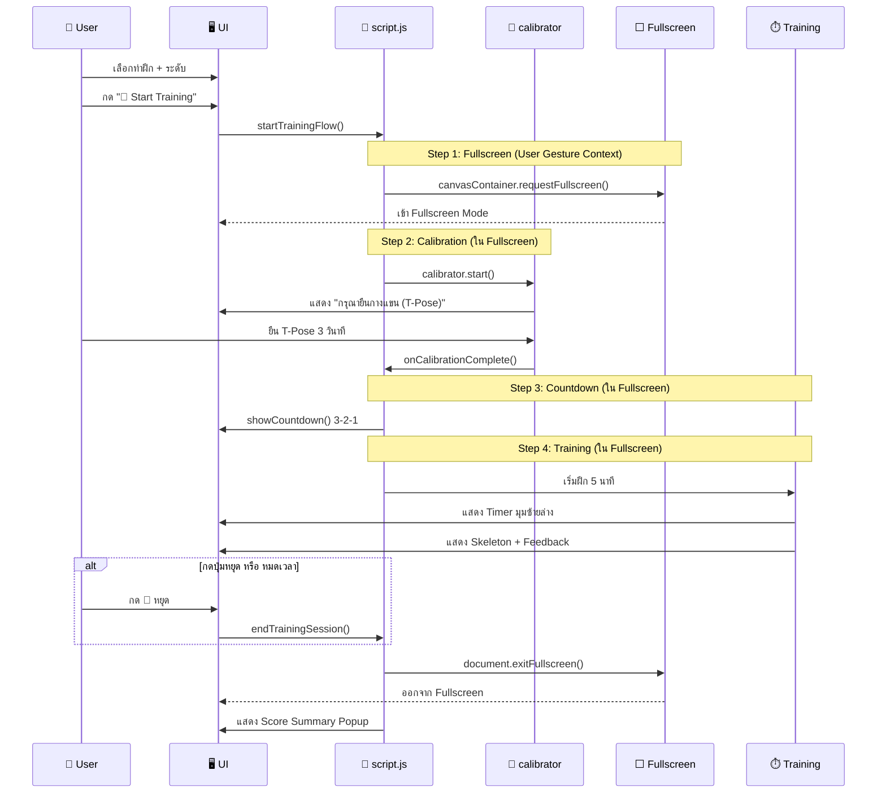

# TaijiFlow AI - Training Flow (v0.4)

แผนภาพแสดงลำดับการทำงานเมื่อผู้ใช้เริ่มฝึก

---

## 📊 Training Session Flow



---

## 🔄 Simplified Flow

```
กด Start Training
     │
     ▼
┌─────────────────┐
│  📺 FULLSCREEN  │  ← เข้า Fullscreen ทันที (User Gesture)
│     Mode        │
└────────┬────────┘
         │
         ▼
┌─────────────────┐
│  📏 Calibration │  ← ยืน T-Pose 3 วินาที
│   "กรุณายืนกางแขน" │
└────────┬────────┘
         │
         ▼
┌─────────────────┐
│  ⏱️ Countdown   │  ← 3-2-1
│     3-2-1       │
└────────┬────────┘
         │
         ▼
┌─────────────────┐
│  🏃 Training    │  ← 5 นาที + Feedback
│   5:00 Timer    │
└────────┬────────┘
         │
    กด 🛑 หรือหมดเวลา
         │
         ▼
┌─────────────────┐
│  📊 Summary     │  ← คะแนน + เกรด
│   Score Popup   │
└────────┬────────┘
         │
         ▼
    ออก Fullscreen
```

---

## 📋 UI Elements During Training (Fullscreen)

```
┌──────────────────────────────────────────────────────┐
│                                                      │
│                    🎥 WEBCAM VIEW                    │
│                  + 🦴 SKELETON OVERLAY               │
│                  + 📍 REFERENCE PATH                 │
│                                                      │
│  ┌─────────────────────┐       ┌──────────────────┐  │
│  │ ⏱️ 4:32 | 🛑 หยุด  │       │ ⬜ จอปกติ        │  │
│  └─────────────────────┘       └──────────────────┘  │
│        ↑ มุมซ้ายล่าง                 ↑ มุมขวาล่าง      │
└──────────────────────────────────────────────────────┘
```

---

## 🔧 Key Functions

| Function | Location | Description |
|----------|----------|-------------|
| `startTrainingFlow()` | script.js | เริ่ม Flow: Fullscreen → Calibrate |
| `startTrainingAfterCalibration()` | script.js | หลัง Calibrate: Countdown → Training |
| `showCountdown()` | script.js | แสดง 3-2-1 |
| `endTrainingSession()` | script.js | หยุด Training + Exit Fullscreen + สรุปผล |

---

## 🪞 Mirror Logic (v0.4)

**ก่อน v0.4:**
- CSS: `canvas { transform: scaleX(-1) }` ✅
- CSS: `canvas:fullscreen { transform: scaleX(-1) }` → Double flip!
- JS: `if (isFullscreen) scale(-1, 1)` → ต้อง flip กลับ

**หลัง v0.4:**
- CSS: `canvas { transform: scaleX(-1) }` ✅
- Container Fullscreen: CSS ยังทำงานปกติ ✅
- JS: ไม่ต้อง check `isFullscreen` อีกต่อไป ✅
