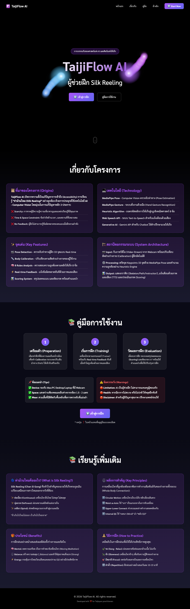

# ภาคผนวก ฉ: คู่มือการใช้งาน TaijiFlow AI

> **🎥 วิดีโอสาธิตการใช้งาน:** ท่านสามารถรับชมวิดีโอสาธิตการใช้งานระบบอย่างละเอียดได้โดยการสแกน QR Code ด้านล่าง


*Figure F.0: Scan to watch the video tutorial (Youtube)*

---

## F.1 System Requirements

### F.1.1 Hardware Requirements

| Device | Minimum | Recommended |
|--------|--------|------|
| **Processor** | Dual-core 2.0 GHz | Quad-core 2.5 GHz+ |
| **Memory** | 4 GB RAM | 8 GB RAM |
| **Webcam** | 720p @ 30fps | 1080p @ 30fps |
| **Display** | 1366×768 | 1920×1080 |

### จ.1.2 Software Requirements

| Browser | Version | สถานะ |
|---------|:-------:|:-----:|
| **Chrome** | 90+ | ✅ แนะนำ |
| **Edge** | 90+ | ✅ รองรับ |
| **Firefox** | 88+ | ✅ รองรับ |
| **Safari** | 14+ | ⚠️ จำกัด |

### จ.1.3 สภาพแวดล้อมการฝึก

- **แสงสว่างเพียงพอ** - ไม่มีเงาบดบังร่างกาย
- **พื้นที่ว่าง** - มีพื้นที่สำหรับเคลื่อนไหว
- **ระยะห่างจากกล้อง** - ประมาณ 1.5-3 เมตร
- **เสื้อผ้า** - สวมเสื้อผ้าสีต่างจากพื้นหลัง

---

## จ.2 การเริ่มต้นใช้งาน

### จ.2.1 เปิดระบบ

1. เปิด Web Browser (แนะนำ Chrome)
2. ไปที่ URL ของระบบ TaijiFlow AI
3. กด **"เริ่มฝึก"** ที่หน้า Landing Page


*รูปที่ จ.1: หน้าจอหลัก (Landing Page)*

### จ.2.2 อนุญาตการใช้งานกล้อง

เมื่อระบบขออนุญาตใช้กล้อง:
1. กด **"Allow"** หรือ **"อนุญาต"**
2. รอให้ระบบโหลด AI Model (~10-15 วินาที)

---

## จ.3 ขั้นตอนการฝึก

### จ.3.1 เลือกท่าและระดับ

**ท่าที่รองรับ:**

| ท่า | คีย์ | คำอธิบาย |
|-----|:---:|----------|
| Right Hand CW | RH-CW | มือขวาหมุนตามเข็มนาฬิกา |
| Right Hand CCW | RH-CCW | มือขวาหมุนทวนเข็มนาฬิกา |
| Left Hand CW | LH-CW | มือซ้ายหมุนตามเข็มนาฬิกา |
| Left Hand CCW | LH-CCW | มือซ้ายหมุนทวนเข็มนาฬิกา |

**ระดับความยาก:**

| ระดับ | ท่า | กฎที่ตรวจ |
|:-----:|-----|:---------:|
| L1 | ท่านั่ง | 3 กฎ |
| L2 | ท่ายืน | 6 กฎ |
| L3 | ท่ายืนย่อ | 9 กฎ |


*รูปที่ จ.2: การเลือกท่าฝึกและระดับความยาก*

### จ.3.2 การปรับเทียบสัดส่วน (Calibration)

1. ยืนท่า **T-Pose** (กางแขนตรงระดับไหล่)
2. รอระบบนับถอยหลัง 3 วินาที
3. เมื่อเห็นข้อความ "Calibration สำเร็จ" = พร้อมฝึก


*รูปที่ จ.3: ขั้นตอนการปรับเทียบสัดส่วน (Calibration)*

**ข้อควรระวัง:**
- ยืนนิ่งที่สุดขณะ Calibrate
- ตรวจสอบว่าเห็นร่างกายครบในกล้อง
- หลีกเลี่ยงแสงสะท้อนหลังตัว

### จ.3.3 เริ่มการฝึก

**วิธีที่ 1: กดปุ่ม**
- กดปุ่ม **▶️ Start** หรือกด **Spacebar**

**วิธีที่ 2: Gesture Control**
- ยกนิ้วโป้ง 👍 ค้างไว้ 1 วินาที


*รูปที่ จ.4a: ปุ่มเริ่มฝึกและคำแนะนำ Gesture Control*

### จ.3.4 ระหว่างการฝึก

- **ทำตาม Ghost** - เงาครูผู้สอนจะแสดงท่าที่ถูกต้อง
- **สังเกต Feedback** - ข้อความเตือนจะปรากฏเมื่อทำผิด
- **ฟังเสียงแจ้งเตือน** - ระบบจะพูดแจ้งเมื่อมีข้อผิดพลาด


*รูปที่ จ.4: หน้าจอขณะฝึกพร้อมการแสดง Feedback แบบ Real-time*

**Feedback ที่อาจพบ:**

| ข้อความ | ความหมาย | วิธีแก้ไข |
|---------|----------|----------|
| เคลื่อนไหวมือให้เป็นวงโค้ง | เส้นทางไม่เป็นวงกลม | วาดวงกลมให้ชัดเจนขึ้น |
| หมุนมือผิดทิศทาง | หมุน CW แทน CCW | ตรวจสอบทิศทางการหมุน |
| ศอกลอย | ศอกอยู่สูงเกินไป | กดศอกลง ผ่อนไหล่ |
| ใช้เอวนำ | ไหล่ขยับก่อนเอว | เริ่มจากหมุนเอวก่อน |
| ศีรษะไม่นิ่ง | หัวขยับมากเกินไป | รักษาศีรษะให้นิ่ง |
| ศีรษะไม่นิ่ง | หัวขยับมากเกินไป | รักษาศีรษะให้นิ่ง |
| อย่าหยุดนิ่ง | หยุดเคลื่อนไหว | เคลื่อนไหวต่อเนื่อง |
| การเคลื่อนไหวสะดุด | ความเร็วไม่สม่ำเสมอ | เคลื่อนไหวให้ลื่นไหล |
| เสียสมดุล | เอียงตัวมากเกินไป | รักษาน้ำหนักให้อยู่ตรงกลาง |
| มือและเท้าไม่สัมพันธ์กัน | มือเท้าเคลื่อนที่สวนทาง | ขยับมือและเท้าไปทางเดียวกัน |

### จ.3.5 หยุดการฝึก

**วิธีที่ 1: กดปุ่ม Stop Control Box**
- กดปุ่ม **STOP** สีแดงที่กล่องควบคุมด้านล่าง (Stop Control Box)
- ระบบจะจบการฝึกอัตโนมัติเมื่อครบ 5 นาที (Auto-finish)


*รูปที่ จ.x: กล่องควบคุมการหยุดฝึก (Stop Control Box)*

**วิธีที่ 2: Gesture Control**
- กำมือ ✊ ค้างไว้ 1 วินาที (คำแนะนำจะแสดงในกล่อง Stop Control ด้านล่าง)

---

## จ.4 ตัวเลือกการแสดงผล

| ตัวเลือก | ค่าเริ่มต้น | คำอธิบาย |
|---------|:----------:|----------|
| **Path** | ON | เส้นทางวงกลมนำทาง |
| **Skeleton** | ON | โครงกระดูกผู้ฝึก |
| **Instructor** | ON | วิดีโอต้นแบบมุมขวาบน |
| **Ghost** | OFF | เงาครูซ้อนบนผู้ฝึก |
| **Trail** | OFF | รอยทางข้อมือ |
| **Silhouette** | OFF | เงาดำของผู้ฝึก |
| **Blur Background** | OFF | เบลอฉากหลัง (Visual Effects) |
| **Mirror Mode** | ON | ภาพกระจกเงา (Visual Effects) |
| **Grid Overlay** | OFF | เส้นตารางช่วยเล็ง (Visual Effects) |
| **Side-by-Side** | OFF | จอแยกซ้าย-ขวา (Visual Effects) |


*รูปที่ จ.6: เมนูตัวเลือกการแสดงผล (Visual Effect Settings)*

---

## จ.5 ผลคะแนน

### จ.5.1 การให้คะแนน

คะแนน = (เฟรมที่ถูกต้อง / เฟรมทั้งหมด) × 100
```


*รูปที่ จ.5: หน้าจรสรุปผลคะแนน (Score Summary Popup)*

### จ.5.2 เกณฑ์การให้เกรด

| เกรด | คะแนน | ความหมาย |
|:----:|:-----:|----------|
| **A** | ≥85% | ยอดเยี่ยม |
| **B** | ≥70% | ดี |
| **C** | ≥55% | พอใช้ |
| **D** | ≥40% | ต้องปรับปรุง |
| **F** | <40% | ไม่ผ่าน |

---

## จ.6 Keyboard Shortcuts (16 ปุ่ม)

> **หมายเหตุ:** Shortcuts ทำงานได้ทั้ง EN และ TH Keyboard Layout

**🎮 Control:**

| ปุ่ม | การทำงาน |
|:---:|----------|
| `Space` | เริ่ม/หยุดการฝึก |
| `Esc` | ยกเลิก/ปิด Popup |
| `F` | เต็มจอ (Fullscreen) |

**👁️ Display Toggle:**

| ปุ่ม | การทำงาน |
|:---:|----------|
| `G` | Grid Overlay (เส้นตาราง) |
| `O` | Ghost (เงาครู) |
| `I` | Instructor (วิดีโอครู) |
| `P` | Path (เส้นทาง) |
| `K` | Skeleton (โครงกระดูก) |
| `B` | **Blur Background (เบลอฉากหลัง)** |
| `S` | **Side-by-Side (จอแยก)** |
| `R` | Trail (รอยข้อมือ) |
| `M` | **Mirror Mode (กระจก)** |
| `A` | **Audio Mute (เปิด/ปิดเสียง)** |

**⚙️ Settings:**

| ปุ่ม | การทำงาน |
|:---:|----------|

| `L` | เปลี่ยนภาษา TH/EN |
| `T` | เปลี่ยน Theme (Dark/Light) |
| `D` | Debug Mode |

**❓ Help:**

| ปุ่ม | การทำงาน |
|:---:|----------|
| `H` | เปิด Tutorial |
| `?` | เปิด Tutorial |
| `/` | แสดงรายการคีย์ลัด |

---

## จ.7 การแก้ไขปัญหา

### จ.7.1 กล้องไม่ทำงาน

| ปัญหา | วิธีแก้ไข |
|-------|----------|
| ไม่พบกล้อง | ตรวจสอบการเชื่อมต่อ Webcam |
| กล้องถูกบล็อก | ไปที่ Settings → Privacy → อนุญาตกล้อง |
| กล้องถูกใช้งาน | ปิดแอปอื่นที่ใช้กล้อง |

### จ.7.2 ตรวจจับไม่ได้

| ปัญหา | วิธีแก้ไข |
|-------|----------|
| แสงไม่พอ | เพิ่มแสงสว่าง หลีกเลี่ยงแสงสะท้อนหลัง |
| ยืนใกล้/ไกลเกินไป | ยืนห่าง 1.5-3 เมตร |
| เสื้อกลมกลืนพื้นหลัง | เปลี่ยนเสื้อให้ตัดกับพื้นหลัง |

### จ.7.3 ระบบช้า

| ปัญหา | วิธีแก้ไข |
|-------|----------|
| FPS ต่ำ | ปิด Ghost และ Silhouette |
| Browser ช้า | ใช้ Chrome และปิด Tab อื่น |
| อุปกรณ์สเปคต่ำ | ลดความละเอียดกล้อง |

---

### จ.8.2 Developer Info (East Egg)
**เคล็ดลับ:** แตะที่โลโก้ ☯️ ใน Wisdom Popup เพื่อดูข้อมูลผู้พัฒนา

---

## จ.9 Tips สำหรับผลลัพธ์ที่ดี

1. **ฝึกใน L1 ก่อน** - เริ่มง่ายก่อนเพิ่มระดับ
2. **ดู Ghost ให้ดี** - ทำตามเงาครูอย่างใกล้ชิด
3. **อย่ารีบ** - เคลื่อนไหวช้าๆ สม่ำเสมอ
4. **หายใจปกติ** - ไม่กลั้นหายใจขณะฝึก
5. **พักเป็นระยะ** - ฝึก 3-5 นาที แล้วพัก

---

> **หมายเหตุ:** สำหรับข้อมูลเพิ่มเติม กด **❓ Tutorial** ในหน้า Training Application

---

*Document updated: 2026-01-24 (v1.1.1)*
