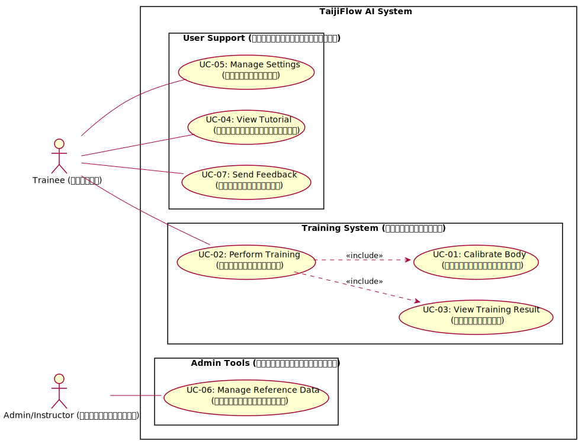
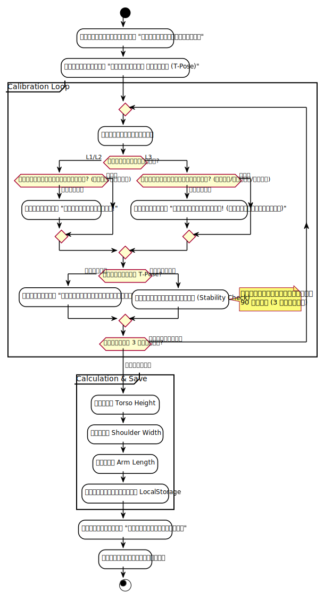
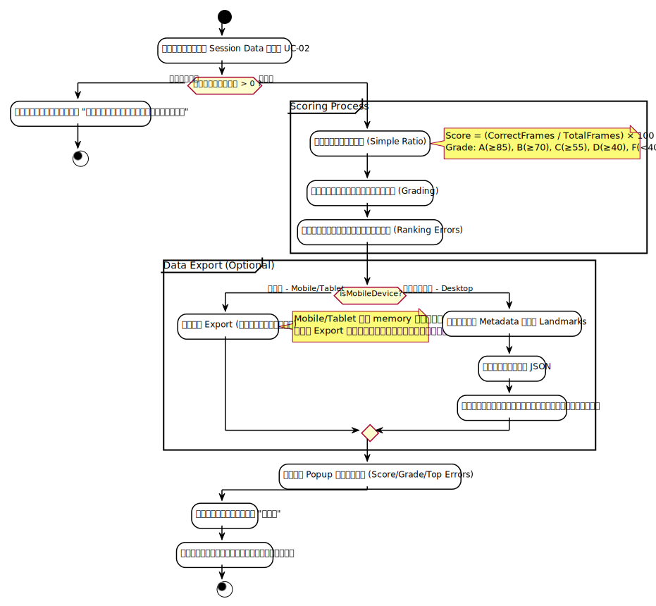
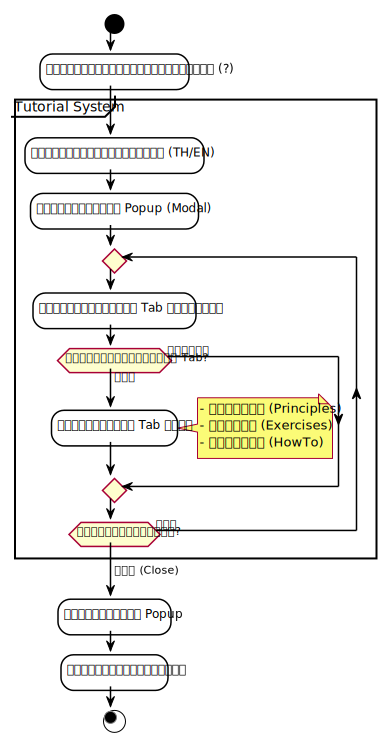
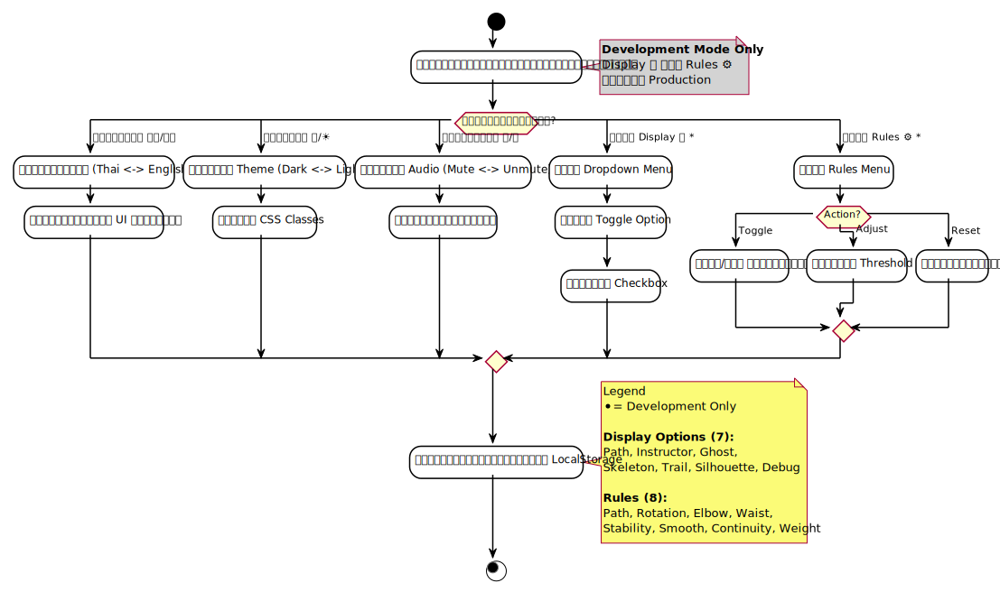
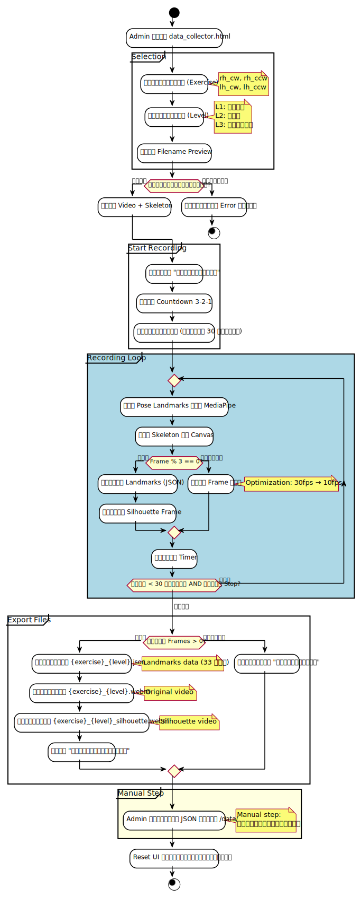
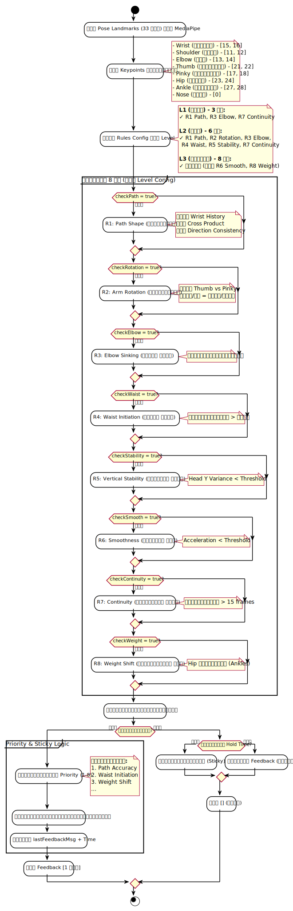

# บทที่ 3: การวิเคราะห์ระบบ (System Analysis)

---

## 3.1 Problem Statement (การวิเคราะห์ปัญหา)

### 3.1.1 ปัญหาของการเรียนรู้ไท่จี๋แบบดั้งเดิม

การฝึกมวยไท้เก๊ก (Taijiquan) โดยเฉพาะท่าม้วนไหม (Silk Reeling / Chan Si Gong) ซึ่งเป็นพื้นฐานสำคัญของมวยไท้เก๊กสายเฉินสี มีความท้าทายหลายประการ:

| ปัญหา | รายละเอียด | ผลกระทบ |
|-------|-----------|---------|
| **ขาดครูผู้สอน** | ผู้เชี่ยวชาญไท่จี๋มีจำกัด ค่าใช้จ่ายสูง | ผู้สนใจเข้าถึงการฝึกได้ยาก |
| **ไม่รู้ว่าทำถูกหรือผิด** | ไม่มีคนตรวจสอบท่าทาง | ฝึกผิดซ้ำๆ เกิดนิสัยไม่ดี |
| **ขาด Feedback ทันที** | ต้องรอครูตรวจทีละคน | เสียเวลา ลืมไปแล้วว่าทำอะไร |
| **เวลาและสถานที่** | ต้องนัดเวลา เดินทางไปโรงเรียน | ไม่ยืดหยุ่น |
| **วิดีโอออนไลน์** | ดูได้แต่ไม่รู้ว่าทำถูกไหม | ฝึกตามแต่ไม่มั่นใจ |

### 3.1.2 ความต้องการของผู้ใช้

จากการศึกษาปัญหาข้างต้น สามารถสรุปความต้องการหลักได้ดังนี้:

1. **ต้องการ Feedback ทันที** - รู้ทันทีว่าท่าถูกหรือผิด
2. **ต้องการฝึกได้ทุกที่ทุกเวลา** - ไม่ต้องพึ่งพาครู
3. **ต้องการเห็นความก้าวหน้า** - มีคะแนน มีเกรด
4. **ต้องการคำแนะนำที่เข้าใจง่าย** - ภาษาที่ใช้ในชีวิตประจำวัน

### 3.1.3 แนวทางการแก้ปัญหา

TaijiFlow AI ถูกออกแบบมาเพื่อแก้ปัญหาเหล่านี้โดยใช้เทคโนโลยี AI:

| วิธีการแก้ปัญหา | เทคโนโลยี | ผลลัพธ์ |
|---------------|----------|--------|
| ตรวจจับท่าทางอัตโนมัติ | MediaPipe Pose | รู้ตำแหน่ง 33 จุดบนร่างกาย |
| วิเคราะห์ตามหลักไท่จี๋ | Heuristics Engine (9 กฎ) | รู้ว่าผิดกฎข้อไหน |
| แจ้งเตือนทันที | Visual + TTS Audio | ได้ Feedback แบบ Real-time |
| ให้คะแนนและเกรด | Scoring Algorithm | วัดความก้าวหน้าได้ |
| ฝึกได้ทุกที่ทุกเวลา | Web Application | เปิด Browser ก็ใช้ได้ |

---

## 3.2 Requirements Analysis (การวิเคราะห์ความต้องการ)

### 3.2.1 Functional Requirements Overview

ระบบ TaijiFlow AI ประกอบด้วยความต้องการเชิงฟังก์ชัน 12 รายการ แบ่งเป็น 2 กลุ่มผู้ใช้:

#### 3.2.1.1 ฟีเจอร์สำหรับผู้ฝึก (Trainee) - 11 ฟีเจอร์

| F-ID | ฟีเจอร์ | คำอธิบาย | Priority |
|:----:|---------|---------|:--------:|
| F-01 | **Body Calibration** | ปรับเทียบสัดส่วนร่างกายด้วย T-Pose | Core |
| F-02 | **Silk Reeling Training** | ฝึกท่าม้วนไหมพร้อมตรวจจับท่าทางด้วย AI | Core |
| F-03 | **9 Rules Analysis** | ตรวจสอบความถูกต้องตามหลักไท่จี๋ 9 ข้อ | Core |
| F-04 | **Real-time Feedback** | แจ้งเตือนแบบ Real-time (ข้อความ + เสียง TTS) | Core |
| F-05 | **Training Result** | คำนวณคะแนน ตัดเกรด แสดง Top Errors | Core |
| F-06 | **Tutorial** | คู่มือการใช้งานและหลักการฝึก | Support |
| F-07 | **System Settings** | ตั้งค่าภาษา ธีมสี เสียงแจ้งเตือน | Support |
| F-08 | **Display Options** | ปรับการแสดงผล (Auto-downgrade เมื่อ Performance ต่ำ) | Support |
| F-09 | **Gesture Control** | ควบคุมด้วยท่าทางมือ (👍 เริ่ม, ✊ หยุด) | Support |
| F-10 | **AI Chatbot** | ถาม-ตอบเกี่ยวกับไท่จี๋ (Gemini API) | Optional |
| F-11 | **Feedback Report** | ส่ง feedback/bug report | Support |
| F-13 | **Performance Mode** | ปรับความลื่นไหล (Lite/Balanced/Quality) | Core |
| F-14 | **Visual Effects** | Virtual Backgrounds (Blur/Image) & Auto-Light | Support |
| F-15 | **Side-by-Side Mode** | แสดงจอแยก (Coach ซ้าย - User ขวา) | Support |
| F-16 | **Mirror Mode** | พลิกภาพกระจกเงา | Support |

#### 3.2.1.2 ฟีเจอร์สำหรับผู้ดูแลระบบ (Admin) - 1 ฟีเจอร์

| F-ID | ฟีเจอร์ | คำอธิบาย | Priority |
|:----:|---------|---------|:--------:|
| F-12 | **Reference Data Management** | บันทึกวิดีโอและพิกัดท่าต้นแบบ | Admin |

### 3.2.2 กฎการตรวจสอบท่าทาง 8 ข้อ (8 Taijiquan Rules)

กฎทั้ง 8 ข้อได้รับการออกแบบตามหลักการของมวยไท้เก๊กแบบดั้งเดิม:

| Rule | ชื่อ (EN) | ชื่อ (TH) | หลักการจีน | คำอธิบาย |
|:----:|-----------|-----------|:----------:|---------|
| R-01 | Path Shape | เส้นทางเป็นวงกลม | - | เคลื่อนที่เป็นวงกลม ไม่ใช่เส้นตรง |
| R-02 | Arm Rotation | หมุนฝ่ามือถูกทิศ | - | หงายมือขึ้นเมื่อขาขึ้น คว่ำลงเมื่อลง |
| R-03 | Elbow Sinking | ศอกจม | 沉肩坠肘 | ศอกต้องต่ำกว่าไหล่เสมอ |
| R-04 | Waist Initiation | เอวนำ | 以腰为轴 | เอวหมุนนำ แขนตาม |
| R-05 | Vertical Stability | หัวนิ่ง | 虚领顶劲 | หัวและลำตัวตั้งตรง |
| R-06 | Smoothness | ลื่นไหล | 如抽丝 | เคลื่อนไหวลื่นเหมือนดึงไหม |
| R-07 | Continuity | ต่อเนื่อง | 绵绵不断 | ไม่หยุดกลางคัน |
| R-08 | Weight Shift | น้ำหนักในฐาน | 分虚实 | จุดศูนย์ถ่วงอยู่ระหว่างเท้า |

### 3.2.3 Non-Functional Requirements

#### 3.2.3.1 Performance Requirements

| ID | Requirement | เกณฑ์ |
|:---:|-------------|-------|
| NFR-01 | Frame Rate | UI ≥ 30 FPS, AI Analysis ≥ 5 FPS (Dynamic Adaptive Quality with PerformanceMonitor) |
| NFR-02 | Response Time | ≤2 วินาทีต่อการกดปุ่ม |

#### 3.2.3.2 Accuracy Requirements

| ID | Requirement | เกณฑ์ |
|:---:|-------------|-------|
| NFR-03 | Pose Detection Accuracy | ≥80% เทียบกับผู้เชี่ยวชาญ |

#### 3.2.3.3 Usability Requirements

| ID | Requirement | เกณฑ์ |
|:---:|-------------|-------|
| NFR-04 | Learning Curve | เรียนรู้ได้ภายใน 5 นาที |
| NFR-05 | Error Messages | ชัดเจนและเข้าใจง่าย |

#### 3.2.3.4 Reliability Requirements

| ID | Requirement | เกณฑ์ |
|:---:|-------------|-------|
| NFR-06 | Stability | ทำงานต่อเนื่อง 5 นาทีไม่ crash |

#### 3.2.3.5 Privacy & Security Requirements

| ID | Requirement | เกณฑ์ |
|:---:|-------------|-------|
| NFR-07 | Camera Permission | ขอทุกครั้ง ไม่ส่งข้อมูลออกนอก |
| NFR-08 | Privacy Warning | แสดงคำเตือนก่อนใช้งาน |

#### 3.2.3.6 Internationalization Requirements

| ID | Requirement | เกณฑ์ |
|:---:|-------------|-------|
| NFR-09 | Multi-language | รองรับ TH/EN เปลี่ยนได้ทันที |
| NFR-10 | Theme Support | รองรับ Dark/Light Mode |

### 3.2.4 System Environment Requirements (ความต้องการด้านสภาพแวดล้อมระบบ)

| Hardware / Software | Recommended Specification (แนะนำ) | Minimum Specification (ขั้นต่ำ) |
|-------------------|-----------------------------------|-------------------------------|
| **Device** | PC / Laptop | Tablet (iPad / Android)* |
| **Browser** | Google Chrome (Latest) | Safari, Edge |
| **Camera** | Webcam 720p 30fps | Built-in Camera |
| **Internet** | Broadband / 4G+ (สำหรับโหลด Model) | 3G |

*Note: การใช้งานบน Tablet ได้รับการสนับสนุนผ่าน **Adaptive Quality System** (PerformanceMonitor) เพื่อป้องกันความร้อนสะสม ส่วนฟีเจอร์ Visual Effects (Blur Background) จะถูกปิดอัตโนมัติในโหมดนี้*

---

## 3.3 Use Case Diagram

### 3.3.1 Actors (ผู้มีส่วนร่วมในระบบ)

| Actor | คำอธิบาย | Use Cases |
|-------|---------|-----------|
| **Trainee (ผู้ฝึก)** | ผู้ใช้ทั่วไปที่ต้องการฝึกท่าม้วนไหม | UC-01 ถึง UC-05 |
| **Admin/Instructor (ผู้เชี่ยวชาญ)** | ครูผู้สอนที่บันทึกท่าต้นแบบ | UC-06 |

### 3.3.2 Use Case Overview



*รูปที่ 3.1: Use Case Diagram ของระบบ TaijiFlow AI*

ระบบประกอบด้วย 6 Use Cases หลัก:

| UC-ID | ชื่อ Use Case | Actor | Description |
|:-----:|---------------|-------|-------------|
| UC-01 | Calibrate Body | Trainee | ปรับเทียบสัดส่วนร่างกาย |
| UC-02 | Perform Training | Trainee | ฝึกท่าม้วนไหม (หลัก) |
| UC-03 | View Training Result | Trainee | ดูผลคะแนนและเกรด |
| UC-04 | View Tutorial | Trainee | ดูคู่มือการใช้งาน |
| UC-05 | Manage Settings | Trainee | ตั้งค่าภาษา/ธีม/เสียง |
| UC-06 | Manage Reference Data | Admin | บันทึกท่าต้นแบบ |

**ความสัมพันธ์ระหว่าง Use Cases:**
- UC-02 (Perform Training) **includes** UC-01 (Calibrate Body) - ต้อง Calibrate ก่อนเริ่มฝึก
- UC-02 (Perform Training) **includes** UC-03 (View Result) - แสดงผลหลังจบการฝึก

---

## 3.4 Use Case Descriptions

### 3.4.1 UC-01: Calibrate Body (ปรับเทียบสัดส่วน)

| หัวข้อ | รายละเอียด |
|-------|-----------|
| **Use Case ID** | UC-01 |
| **Use Case Name** | Calibrate Body (ปรับเทียบสัดส่วนร่างกาย) |
| **Actor** | ผู้ฝึกฝน (Trainee) |
| **Goal** | วัดสัดส่วนร่างกายของผู้ใช้เพื่อปรับ threshold ให้เหมาะสม |
| **Precondition** | 1. มี Webcam<br>2. แสงสว่างเพียงพอ<br>3. มีพื้นที่ว่างสำหรับยืน |
| **Postcondition** | บันทึกค่าสัดส่วน (armLength, shoulderWidth, torsoHeight) ลง LocalStorage |

**Main Flow:**

| Step | Actor Action | System Response |
|:----:|--------------|-----------------|
| 1 | กดปุ่ม "Calibrate" หรือเริ่มการฝึก | แสดง Overlay คำแนะนำท่า T-Pose |
| 2 | ยืนท่า T-Pose (แขนกางออกสองข้าง) | ตรวจจับ Pose และแสดง Skeleton |
| 3 | รอให้ระบบตรวจจับ | นับ Countdown 3 วินาที |
| 4 | - | คำนวณและบันทึกสัดส่วน |
| 5 | - | แสดงข้อความ "Calibration สำเร็จ" |

**Exception Flow:**

| Exception | Trigger | System Response |
|-----------|---------|-----------------|
| E1 | ไม่พบ Keypoints ครบ | แสดง "กรุณายืนให้ห่างกล้อง" |
| E2 | แสงน้อยเกินไป | แสดง "แสงไม่เพียงพอ" + เสียงเตือน |
| E3 | ท่าไม่ถูกต้อง | แสดง "กรุณายืนท่า T-Pose" |

**Measurements ที่บันทึก:**

| Data | วิธีคำนวณ | การใช้งาน |
|------|----------|----------|
| `shoulderWidth` | ระยะห่างไหล่ซ้าย-ขวา | Normalize ระยะทาง |
| `armLength` | ความยาวแขน (ไหล่-ข้อมือ) | ตรวจสอบการเหยียดแขน |
| `torsoHeight` | ความสูงลำตัว (ไหล่-สะโพก) | ตรวจสอบการก้ม |
| `initialShoulderY` | ความสูงไหล่เริ่มต้น | ตรวจสอบการยกไหล่ |

---

### 3.4.2 UC-02: Perform Training (ฝึกฝนท่าม้วนไหม)

| หัวข้อ | รายละเอียด |
|-------|-----------|
| **Use Case ID** | UC-02 |
| **Use Case Name** | Perform Training (ฝึกท่าม้วนไหม) |
| **Actor** | ผู้ฝึกฝน (Trainee) |
| **Goal** | ฝึกท่าม้วนไหมพร้อมรับ Feedback แบบ Real-time |
| **Precondition** | 1. ผ่าน Calibration แล้ว<br>2. เลือกท่าและระดับแล้ว |
| **Postcondition** | แสดงผลคะแนนและเกรด |

**Main Flow:**

| Step | Actor Action | System Response |
|:----:|--------------|-----------------|
| 1 | เลือกท่า (เช่น Right Hand CW) | โหลด Reference Data (JSON + Video) |
| 2 | เลือกระดับ (L1/L2/L3) | กำหนดกฎที่จะตรวจสอบ |
| 3 | กดปุ่ม "Start" หรือยก 👍 | เข้าสู่ Fullscreen + เริ่ม Calibration |
| 4 | ยืน T-Pose | (UC-01) Calibrate สำเร็จ |
| 5 | ทำท่าตาม Ghost/Video | ตรวจจับท่าและวิเคราะห์ตาม 9 กฎ |
| 6 | - | แสดง Feedback บนหน้าจอ + เสียง TTS |
| 7 | กด "Stop" หรือกำมือ ✊ หรือหมดเวลา | จบการฝึก → (UC-03) แสดงผลคะแนน |

**Alternative Flow:**

| Alt Flow | Trigger | Description |
|----------|---------|-------------|
| A1 | ยกนิ้วโป้ง 👍 | Gesture Control - เริ่มการฝึก |
| A2 | กำมือ ✊ | Gesture Control - หยุดการฝึก |

**Exception Flow:**

| Exception | Trigger | System Response |
|-----------|---------|-----------------|
| E1 | Camera Error | แจ้ง Error + คำแนะนำแก้ไข |
| E2 | Reference Not Found | แจ้ง "ไม่พบข้อมูลท่านี้" |
| E3 | Low Light | Warning (Toast + TTS) + ฝึกต่อได้ |

**ระดับความยาก (Difficulty Levels):**

| Level | กฎที่ตรวจสอบ | จำนวนกฎ |
|:-----:|-------------|:-------:|
| L1 (Easy) | R-01, R-03, R-07 | 3 |
| L2 (Medium) | R-01, R-02, R-03, R-06, R-07 | 5 |
| L3 (Hard) | R-01 ถึง R-08 ทั้งหมด | 8 |

---

### 3.4.3 UC-03: View Training Result (ดูผลการฝึก)

| หัวข้อ | รายละเอียด |
|-------|-----------|
| **Use Case ID** | UC-03 |
| **Use Case Name** | View Training Result (ดูผลการฝึก) |
| **Actor** | ผู้ฝึกฝน (Trainee) |
| **Goal** | ดูคะแนน เกรด และข้อผิดพลาดที่พบบ่อย |
| **Precondition** | จบการฝึกแล้ว (UC-02) |
| **Postcondition** | ผู้ใช้เห็นผลคะแนนและสามารถ Export ได้ |

**Main Flow:**

| Step | Actor Action | System Response |
|:----:|--------------|-----------------|
| 1 | - | คำนวณคะแนนจาก Error Rate |
| 2 | - | แปลงคะแนนเป็นเกรด (A-F) |
| 3 | - | แสดง Popup สรุปผล |
| 4 | กด Export (ถ้าต้องการ) | ดาวน์โหลด JSON/CSV |
| 5 | กดปิด หรือ Try Again | ปิด Popup / เริ่มฝึกใหม่ |

**Score Calculation:**

```
คะแนน = (Correct Frames / Total Frames) × 100
```

**Grading Scale:**

| เกรด | คะแนน | ความหมาย |
|:----:|:-----:|----------|
| A | ≥85% | ยอดเยี่ยม |
| B | ≥70% | ดี |
| C | ≥55% | พอใช้ |
| D | ≥40% | ต้องปรับปรุง |
| F | <40% | ไม่ผ่าน |

---

### 3.4.4 UC-04: View Tutorial (ดูคู่มือ)

| หัวข้อ | รายละเอียด |
|-------|-----------|
| **Use Case ID** | UC-04 |
| **Use Case Name** | View Tutorial (ดูคู่มือการใช้งาน) |
| **Actor** | ผู้ฝึกฝน (Trainee) |
| **Goal** | เรียนรู้วิธีใช้งานและหลักการไท่จี๋ |
| **Precondition** | - |
| **Postcondition** | - |

**Main Flow:**

| Step | Actor Action | System Response |
|:----:|--------------|-----------------|
| 1 | กดปุ่ม "Tutorial" (❓) | แสดง Modal Tutorial |
| 2 | เลือกหัวข้อ (หลักการ/ท่าฝึก/วิธีใช้) | แสดงเนื้อหาตามหัวข้อ |
| 3 | อ่านเนื้อหา | - |
| 4 | กดปิด หรือ Click นอก Modal | ปิด Modal |

**หมวดหมู่เนื้อหา:**

| Tab | เนื้อหา |
|-----|--------|
| หลักการ | 9 กฎไท่จี๋ + คำอธิบาย |
| ท่าฝึก | รายละเอียดท่าม้วนไหม |
| วิธีใช้ | ขั้นตอนการใช้งานระบบ |

---

### 3.4.5 UC-05: Manage Settings (ตั้งค่าระบบ)

| หัวข้อ | รายละเอียด |
|-------|-----------|
| **Use Case ID** | UC-05 |
| **Use Case Name** | Manage Settings (ตั้งค่าระบบ) |
| **Actor** | ผู้ฝึกฝน (Trainee) |
| **Goal** | ปรับแต่งการใช้งานตามความต้องการ |
| **Precondition** | - |
| **Postcondition** | บันทึกค่าตั้งค่าลง LocalStorage |

**Main Flow:**

| Step | Actor Action | System Response |
|:----:|--------------|-----------------|
| 1 | กดปุ่ม Quick Toggles (🌐/☀️/🔇) | สลับค่าภาษา/ธีม/เสียง ทันที |
| 2 | กดปุ่ม Settings Menu (⚙️) | แสดง Dropdown หมวดย่อย: Performance, Effects, Backgrounds |
| 3 | เลือกหมวด Performance ⚡ | ปรับโหมด Lite/Balanced/Quality |
| 4 | เลือกหมวด Backgrounds 🖼️ | ปรับพื้นหลัง (None/Blur/Image) |
| 5 | เลือกหมวด Display Options 👁️ | ปรับการแสดงผล (Ghost, Skeleton, User) |
| 6 | - | บันทึกค่าอัตโนมัติลง LocalStorage |

**Settings ที่บันทึก:**

| Setting | Values | Default |
|---------|--------|---------|
| Language | `th` / `en` | `th` |
| Theme | `light` / `dark` | `light` |
| Audio | `true` / `false` | `true` |
| Performance | `lite` / `balanced` / `quality` | `balanced` |
| Background | `none` / `blur` / `image` | `none` |
| SideBySide | `true` / `false` | `false` |

---

### 3.4.6 UC-06: Manage Reference Data (จัดการท่าต้นแบบ)

| หัวข้อ | รายละเอียด |
|-------|-----------|
| **Use Case ID** | UC-06 |
| **Use Case Name** | Manage Reference Data (จัดการท่าต้นแบบ) |
| **Actor** | ผู้ดูแลระบบ / ผู้เชี่ยวชาญ (Admin) |
| **Goal** | บันทึกวิดีโอและข้อมูลท่าต้นแบบ |
| **Precondition** | เข้าถึง data_collector.html |
| **Postcondition** | ได้ไฟล์ JSON + WebM |

**Main Flow:**

| Step | Actor Action | System Response |
|:----:|--------------|-----------------|
| 1 | เปิด data_collector.html | แสดงหน้า Data Collector |
| 2 | เลือกท่า (RH_CW, LH_CCW, ...) | - |
| 3 | เลือกระดับ (L1/L2/L3) | - |
| 4 | กด "Start Recording" | เริ่มบันทึก + Countdown 3-2-1 |
| 5 | ทำท่าจนหมดเวลา | บันทึก Video + Landmarks ทุกเฟรม |
| 6 | รอประมวลผล | สร้างไฟล์ JSON + WebM |
| 7 | - | Download อัตโนมัติ |

**Output Files:**

| File | Format | Content |
|------|--------|---------|
| `{exercise}_L{level}.json` | JSON | Landmarks ทุกเฟรม |
| `{exercise}_L{level}.webm` | WebM | Video recording |
| `{exercise}_L{level}_silhouette.webm` | WebM | Silhouette video |

---

## 3.5 Data Flow Diagram

### 3.5.1 DFD Level 1 Overview


*รูปที่ 3.2: Data Flow Diagram Level 1 ของระบบ TaijiFlow AI*

### 3.5.2 DFD Components

#### External Entities (แหล่งข้อมูลภายนอก)

| Entity | Description | Data Flow |
|--------|-------------|-----------|
| 👤 User (ผู้ฝึก) | ผู้ใช้งานระบบ | Webcam input, Settings, Score output |
| 🤖 MediaPipe | AI Model | 33 Landmarks |
| 📁 Reference Data | ไฟล์ JSON/WebM | Ghost Landmarks, Instructor Video |
| 💾 LocalStorage | Browser Storage | Settings, Calibration Data |

#### Processes (กระบวนการ)

| Process | Name | Description | Input | Output |
|:-------:|------|-------------|-------|--------|
| 1.0 | Capture Video | รับวิดีโอจาก Webcam | Webcam Stream | Video Frame |
| 2.0 | Detect Pose | ตรวจจับท่าทางด้วย AI | Video Frame | 33 Landmarks |
| 3.0 | Calibrate | ปรับเทียบสัดส่วน | Landmarks (first time) | Calibration Data |
| 4.0 | Analyze Heuristics | วิเคราะห์ตาม 9 กฎ | Landmarks, Calibration, Ghost | Feedbacks |
| 5.0 | Calculate Score | คำนวณคะแนน | All Feedbacks | Score Summary |
| 6.0 | Render Canvas | วาดภาพบน Canvas | Violations, Video, Ghost | Canvas Output |
| 7.0 | Play Audio | เล่นเสียงเตือน | Errors | Audio (TTS) |

#### Data Stores (แหล่งเก็บข้อมูล)

| Store | Name | Data |
|:-----:|------|------|
| D1 | Calibration Data | armLength, shoulderWidth, torsoHeight |
| D2 | Frame Buffer | feedbacks[] สะสมระหว่างการฝึก |

### 3.5.3 Main Data Flows

| Flow | From | To | Data |
|------|------|-----|------|
| Webcam Stream | User | P1 | 720p Video |
| Video Frame | P1 | P2 | Image Frame |
| Landmarks | P2 | P3, P4 | 33 points (x, y, z, visibility) |
| Calibration | P3 | D1 | สัดส่วนร่างกาย |
| Ghost Landmarks | RefData | P4 | ท่าต้นแบบ |
| Feedbacks | P4 | D2, P6, P7 | rule, type, severity, message |
| Score Summary | P5 | User | %, grade, topErrors |
| Canvas | P6 | User | Skeleton, Path, Ghost |
| Audio | P7 | User | TTS เสียงเตือน |

---

## 3.6 Activity Diagrams

### 3.6.1 Activity Diagram: UC-01 Calibrate Body



*รูปที่ 3.3: Activity Diagram สำหรับ UC-01 Calibrate Body*

**Description:**
1. ผู้ใช้เริ่มกระบวนการ Calibration
2. ระบบแสดงคำแนะนำท่า T-Pose
3. ผู้ใช้ยืนท่า T-Pose
4. ระบบตรวจสอบ Visibility ของ Keypoints
   - ถ้าไม่ครบ: แสดง Error และขอให้ลองใหม่
5. ระบบนับ 3 วินาที
6. คำนวณและบันทึกสัดส่วนลง LocalStorage
7. แสดงข้อความสำเร็จ

---

### 3.6.2 Activity Diagram: UC-02 Perform Training


*รูปที่ 3.4: Activity Diagram สำหรับ UC-02 Perform Training*

**Description:**
1. ผู้ใช้เลือกท่าและระดับ
2. กดเริ่มฝึก (หรือยก 👍)
3. ระบบเข้าสู่ Fullscreen และ Calibrate
4. **Loop:** ขณะยังไม่หยุด
   - ตรวจจับ Pose
   - วิเคราะห์ตาม 9 กฎ
   - แสดง Feedback (Visual + Audio)
   - สะสม Error Count
5. เมื่อหยุด (กด Stop / ✊ / หมดเวลา)
6. คำนวณคะแนนและแสดงผล

---

### 3.6.3 Activity Diagram: UC-03 View Training Result



*รูปที่ 3.5: Activity Diagram สำหรับ UC-03 View Training Result*

**Description:**
1. รับข้อมูล Feedbacks จากการฝึก
2. คำนวณ Score = (Correct/Total) × 100
3. แปลงเป็น Grade (A-F)
4. จัดลำดับ Top Errors
5. แสดง Popup สรุปผล
6. ผู้ใช้เลือก: Export / Try Again / Close

---

### 3.6.4 Activity Diagram: UC-04 View Tutorial



*รูปที่ 3.6: Activity Diagram สำหรับ UC-04 View Tutorial*

**Description:**
1. ผู้ใช้กดปุ่ม Tutorial (❓)
2. ระบบแสดง Modal
3. ผู้ใช้เลือกหัวข้อ
4. ระบบแสดงเนื้อหาตามหัวข้อ
5. ผู้ใช้กดปิด Modal

---

### 3.6.5 Activity Diagram: UC-05 Manage Settings



*รูปที่ 3.7: Activity Diagram สำหรับ UC-05 Manage Settings*

**Description:**
1. ผู้ใช้เลือกตัวเลือก (Language/Theme/Audio)
2. ระบบอัปเดต UI ทันที
3. บันทึกค่าลง LocalStorage
4. (ถ้าเปลี่ยนภาษา) อัปเดต Text ทั้งหน้า

---

### 3.6.6 Activity Diagram: UC-06 Manage Reference Data



*รูปที่ 3.8: Activity Diagram สำหรับ UC-06 Manage Reference Data*

**Description:**
1. ผู้ดูแลเปิด data_collector.html
2. เลือกท่าและระดับ
3. กดเริ่มบันทึก
4. Countdown 3-2-1
5. **Loop:** บันทึก Landmarks ทุกเฟรม + Video
6. เมื่อหมดเวลา
7. สร้างไฟล์ JSON และ WebM
8. Download อัตโนมัติ

---

### 3.6.7 Activity Diagram: Heuristics Engine (9 Rules Analysis)



*รูปที่ 3.9: Activity Diagram สำหรับ Heuristics Engine - การวิเคราะห์ท่าทาง 9 กฎ*

**Description:**
1. รับ Pose Landmarks (33 จุด) จาก MediaPipe
2. ดึง Keypoints ที่ต้องการ (Wrist, Shoulder, Elbow, Hip ฯลฯ)
3. โหลด Rules Config ตาม Level:
   - **L1 (นั่ง):** 3 กฎ (Path, Elbow, Continuity)
   - **L2 (ยืน):** 6 กฎ (+Rotation, Waist, Stability)
   - **L3 (ยืนย่อ):** 9 กฎ (ทุกกฎ)
4. ตรวจสอบ 9 กฎตามหลักไท่จี๋:
   - R1: Path Shape (วิถีวงกลม)
   - R2: Arm Rotation (หมุนฝ่ามือ)
   - R3: Elbow Sinking (ศอกจม 沉肩坠肘)
   - R4: Waist Initiation (เอวนำ 以腰为轴)
   - R5: Vertical Stability (หัวนิ่ง 虚领顶劲)
   - R6: Smoothness (ลื่นไหล 如抽丝)
   - R7: Continuity (ต่อเนื่อง 绵绵不断)
   - R8: Weight Shift (ถ่ายน้ำหนัก 分虚实)
5. รวบรวมข้อผิดพลาดและเรียงตาม Priority
6. แสดง Feedback เฉพาะข้อที่สำคัญที่สุด (Sticky 1 วินาที)

> **หมายเหตุ:** Diagram นี้แสดง Internal Process ของ HeuristicsEngine ซึ่งเป็นส่วนหนึ่งของ UC-02 (Perform Training) ไม่ใช่ Use Case แยกต่างหาก เนื่องจากไม่มี Actor ภายนอกเรียกใช้งานโดยตรง

---

## 3.7 Traceability Matrix

### 3.7.1 Feature → Use Case Mapping

| Feature | UC-01 | UC-02 | UC-03 | UC-04 | UC-05 | UC-06 |
|---------|:-----:|:-----:|:-----:|:-----:|:-----:|:-----:|
| F-01 Calibration | ✓ | | | | | |
| F-02 Training | | ✓ | | | | |
| F-03 9 Rules | | ✓ | | | | |
| F-04 Feedback | | ✓ | | | | |
| F-05 Result | | | ✓ | | | |
| F-06 Tutorial | | | | ✓ | | |
| F-07 Settings | | | | | ✓ | |
| F-08 Display | | ✓ | | | ✓ | |
| F-09 Gesture | | ✓ | | | | |
| F-10 Chatbot | | ✓ | | | | |
| F-11 Feedback Report | | | | | ✓ | |
| F-12 Ref Data | | | | | | ✓ |
| F-13 Performance | | ✓ | | | ✓ | |
| F-14 Visual FX | | ✓ | | | ✓ | |
| F-15 Side-by-Side | | ✓ | | | ✓ | |
| F-16 Mirror Mode | | ✓ | | | ✓ | |

### 3.7.2 Use Case → Requirements Mapping

| Use Case | User Requirements | System Requirements |
|----------|-------------------|---------------------|
| UC-01 | URS-01, URS-02, URS-03 | SRS-01-01 ~ SRS-01-05 |
| UC-02 | URS-04, URS-05, URS-06 | SRS-02-01 ~ SRS-02-16 |
| UC-03 | URS-07, URS-08 | SRS-03-01 ~ SRS-03-03 |
| UC-04 | URS-09, URS-10, URS-11 | SRS-04-01 ~ SRS-04-03 |
| UC-05 | URS-12, URS-13, URS-14 | SRS-05-01 ~ SRS-05-03 |
| UC-06 | URS-15, URS-16, URS-17 | SRS-06-01 ~ SRS-06-03 |

### 3.7.3 Requirements Summary

| Category | Count |
|----------|:-----:|
| User Requirements (URS) | 21 |
| System Requirements (SRS) | 36 |
| Non-Functional Requirements (NFR) | 10 |
| **Total** | **67** |

---

*Document updated: 2026-01-26 (v1.2.0)*
