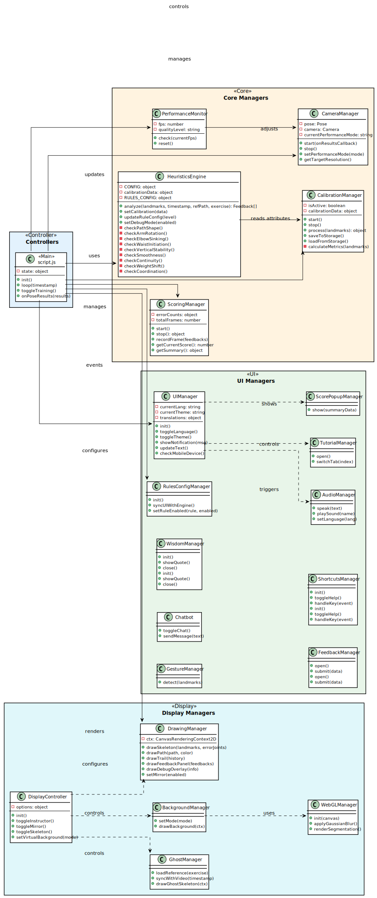
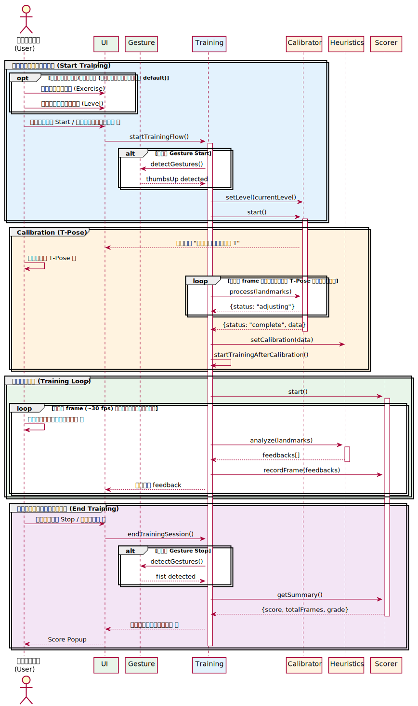
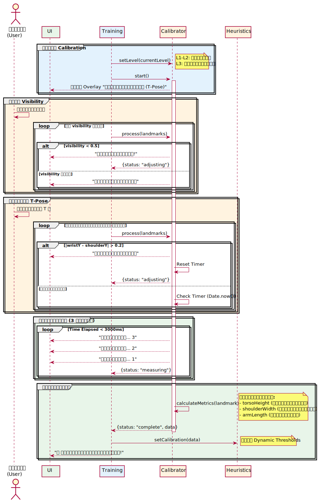
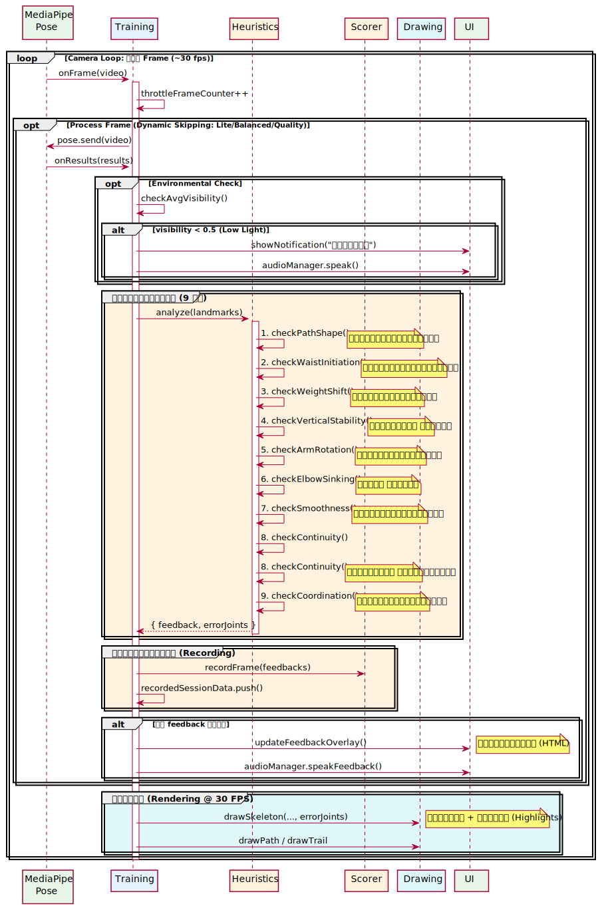
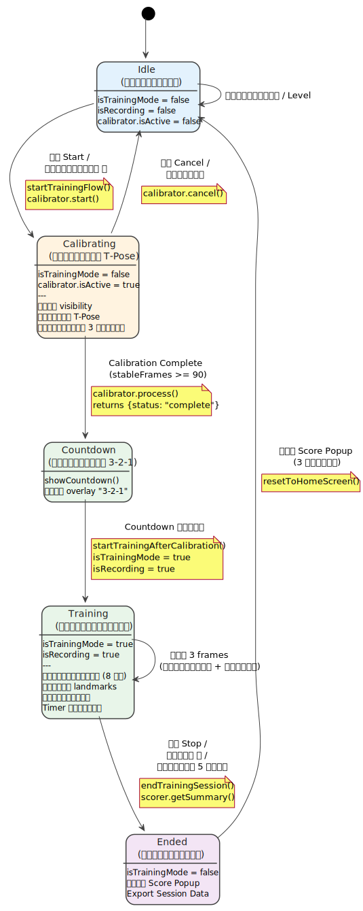
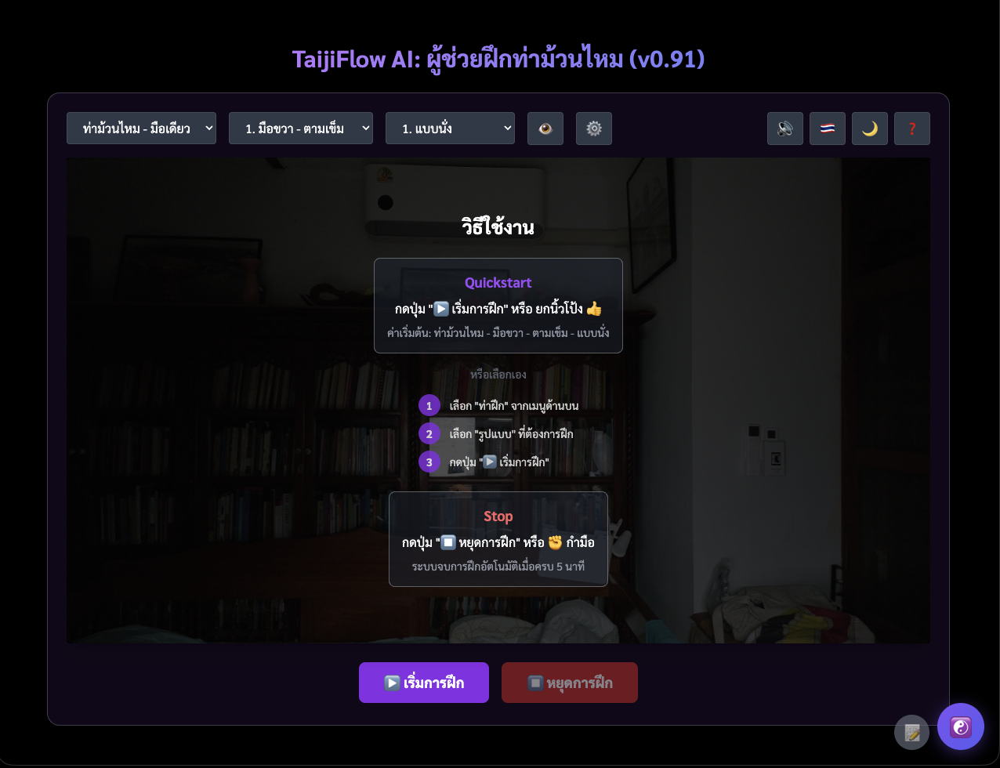
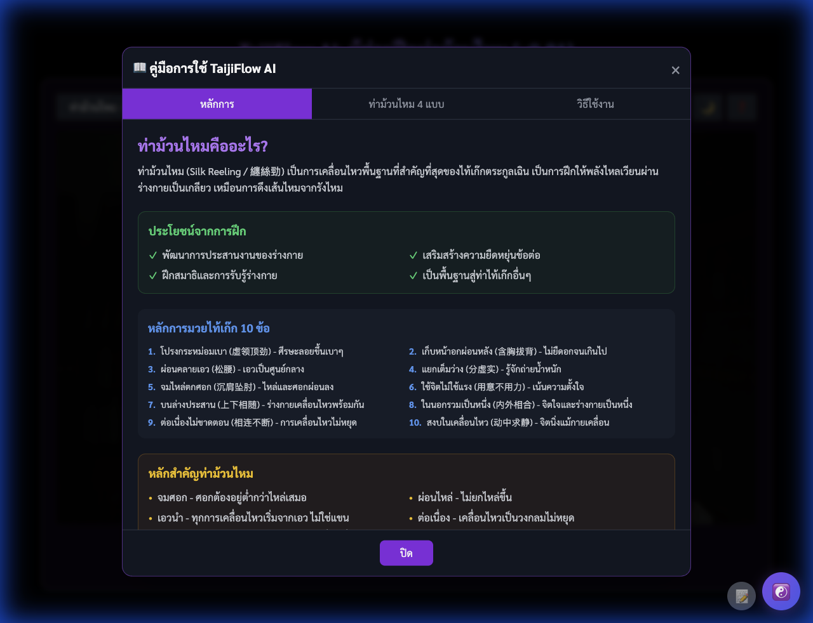
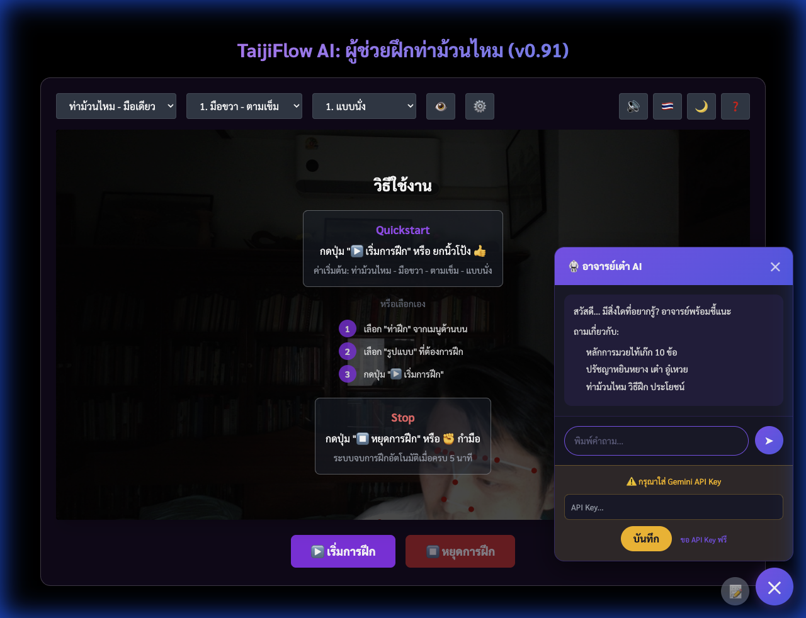

# บทที่ 4: การออกแบบระบบ (System Design)

---

## 4.1 System Architecture

### 4.1.1 Architecture Overview

TaijiFlow AI ใช้สถาปัตยกรรมแบบ **Client-Side Only** ประมวลผลทั้งหมดบนเว็บเบราว์เซอร์ ไม่มี Backend Server

#### ข้อดีของ Client-Side Architecture

| ข้อดี | รายละเอียด |
| :--- | :--- |
| **ไม่มีค่า Server** | ไม่ต้องจ่ายค่า Hosting Backend |
| **Offline Support** | ใช้งานได้หลังโหลด AI Model ครั้งแรก |
| **Privacy** | ข้อมูลไม่ถูกส่งออกนอก |
| **Low Latency** | ไม่มี Network Delay |
| **Easy Deploy** | Static Hosting (GitHub Pages, Netlify) |

#### Structure
- **index.html**: Landing Page & Information
- **app.html**: Main Application (SPA experience)

### 4.1.2 System Architecture Diagram


*รูปที่ 4.1: System Architecture ของ TaijiFlow AI*

```text
┌─────────────────────────────────────────────────────────────────┐
│                     TaijiFlow AI Architecture                    │
├─────────────────────────────────────────────────────────────────┤
│                                                                  │
│  ┌──────────────┐    ┌──────────────┐    ┌──────────────┐       │
│  │   Browser    │    │   Webcam     │    │   Speaker    │       │
│  │   (Chrome)   │    │   (720p+)    │    │   (Audio)    │       │
│  └──────┬───────┘    └──────┬───────┘    └──────▲───────┘       │
│         │                   │                   │                │
│  ┌──────┴───────────────────┴───────────────────┴───────┐       │
│  │                    Web Application                    │       │
│  │  ┌─────────────────────────────────────────────────┐ │       │
│  │  │              Presentation Layer                 │ │       │
│  │  │   [UI Manager] [Drawing Manager] [Chatbot]      │ │       │
│  │  └─────────────────────────────────────────────────┘ │       │
│  │  ┌─────────────────────────────────────────────────┐ │       │
│  │  │             Business Logic Layer                │ │       │
│  │  │  [Heuristics] [Calibration] [Scoring] [Gesture] │ │       │
│  │  └─────────────────────────────────────────────────┘ │       │
│  │  ┌─────────────────────────────────────────────────┐ │       │
│  │  │                 Data Layer                      │ │       │
│  │  │  [Session] [Exporter] [Translations] [Storage]  │ │       │
│  │  └─────────────────────────────────────────────────┘ │       │
│  └───────────────────────┬───────────────────────────────┘       │
│                          │                                       │
│  ┌───────────────────────┴───────────────────────────────┐       │
│  │                   External APIs (CDN)                 │       │
│  │  [MediaPipe Pose] [MediaPipe Gesture] [Gemini API]   │       │
│  └───────────────────────────────────────────────────────┘       │
│                                                                  │
└─────────────────────────────────────────────────────────────────┘
```

### 4.1.3 Layer Architecture (4 Layers)

ระบบใช้สถาปัตยกรรมแบบ 4 Layers:


*รูปที่ 4.2: 4-Layer Architecture*

| Layer | หน้าที่ | Modules | Responsibility |
| :--- | :--- | :--- | :--- |
| **Presentation** | แสดงผล UI | ui_manager, drawing_manager, shortcuts_manager, tutorial_manager, gesture_manager, feedback_manager, score_popup_manager, background_manager, webgl_manager, wisdom_manager | รับ input, แสดงผล Canvas/WebGL, ตอบโต้ผู้ใช้ |
| **Business Logic** | ประมวลผลหลัก | script.js, heuristics_engine, calibration_manager, scoring_manager, rules_config_manager | วิเคราะห์ท่า, คำนวณคะแนน, จัดการกฎ |
| **Data** | จัดการข้อมูล | session_manager, data_exporter, translations | Session, Export, i18n |
| **External APIs** | บริการภายนอก | MediaPipe, Gemini API | Pose Detection, AI Chatbot |

#### หลักการ Loose Coupling
- แต่ละ Layer สื่อสารกับ Layer ที่อยู่ติดกันเท่านั้น
- Presentation ไม่เข้าถึง Data โดยตรง ต้องผ่าน Business Logic

### 4.1.4 Technology Stack

#### Frontend Technologies

| Technology | Version | Purpose |
| :--- | :---: | :--- |
| **HTML5** | 5 | Page Structure, Canvas, Video Elements |
| **CSS3** | 3 | Styling, Theme System, Responsive Design |
| **JavaScript** | ES6+ | Core Logic (22 modules) |
| **TailwindCSS** | 3.x | Utility CSS Framework |
| **Google Fonts** | - | Sarabun Thai Font |

#### AI / Machine Learning

| Technology | Version | Purpose |
| :--- | :---: | :--- |
| **MediaPipe Pose** | @latest | Pose Detection (33 landmarks) |
| **MediaPipe Tasks Vision** | @0.10.8 | Hand Gesture Recognition (👍✊) |
| **Gemini API** | - | AI Chatbot (Optional) |

#### Browser APIs

| API | Purpose |
| :--- | :--- |
| **Canvas API** | วาด Skeleton, Path, Trail, Ghost |
| **WebGL 2.0** | Primitives Rendering, Shaders, Background Blur |
| **Web Speech API** | Text-to-Speech เสียงเตือน |
| **LocalStorage API** | บันทึก Calibration, Settings |
| **Fullscreen API** | โหมดเต็มจอ |
| **getUserMedia** | เข้าถึง Webcam |
| **Fetch API** | โหลด Reference Data |

---

## 4.2 Module Design

### 4.2.1 Module Overview

ระบบประกอบด้วย **32 JavaScript Modules** แบ่งเป็น 6 กลุ่มหลัก (ตามโครงสร้างโฟลเดอร์):


*รูปที่ 4.3: Module Dependencies Diagram*

| Category | Modules | Count | หน้าที่ |
| :--- | :---: | :---: | :--- |
| **Main Controller** | script.js | 1 | ควบคุมการทำงานหลัก (Glue Code) |
| **Core Managers** | Camera, Heuristics, Calibration, Scoring, Performance | 5 | วิเคราะห์ท่า, จัดการ Input/Output หลัก |
| **Display Managers** | Drawing, Ghost, Background, WebGL, SilkAnimation | 5 | วาด Canvas, WebGL, Ghost, Background |
| **UI Managers** | UI, Audio, Chatbot, Tutorial, Score, Gesture, Shortcuts, Debug, Lighting, Wisdom, Feedback, RulesConfig | 12 | จัดการ UI Components ทั้งหมด |
| **Controllers** | Keyboard, Display (Options) | 2 | รับ Input ควบคุมการแสดงผล |
| **Utilities** | Session, Exporter, Path, Translations, Time, Math, I18n | 7 | เครื่องมือคำนวณและจัดการข้อมูล |
| **Total** | | **32** | - |

### 4.2.2 Main Controller

#### 4.2.2.1 Script (Entry Point)

**ไฟล์:** `js/script.js`

**หน้าที่:** เป็น Coordinator ระดับสูงสุด (High-level Coordinator) ทำหน้าที่เชื่อมต่อนำเข้า Modules ต่างๆ และบริหารวัฏจักรของระยย (Application Lifecycle):

1. **Initialization:** สร้าง Instance ของ Manager ทั้งหมดในลำดับที่ถูกต้อง
2. **Loop Management:** ขับเคลื่อน Main Loop (30 FPS) โดยรับเฟรมจาก `CameraManager`
3. **Delegation:** ส่งต่อข้อมูลระหว่าง Core, UI, และ Display layers

```javascript
// Main Application State
let state = {
    isTraining: false,
    isCalibrating: false,
    currentExercise: 'rh_cw',
    level: 'L1'
};

// Key Functions
async function init() {
    // 1. Init Core Systems
    await cameraManager.start();
    await poseDetector.init();
    
    // 2. Bind Events
    uiManager.init();
    keyboardController.init();
    
    // 3. Start Loop
    requestAnimationFrame(loop);
}

function loop(timestamp) {
    // 1. Update Time & Performance
    const deltaTime = timeUtils.update(timestamp);
    performanceMonitor.begin();

    // 2. Logic Update
    if (state.isTraining) {
        heuristicsEngine.update(deltaTime);
    }

    // 3. Render
    drawingManager.render(state);
    
    performanceMonitor.end();
    requestAnimationFrame(loop);
}
```

### 4.2.3 Core Managers

#### 4.2.3.4 CameraManager (v1.1)

**ไฟล์:** `js/camera_manager.js`

**หน้าที่:** จัดการ Video Input, WebRTC, และ Input Resolution Strategy

```javascript
class CameraManager {
    + start(constraints)     // ขอสิทธิ์และเริ่มกล้อง
    + stop()                 // ปิดกล้อง
    + getVideoFrame()        // ดึงเฟรมปัจจุบัน (HTMLVideoElement)
    + getResolution()        // คืนค่าความละเอียดจริง (width, height)
    + flip(isMirrored)       // กลับด้านภาพ (CSS Transform)
}
```

#### 4.2.3.5 PerformanceMonitor (v1.2) - **New**

**ไฟล์:** `js/core/performance_monitor.js`

**หน้าที่:** ตรวจสอบความลื่นไหลของระบบ (FPS) และปรับคุณภาพกราฟิกอัตโนมัติ (Adaptive Quality)

```javascript
class PerformanceMonitor {
    // States
    - fps: number           // Frame Rate ปัจจุบัน
    - qualityLevel: string  // 'high', 'balanced', 'low'
    
    // Methods
    + begin() / end()       // จับเวลาแต่ละเฟรม
    + checkPerformance()    // วิเคราะห์ FPS เฉลี่ยทุก 2 วินาที
    + adaptQuality()        // ลด/เพิ่มภาระงาน AI และ Visuals ตาม FPS
    
    // Adaptive Strategies:
    // FPS < 20 -> Low Quality (Skip AI 2/3 frames, Disable Blur)
    // FPS > 55 -> High Quality
}
```

#### 4.2.3.1 HeuristicsEngine

**ไฟล์:** `js/heuristics_engine.js` (~63 KB)

**หน้าที่:** วิเคราะห์ท่าทางตามหลักไท่จี๋ 9 กฎ โดยเปรียบเทียบ Landmarks ผู้ฝึกกับกฎทางฟิสิกส์และสัดส่วน

```javascript
class HeuristicsEngine {
    // Configuration
    - CONFIG: object           // ค่า Thresholds ความไวในการตรวจจับ
    - calibrationData: object  // ข้อมูลสัดส่วนร่างกายจาก T-Pose
    - RULES_CONFIG: object     // การเปิด/ปิดกฎในแต่ละ Level (L1-L3)
    
    // Public Methods
    + analyze(landmarks): Feedback[]     // วิเคราะห์ท่าทาง (คืนค่าเป็น Array ข้อผิดพลาด)
    + setCalibration(data)               // รับค่า Calibration
    + updateRuleConfig(level)            // อัปเดตกฎตามระดับความยาก
    
    // Private Methods (9 Rules Implementation)
    - checkPathShape()        // R-01: มือหลุดกรอบวงกลม
    - checkArmRotation()      // R-02: การหมุนของแขนท่อนล่าง (Pronation/Supination)
    - checkElbowSinking()     // R-03: ข้อศอกลอย (Elbow Check)
    - checkWaistInitiation()  // R-04: เอวไม่หมุน (Waist Turn)
    - checkVerticalStability()// R-05: ตัวเอียง/โครงสร้างไม่สมดุล
    - checkSmoothness()       // R-06: ความกระตุกของการเคลื่อนไหว
    - checkContinuity()       // R-07: ความเร็วไม่สม่ำเสมอ
    - checkWeightShift()      // R-08: การถ่ายน้ำหนักเท้าซ้าย/ขวา
    - checkCoordination()     // R-09: ความสัมพันธ์มือ-เท้า (Upper-Lower Coordination)
}
```

**9 Heuristic Rules by Level:**

| Rule | ชื่อกฎ | L1 (พื้นฐาน) | L2 (มาตรฐาน) | L3 (ขั้นสูง) |
| :---: | :--- | :---: | :---: | :---: |
| R-01 | Path Shape | ✓ | ✓ | ✓ |
| R-02 | Arm Rotation | | ✓ | ✓ |
| R-03 | Elbow Sinking | ✓ | ✓ | ✓ |
| R-04 | Waist Initiation | | ✓ | ✓ |
| R-05 | Vertical Stability | | | ✓ |
| R-06 | Smoothness | | ✓ | ✓ |
| R-07 | Continuity | ✓ | ✓ | ✓ |
| R-08 | Weight Shift | | | ✓ |
| R-09 | Coordination | | | ✓ |
| **Total** | | **3** | **6** | **9** |

#### 4.2.3.2 CalibrationManager

**ไฟล์:** `js/calibration_manager.js` (~15 KB)

**หน้าที่:** ปรับเทียบสัดส่วนร่างกายผู้ฝึก (Normalization) ด้วยท่า T-Pose

```javascript
class CalibrationManager {
    // State
    - isActive: boolean       // สถานะการ Calibrate
    - frameBuffer: array      // เก็บข้อมูล 30 เฟรมเพื่อนหาค่าเฉลี่ย
    
    // Public Methods
    + start()                 // เริ่มกระบวนการ Calibration
    + stop()                  // หยุดการ Calibration (สำเร็จ)
    + cancel()                // ยกเลิก
    + process(landmarks)      // ประมวลผลแต่ละเฟรม (สะสมค่า)
    + getCalibrationData()    // คำนวณและคืนค่าผลลัพธ์สุดท้าย
    
    // Private Methods
    - checkVisibility(landmarks) // ตรวจสอบว่าเห็นร่างกายครบหรือไม่
    - checkTPose(landmarks)      // ตรวจสอบมุมแขนว่าเป็น T-Pose หรือยัง
    - calculateDimensions()      // คำนวณความยาวแขน, ไหล่, เอว
}
```

**Calibration Data Structure:**

```javascript
calibrationData = {
    armLength: number,      // ความยาวแขน (normalized)
    shoulderWidth: number,  // ความกว้างไหล่
    torsoHeight: number,    // ความสูงลำตัว
    hipWidth: number,       // ความกว้างสะโพก
    level: string,          // L1, L2, L3
    timestamp: number       // เวลาที่ calibrate
}
```

#### 4.2.3.3 ScoringManager

**ไฟล์:** `js/scoring_manager.js` (~11 KB)

**หน้าที่:** คำนวณคะแนนแบบ Real-time และสรุปผลเกรด (A-F)

```javascript
class ScoringManager {
    // State
    - scoreHistory: array      // ประวัติคะแนนรายเฟรม
    - errorCounts: object      // นับจำนวนครั้งที่ทำผิดแต่ละกฎ
    
    // Public Methods
    + start()                  // เริ่มจับเวลาและ Reset คะแนน
    + recordFrame(feedbacks)   // บันทึกผลการวิเคราะห์ในเฟรมปัจจุบัน
    + getSummary()             // สรุปผลคะแนนรวมและเกรด
    
    // Private Methods
    - calculateGrade(score)    // ตัดเกรด (A: >80, B: >70, ...)
    - getTopErrors(n)          // หาข้อผิดพลาดที่พบบ่อยที่สุด N อันดับแรก
}
```

### 4.2.4 Display Managers

#### 4.2.4.1 DrawingManager

**ไฟล์:** `js/drawing_manager.js` (~25 KB)

**หน้าที่:** วาดกราฟิกซ้อนทับวิดีโอ (Overlay) บน HTML5 Canvas

```javascript
class DrawingManager {
    // Public Methods
    + drawSkeleton(landmarks)       // วาดโครงกระดูกผู้ฝึก (เส้นสีขาว/แดงถ้าผิด)
    + drawPath(pathPoints)          // วาดเส้นทางวงกลม (สีม่วง)
    + drawTrail(trailHistory)       // วาดเส้นรอยทางย้อนหลัง (Motion Trail)
    + drawDebugInfo(fps, rules)     // แสดงค่า FPS และสถานะกฎ
    + clear()                       // ล้างหน้าจอ
}
```

#### 4.2.4.2 GhostManager

**ไฟล์:** `js/ghost_manager.js` (~8 KB)

**หน้าที่:** แสดง "เงาครู" (Instructor Overlay) เพื่อนำท่าทาง

```javascript
class GhostManager {
    // Public Methods
    + loadReference(exerciseId)     // โหลดข้อมูล JSON ท่าต้นแบบ
    + syncWithVideo(currentTime)    // ซิงค์ท่าครูกับเวลาของวิดีโอ
    + drawGhost(ctx)                // วาดโครงกระดูกครู (สีทองโปร่งแสง)
}
```

#### 4.2.4.3 BackgroundManager

**ไฟล์:** `js/background_manager.js` (~5 KB)

**หน้าที่:** จัดการพื้นหลัง (Virtual Background) และ Visual Effects

```javascript
class BackgroundManager {
    + setMode(mode)         // none, blur, image, silhouette
    + drawBackground(ctx)   // วาดพื้นหลัง/Mask (ใช้ WebGLManager ถ้าจำเป็น)
    + loadVirtualImage(url) // โหลดรูปภาพพื้นหลัง
}
```

#### 4.2.4.4 WebGLManager

**ไฟล์:** `js/webgl_manager.js` (~8 KB)

**หน้าที่:** จัดการ Low-level Rendering ด้วย WebGL 2.0 เพื่อประสิทธิภาพสูงสุด และทำ Image Processing (Gaussian Blur, Selfie Segmentation)

```javascript
class WebGLManager {
    + init(canvas)          // เตรียม WebGL Context
    + createProgram(vs, fs) // Compile Shaders
    + applyGaussianBlur()   // ใช้ Fragment Shader เบลอภาพ (GPU)
    + drawTexture(image)    // วาดภาพลง Texture
    + renderSegmentation(mask) // **New** วาด Mask ตัดฉากหลัง
}
```

### 4.2.5 UI Managers

จัดการส่วนติดต่อผู้ใช้ (User Interface) และการโต้ตอบทั้งหมด แยกเป็น 8 Module ย่อยเพื่อลดความซับซ้อน

#### 4.2.5.1 UIManager (Main)

**ไฟล์:** `js/ui_manager.js` (~41 KB)

**หน้าที่:** จัดการ UI หลัก, DOM Elements, Theme และระบบแปลภาษา

```javascript
class UIManager {
    // Properties
    - translations: object    // Dictionary ภาษา TH/EN
    
    // Core Methods
    + init()                  // ผูก Event Listeners ทั้งหมด
    + toggleTheme()           // สลับ Light/Dark Mode
    + toggleLanguage()        // สลับภาษา TH/EN
    + updateText()            // อัปเดตข้อความบนหน้าจอตามภาษาที่เลือก
    + showNotification(msg)   // แสดง Toast Notification แบบไม่บล็อกหน้าจอ
    + updateButtons(state)    // เปิด/ปิดปุ่มตามสถานะ (Training/Idle)
}
```

#### 4.2.5.2 AudioManager

**ไฟล์:** `js/audio_manager.js` (~31 KB)

**หน้าที่:** ระบบเสียงพูดแจ้งเตือน (Text-to-Speech) และเสียงเอฟเฟกต์

```javascript
class AudioManager {
    // Core Methods
    + setLanguage(lang)       // ตั้งค่าเสียงภาษาไทย/อังกฤษ
    + speak(message)          // พูดข้อความ (มีระบบ Cooldown ไม่พูดซ้ำถี่เกินไป)
    + speakFeedback(feedbacks)// แปลง Feedback Array เป็นประโยคพูดที่เข้าใจง่าย
    + announce(event)         // พูดตามเหตุการณ์ (เช่น "เริ่มการฝึก", "โพสท่า T-Pose")
}
```

#### 4.2.5.3 TutorialManager

**ไฟล์:** `js/tutorial_manager.js` (~30 KB)

**หน้าที่:** จัดการหน้าต่างคู่มือการใช้งาน (Popup)

```javascript
class TutorialManager {
    + open()                  // เปิดหน้าต่าง Tutorial
    + switchTab(tabName)      // สลับแท็บ (หลักการ / วิธีใช้งาน / ท่าฝึก)
    + renderPrinciples()      // แสดงเนื้อหาหลักการไท่จี๋
    + renderExercises()       // แสดงรายละเอียดท่าฝึก 4 แบบ
}
```

#### 4.2.5.4 ScorePopupManager

**ไฟล์:** `js/score_popup_manager.js` (~7 KB)

**หน้าที่:** แสดงหน้าต่างสรุปผลหลังจบการฝึก

```javascript
class ScorePopupManager {
    + show(summaryData)       // แสดง Popup พร้อมคะแนน, เกรด, และกราฟ
    + _createChart(scores)    // สร้าง Radar Chart แสดงคะแนนแต่ละกฎ
}
```

#### 4.2.5.5 GestureManager

**ไฟล์:** `js/gesture_manager.js` (~14 KB)

**หน้าที่:** ตรวจจับท่ามือเพื่อสั่งงานไร้สัมผัส

```javascript
class GestureManager {
    + detectGestures(video)   // ตรวจจับท่ามือจากภาพวิดีโอ
    + processGesture(name)    // ประมวลผลท่า (Thumps Up = Start, Fist = Stop)
    + showOverlay(icon)       // แสดงไอคอน Feedback บนกลางหน้าจอ
}
```

#### 4.2.5.6 FeedbackManager

**ไฟล์:** `js/feedback_manager.js` (~4 KB)

**หน้าที่:** จัดการระบบรับความคิดเห็นผู้ใช้

```javascript
class FeedbackManager {
    + createButton()          // สร้างปุ่มลอยมุมขวาล่าง
    + showPopup()             // แสดง QR Code ไปยัง Google Forms
}
```

#### 4.2.5.7 Chatbot

**ไฟล์:** `js/chatbot.js` (~26 KB)

**หน้าที่:** ระบบ AI Assistant ตอบคำถามผู้ใช้โดยเชื่อมต่อกับ Google Gemini API

```javascript
class TaijiChatbot {
    + toggleChat()            // เปิด/ปิดหน้าต่างแชท
    + sendMessage(text)       // ส่งข้อความไปหา Gemini API
    + formatMessage(markdown) // แปลง Markdown Response เป็น HTML
}
```

#### 4.2.5.8 RulesConfigManager

**ไฟล์:** `js/rules_config_manager.js` (~13 KB)

**หน้าที่:** จัดการหน้าต่างตั้งค่ากฎ (Rules Settings) ให้ผู้ใช้สามารถเปิด/ปิดกฎแต่ละข้อ และปรับค่า Threshold ได้

```javascript
class RulesConfigManager {
    // Properties
    - defaults: object        // ค่า Default สำหรับ Reset
    - rules: array            // Mapping UI Elements → Engine Config
    
    // Public Methods
    + init()                  // ผูก Event Listeners ทั้งหมด
    + syncUIWithEngine()      // ดึงค่า Config ปัจจุบันมาแสดงบน Checkbox/Input
    + setRuleEnabled(key)     // เปิด/ปิดกฎแต่ละข้อ (บันทึกลง userOverrides)
    + setThreshold(key, val)  // ปรับค่า Threshold
    + resetToDefaults()       // คืนค่าเริ่มต้นตาม Level ที่เลือก
    + onLevelChange(level)    // อัปเดต UI เมื่อเปลี่ยน Level
}
```

#### 4.2.5.9 WisdomManager

**ไฟล์:** `js/wisdom_manager.js` (~5 KB)

**หน้าที่:** สุ่มคำคมปรัชญาเต๋า (Taoist Wisdom) และแสดงผลพร้อม Animation เมื่อโหลดหน้าเว็บหรือหยุดพัก

```javascript
class WisdomManager {
    + show()                  // สุ่มคำคมและแสดง Popup
    + hide()                  // ซ่อน Popup
    + animateSilkReeling()    // เล่น Animation วงกลม Enso (Pure CSS/JS)
}
```

#### 4.2.5.10 ShortcutsManager

**ไฟล์:** `js/ui/shortcuts_manager.js` (~8 KB)

**หน้าที่:** แสดง Popup รายการคีย์ลัดทั้งหมดในรูปแบบ Grid แยกตามหมวดหมู่ (Control, Display, Analysis, Settings)

```javascript
class ShortcutsManager {
    + init()                  // สร้าง DOM Elements (overlay, grid)
    + toggle()                // เปิด/ปิด Popup
    + getShortcutsData()      // คืนค่ารายการคีย์ลัดแยกตามหมวดหมู่
}
```

#### 4.2.5.11 LightingManager (v1.1)

**ไฟล์:** `js/ui/lighting_manager.js`

**หน้าที่:** ตรวจสอบความสว่างของสภาพแวดล้อมเพื่อแจ้งเตือนผู้ใช้หากแสงน้อยเกินไป (ป้องกันการตรวจจับผิดพลาด)

```javascript
class LightingManager {
    - checkInterval: 2000ms
    + start()                 // เริ่ม Loop ตรวจสอบวัดค่า Luma เฉลี่ย
    + checkLighting(frame)    // คำนวณความสว่างจาก Pixel Data
    + showLowLightWarning()   // แสดง Toast เตือน "แสงน้อย"
}
```

#### 4.2.5.12 DebugManager

**ไฟล์:** `js/ui/debug_manager.js`

**หน้าที่:** แสดงข้อมูลเชิงลึกสำหรับนักพัฒนา (FPS Graph, Landmark Confidence, Memory Usage)

```javascript
class DebugManager {
    + toggle()                // เปิด/ปิด Panel
    + update(stats)           // อัปเดตค่า Real-time
    + drawLandmarksOverlay()  // แสดงเลข Index บนจุดต่างๆ
}
```

**Rules Settings UI Structure:**

หน้าต่าง Rules Settings จัดกลุ่มกฎตาม Level เพื่อให้ผู้ใช้เข้าใจได้ง่าย:

```text
┌─────────────────────────────────────────────────────┐
│  ⚙️ Rules Settings                                  │
├─────────────────────────────────────────────────────┤
│  L1: นั่ง (3 กฎ)                    ← สีเขียว       │
│  ☑ 1. Path Shape       [Consistency: 0.6]          │
│  ☑ 3. Elbow Sinking    [Tolerance: 0.01]           │
│  ☑ 7. Continuity       [Threshold: 0.003]          │
├─────────────────────────────────────────────────────┤
│  L2: ยืน (เพิ่มอีก 3 กฎ)            ← สีน้ำเงิน     │
│  ☑ 2. Arm Rotation     [Motion: 0.015]             │
│  ☑ 4. Waist Initiation [Hip Vel: 1.0, Ratio: 2.0]  │
│  ☑ 6. Smoothness       [Threshold: 0.05]           │
├─────────────────────────────────────────────────────┤
│  L3: ยืนย่อ (เพิ่มอีก 3 กฎ)          ← สีม่วง       │
│  ☑ 5. Vertical Stability [Threshold: 0.05]         │
│  ☑ 8. Weight Shift     [Buffer: 0.3]               │
│  ☑ 9. Coordination     [Threshold: 0.4]            │
├─────────────────────────────────────────────────────┤
│  [🔄 Reset to Defaults]                             │
└─────────────────────────────────────────────────────┘
```

**Configurable Parameters:**

| กฎ | Parameter | Default | ช่วง | ความหมาย |
| :---: | :--- | :---: | :--- | :--- |
| 1 | Consistency | 0.6 | 0.3-0.9 | ความสม่ำเสมอของทิศทางหมุน |
| 2 | Motion | 0.015 | 0.005-0.05 | ต้องขยับขึ้น/ลงอย่างน้อยเท่านี้ก่อนเช็คการหมุน |
| 3 | Tolerance | 0.01 | 0.005-0.05 | ความอดทนต่อความสูงศอกที่เกินข้อมือ |
| 4 | Hip Vel | 1.0 | 0.5-10 | ความเร็วสะโพกขั้นต่ำ (°/วินาที) |
| 4 | S/H Ratio | 2.0 | 1-10 | อัตราส่วนไหล่:สะโพก สูงสุด |
| 5 | Threshold | 0.05 | 0.01-0.15 | การขยับศีรษะสูงสุด (% screen) |
| 6 | Threshold | 0.05 | 0.01-0.15 | ความเร่งสูงสุดที่ยอมรับ |
| 7 | Threshold | 0.003 | 0.001-0.01 | ความเร็วขั้นต่ำ (ไม่หยุดนิ่ง) |
| 7 | Window | 2s | 1-5 | ระยะเวลาวิเคราะห์ |
| 8 | Buffer | 0.3 | 0.05-0.5 | ขนาด Safe Zone (% ของความกว้างเท้า) |

**User Override Persistence:**

ระบบใช้ `userOverrides` object เพื่อเก็บการตั้งค่าของผู้ใช้แยกจาก Level defaults:

```javascript
// เมื่อผู้ใช้เปิด/ปิดกฎ
setRuleEnabled(configKey, enabled) {
    this.engine.currentRulesConfig[configKey] = enabled;
    this.engine.userOverrides[configKey] = enabled; // เก็บแยก
}

// เมื่อเปลี่ยน Level: merge userOverrides กับ Level defaults
analyze(..., currentLevel) {
    const levelDefaults = RULES_CONFIG[currentLevel];
    this.currentRulesConfig = { ...levelDefaults, ...this.userOverrides };
}
```

> **หมายเหตุ:** เมื่อกด "Reset to Defaults" ระบบจะ clear `userOverrides` และคืนค่าตาม Level ที่เลือกจาก UI dropdown

### 4.2.6 Controllers

#### 4.2.6.1 KeyboardController

**ไฟล์:** `js/keyboard_controller.js` (~9 KB)

**Keyboard Shortcuts (15 ปุ่ม):**

> **หมายเหตุ:** ใช้ `e.code` แทน `e.key` เพื่อรองรับ Thai Keyboard Layout

**🎮 Control:**

| Key | Action |
| :---: | :--- |
| `Space` | Start/Stop Training |
| `Esc` | Cancel/Close |
| `F` | Toggle Fullscreen |

**👁️ Display Toggle:**

| Option | Default | Description |
| :--- | :---: | :--- |
| Path | ON | เส้นทางวงกลม |
| Skeleton | ON | โครงกระดูกผู้ฝึก |
| Instructor | ON | วิดีโอต้นแบบ (thumbnail) |
| Ghost | OFF | เงาครู Overlay |
| Silhouette | OFF | เงาผู้ฝึก |
| Trail | OFF | รอยทางมือ |
| **Blur Background** | **OFF** | **🆕 เบลอฉากหลัง (Visual Effects)** |

| Key | Action |
| :---: | :--- |
| `O` | Ghost (เงาครู) |
| `I` | Instructor (วิดีโอครู) |
| `P` | Path (เส้นทาง) |
| `K` | Skeleton (โครงกระดูก) |
| `B` | **Blur Background (เบลอฉากหลัง)** |
| `S` | **Side-by-Side (จอแยก)** |
| `M` | **Mirror Mode (กระจก)** |
| `G` | **Grid Overlay (ตาราง)** |
| `R` | Trail (รอยข้อมือ) |
| `E` | Error Highlights (จุดแดง) |

**⚙️ Settings:**

| Key | Action |
| :---: | :--- |
| `M` | Mute/Unmute |
| `L` | Language TH/EN |
| `T` | Theme Dark/Light |
| `D` | Debug Mode |

**❓ Help:**

| Key | Action |
| :---: | :--- |
| `H` | Open Tutorial |
| `?` | Open Tutorial |
| `/` | Show Shortcuts |

### 4.2.7 Utilities

#### 4.2.7.1 Utilities Core

กลุ่มเครื่องมือพื้นฐานเพื่อลดความซ้ำซ้อนของโค้ด:

1.  **TimeUtils (`js/utils/time_utils.js`):** จัดการ Delta Time และ Timestamp เพื่อให้ Animation ลื่นไหลไม่ขึ้นกับ Frame Rate
2.  **MathUtils (`js/utils/math_utils.js`):** ฟังก์ชันคำนวณทางคณิตศาสตร์ (Angle between points, Distance, Normalization)
3.  **I18nManager (`js/utils/i18n_manager.js`):** (มาแทน translations.js เดิม) ระบบจัดการภาษาที่รองรับ Dynamic Loading

#### 4.2.7.2 SessionManager

**ไฟล์:** `js/session_manager.js` (~5 KB)

**หน้าที่:** จัดการ Identity ของ User และ Session

```javascript
// Functions export
getOrCreateUserId()    // สร้าง/ดึง User ID ถาวรจาก LocalStorage
generateSessionId()    // สร้าง Session ID ใหม่ทุกครั้งที่เริ่มฝึก
getPlatformInfo()      // เก็บข้อมูล Browser/Device เพื่อ Analytics
```

#### 4.2.7.3 DataExporter

**ไฟล์:** `js/data_exporter.js` (~8 KB)

**หน้าที่:** ส่งออกข้อมูลการฝึกเพื่อการวิจัย (Research Data Collection)

```javascript
class DataExporter {
    static exportFullSession(data)  // แปลง Session Data เป็น JSON และ Download
    static download(content, name)  // สร้าง Blob และ Trigger Download
}
```

#### 4.2.7.4 PathGenerator

**ไฟล์:** `js/path_generator.js` (~5 KB)

**หน้าที่:** คำนวณเส้นทางวงกลม (Dynamic Path) ตามสัดส่วนร่างกายผู้ฝึก

```javascript
// Functions export
generateDynamicPath(landmarks, exerciseType) {
    // 1. คำนวณ Center Point จากตำแหน่งไหล่และสะโพก
    // 2. คำนวณ Radius จากความยาวแขน
    // 3. สร้าง Array จุด x,y จำนวน 72 จุด (วงกลม)
}
```

### 4.2.8 Landing Page Components

#### 4.2.8.1 Silk Animation

**ไฟล์:** `js/silk-animation.js` (~7 KB)

**หน้าที่:** สร้าง Animation พื้นหลัง "เส้นไหม" (Silk Reeling Effect) ในหน้า Landing Page

```javascript
class SilkReelingAnimation {
    + start() / stop()      // ควบคุม Animation Loop
    + animate()             // วาด Particle เอฟเฟกต์เกลียวม้วน
}
```

---

## 4.3 Class Diagram


### 4.3.1 Class Diagram Overview



*รูปที่ 4.4: Class Diagram ของระบบ TaijiFlow AI*

ระบบประกอบด้วย **30+ Classes** แบ่งเป็น **6 Packages:**

| Package | Classes | Description |
| :--- | :---: | :--- |
| Controllers | 3 | script.js, KeyboardController, DisplayController |
| Core Managers | 5 | HeuristicsEngine, CalibrationManager, ScoringManager, CameraManager, PerformanceMonitor |
| Display Managers | 4 | DrawingManager, GhostManager, BackgroundManager, WebGLManager |
| UI & Feedback | 11 | UIManager, AudioManager, TutorialManager, ScorePopupManager, GestureManager, FeedbackManager, RulesConfigManager, WisdomManager, LightingManager, DebugManager, ShortcutsManager |
| Utilities | 7 | SessionManager, PathGenerator, DataExporter, TimeUtils, MathUtils, I18nManager, etc. |

### 4.3.2 Key Class Relationships

#### Main Controller (script.js)

```mermaid
script.js ──────┬───> HeuristicsEngine
                ├───> CalibrationManager
                ├───> DrawingManager
                ├───> UIManager
                ├───> AudioManager
                ├───> GestureManager
                ├───> KeyboardController
                └───> DisplayController
```

#### Display Controller

```mermaid
DisplayController ──┬───> GhostManager
                    ├───> BackgroundManager
                    │      └──> WebGLManager
                    └───> DisplayController
```

#### Heuristics Engine

```mermaid
HeuristicsEngine <─── CalibrationManager (setCalibration)
HeuristicsEngine ───> ScoringManager (recordFrame)
HeuristicsEngine ───> DrawingManager (highlight violations)
```

---

## 4.4 Sequence Diagrams

### 4.4.1 Training Flow Sequence



*รูปที่ 4.5: Sequence Diagram สำหรับ Training Flow*

#### Participants
- User (ผู้ฝึก)
- UI
- Gesture
- Training (script.js)
- Calibrator
- Heuristics
- Scorer

#### 4 Phases

| Phase | Description | Key Steps |
| :---: | :--- | :--- |
| 1 | Start Training | เลือกท่า → กด Start / 👍 → เริ่ม Calibration |
| 2 | Calibration | ทำ T-Pose → นับ 3 วินาที → บันทึกสัดส่วน |
| 3 | Training Loop | วิเคราะห์ทุก frame → แสดง Feedback → บันทึกคะแนน |
| 4 | End & Result | กด Stop / ✊ → คำนวณคะแนน → แสดง Popup |

### 4.4.2 Calibration Sequence



*รูปที่ 4.6: Sequence Diagram สำหรับ Calibration*

#### Flow

1. User ยืนท่า T-Pose
2. CalibrationManager ตรวจสอบ Visibility
3. ถ้า Visibility < threshold → แจ้ง Error
4. ถ้า T-Pose ไม่ถูกต้อง → แจ้งให้ปรับท่า
5. นับ 3 วินาที (stable frames)
6. คำนวณ armLength, shoulderWidth, torsoHeight
7. บันทึกลง LocalStorage
8. ส่ง calibrationData ไป HeuristicsEngine

### 4.4.3 Realtime Analysis Sequence



*รูปที่ 4.7: Sequence Diagram สำหรับ Realtime Heuristics Analysis*

#### Flow (Decoupled Frame Rates)

1. **System Loop (30 FPS):** MediaPipe รับภาพจากกล้องทุกเฟรมเพื่อแสดงผล (Skeleton Rendering)
2. **Throttling Check:** ตรวจสอบว่าเป็นเฟรมที่กำหนดให้ประมวลผลหรือไม่ (Dynamic Skipping based on Performance Mode: Lite=4, Balanced=3, Quality=2)
3. **AI Analysis Loop (variable FPS):**
    - ส่งภาพไปประมวลผล AI
    - HeuristicsEngine เรียก 8 checkMethods
    - รวบรวม Feedbacks
4. **Update State:**
    - ScoringManager (recordFrame)
    - DrawingManager (highlight)
    - AudioManager (TTS)

> **Note on Optimization:** เพื่อประสิทธิภาพสูงสุด ระบบใช้ **Performance Mode** (Lite/Balanced/Quality) ในการปรับ Frame Skipping Rate ให้เหมาะสมกับอุปกรณ์ แยก Camera Loop (30 FPS) ออกจาก AI Loop (5-10 FPS) ทำให้ UI ลื่นไหลและเครื่องไม่ร้อนเกินไป

---

## 4.5 State Diagram

### 4.5.1 Training Session States



*รูปที่ 4.8: State Diagram สำหรับ Training Session*

#### 8 States

| State | Description | Variables |
| :--- | :--- | :--- |
| **PrivacyModal** | แสดง Privacy + Warning Modal | รอผู้ใช้กด "เข้าใจแล้ว" |
| **MobileCheck** | ตรวจสอบอุปกรณ์ | isMobilePhone()? |
| **MobileWarning** | เตือนผู้ใช้มือถือ | เลือก "กลับ" หรือ "ดำเนินการต่อ" |
| **Idle** | หน้าจอหลัก รอการเริ่มฝึก | isTrainingMode=false, Camera Active |
| **Calibrating** | กำลัง Calibrate T-Pose | calibrator.isActive=true |
| **Countdown** | นับถอยหลัง 3-2-1 | showCountdown() |
| **Training** | กำลังฝึกและวิเคราะห์ท่า | isTrainingMode=true, isRecording=true |
| **Ended** | แสดงผลคะแนน | Score Popup visible |

#### Transitions

| From | To | Trigger |
| :--- | :--- | :--- |
| **[*]** | PrivacyModal | เปิด app.html |
| PrivacyModal | MobileCheck | กด "เข้าใจแล้ว" + initCamera() |
| MobileCheck | MobileWarning | [isMobilePhone = true] |
| MobileCheck | Idle | [isMobilePhone = false] + Camera Ready |
| MobileWarning | Idle | กด "ดำเนินการต่อ →" |
| MobileWarning | **[*]** | กด "← กลับหน้าหลัก" (redirect) |

| Idle | Calibrating | กด Start / ยก 👍 |
| Calibrating | Countdown | Calibration Complete |
| Calibrating | Idle | กด Cancel / Timeout |
| Countdown | Training | Countdown เสร็จ |
| Training | Ended | กด Stop / ✊ / หมดเวลา |
| Ended | Idle | ปิด Popup (3 วินาที) |

---

## 4.6 UI Design

ระบบออกแบบ User Interface (UI) โดยเน้นความเรียบง่ายและใช้งานง่าย (User-Friendly) แบ่งออกเป็น 4 ส่วนหลักดังนี้:

### 4.6.1 Landing Page Design (หน้าแรก)


*รูปที่ 4.x: หน้าจอ Landing Page พร้อมเมนูเริ่มต้นและ Animation*

### 4.6.2 Main Application Layout (หน้าจอฝึก)



*รูปที่ 4.x: หน้าจอหลักขณะทำการฝึก (Main Training Interface)*

### 4.6.3 Score Summary Design (หน้าสรุปผล)


*รูปที่ 4.x: หน้าต่างสรุปผลคะแนน (Score Summary Popup)*

### 4.6.4 Support & Features (หน้าจออื่นๆ)

| Feature | Screenshot | คำอธิบาย |
| :--- | :--- | :--- |
| **Tutorial** |  | คู่มือการใช้งานและคำแนะนำเบื้องต้น |
| **Chatbot** |  | หน้าต่างสนทนากับ AI (Gemini) |
| **Feedback** |  | ช่องทางแจ้งปัญหา/ข้อเสนอแนะ |

### 4.6.5 Privacy & Warning Modal (v0.9.9)

Modal ที่แสดงเมื่อเข้าสู่หน้า app.html เพื่อแจ้งข้อมูลความเป็นส่วนตัวและคำเตือนก่อนใช้งาน

**ส่วนประกอบ:**

| Section | เนื้อหา |
| :--- | :--- |
| 🔒 **Privacy** | 1. ประมวลผลในเครื่อง 2. ไม่ส่งข้อมูลออก 3. Gemini API (optional) |
| ⚠️ **Warning** | 1. ข้อจำกัด (ไม่ใช่ครูจริง) 2. สุขภาพ 3. Disclaimer |

**ปุ่ม:** "เข้าใจแล้ว, เริ่มใช้งาน" → เปิดกล้องหลังกดยินยอม (Privacy-Gated Camera)

### 4.6.6 Mobile Warning Modal (v0.9.9)

Modal ที่แสดงเมื่อตรวจพบว่าผู้ใช้เข้าจากมือถือ (Mobile Phone) เพื่อแจ้งเตือนข้อจำกัดการใช้งาน

**เงื่อนไขการแสดง:**
- User Agent มีคำว่า "iPhone", "Android" และไม่ใช่ "iPad", "Tablet"
- Screen Width < 768px

**ปุ่ม:**
- "← กลับหน้าหลัก" → redirect ไป index.html
- "ดำเนินการต่อ →" → ใช้งานต่อ (รับความเสี่ยง)

### 4.6.7 Theme System

ระบบรองรับการแสดงผล 2 ธีม (Light/Dark) โดยมีการกำหนดชุดสี (Color Palette) ดังนี้:

| Theme | Background | Text | Accent |
| :--- | :--- | :--- | :--- |
| Light (☀️) | `#f8fafc` | `#1e293b` | `#a855f7` |
| Dark (🌙) | `#000000` | `#ffffff` | `#a855f7` |

#### Theme Toggle Implementation (CSS Variables)

```css
:root {
    /* Default (Light) */
    --color-bg-primary: #f8fafc;
    --color-text-primary: #1e293b;
    --color-accent: #a855f7;
}

body.dark {
    /* Dark Mode Override */
    --color-bg-primary: #000000;
    --color-text-primary: #ffffff;
}
```

---

## 4.7 Data Design

### 4.7.1 Data Flow


```text
┌─────────┐    ┌──────────────┐    ┌─────────────────┐
│ Webcam  │───▶│ MediaPipe    │───▶│ 33 Landmarks    │
└─────────┘    │ Pose         │    │ (x, y, z, vis)  │
               └──────────────┘    └────────┬────────┘
                                            │
                    ┌───────────────────────┴──────────────────┐
                    ▼                                          ▼
            ┌───────────────┐                          ┌───────────────┐
            │ Calibration   │                          │  Heuristics   │
            │ Manager       │                          │  Engine       │
            └───────┬───────┘                          └───────┬───────┘
                    │                                          │
                    ▼                                          ▼
            ┌───────────────┐                          ┌───────────────┐
            │ calibration   │                          │ feedbacks[]   │
            │ Data          │                          │               │
            └───────────────┘                          └───────┬───────┘
                                                               │
                                   ┌───────────────────────────┴───────┐
                                   ▼                                   ▼
                           ┌───────────────┐                   ┌───────────────┐
                           │ Scoring       │                   │ UI Manager    │
                           │ Manager       │                   │ (Display)     │
                           └───────────────┘                   └───────────────┘
```

### 4.7.2 Data Structures

#### 4.7.2.1 Pose Landmark

```javascript
landmark = {
    x: number,          // 0.0 - 1.0 (normalized)
    y: number,          // 0.0 - 1.0 (normalized)
    z: number,          // ความลึก (ค่าลบ = ใกล้กล้อง)
    visibility: number  // 0.0 - 1.0 (confidence)
}
```

#### 4.7.2.2 33 Landmark Points

ตำแหน่งจุดต่างๆ บนร่างกายอ้างอิงตามมาตรฐาน Google MediaPipe Pose:


*รูปที่ 4.x: แผนภาพแสดงตำแหน่ง 33 Landmarks (ที่มา: MediaPipe)*

| Index | Name | Index | Name |
| :---: | :--- | :---: | :--- |
| 0 | nose | 16 | right_wrist |
| 11 | left_shoulder | 17 | right_pinky |
| 12 | right_shoulder | 18 | left_index |
| 13 | left_elbow | 19 | right_index |
| 14 | right_elbow | 20 | left_thumb |
| 15 | left_wrist | 21 | right_thumb |
| 23 | left_hip | 27 | left_ankle |
| 24 | right_hip | 28 | right_ankle |

#### 4.7.2.3 Feedback Object

```javascript
feedback = {
    rule: string,       // "R-01" to "R-08"
    type: string,       // "error" | "warning" | "info"
    severity: number,   // 1-3
    message: string,    // ข้อความภาษาไทย
    messageEn: string,  // ข้อความภาษาอังกฤษ
    landmark: number,   // Index ของ landmark ที่ผิด
    value: number       // ค่าที่วัดได้ (for debugging)
}
```

### 4.7.3 Storage Design

#### 4.7.3.1 LocalStorage Keys

| Key | Type | Content |
| :--- | :--- | :--- |
| `taijiflow_theme` | string | `"light"` / `"dark"` |
| `taijiflow_lang` | string | `"th"` / `"en"` |
| `taijiflow_audio` | boolean | Audio enabled |
| `taijiflow_calibration` | object | Calibration data |
| `taijiflow_gesture` | boolean | Gesture control enabled |
| `geminiApiKey` | string | Gemini API Key |

#### 4.7.3.2 Reference Data Files

```text
data/
├── rh_cw_L1.json          # Ghost Landmarks (Right Hand CW Level 1)
├── rh_cw_L1.webm          # Instructor Video
├── rh_cw_L1_silhouette.webm  # Silhouette Video
├── rh_cw_L2.json
├── rh_cw_L2.webm
└── ...
```

**JSON Format:**

```javascript
{
    "exercise": "rh_cw",
    "level": "L1",
    "fps": 30,
    "frames": [
        {
            "timestamp": 0,
            "landmarks": [ /* 33 landmarks */ ]
        },
        // ...
    ]
}
```

### 4.7.4 Data Export Module

ระบบได้ออกแบบโครงสร้างข้อมูล (Schema) สำหรับการ Export Session Data เพื่อนำไปใช้ต่อยอดในงานวิจัย Machine Learning (Phase 3) ดังนี้:

**Export Flow:**
1.  **Collection:** บันทึกข้อมูล Raw Landmarks และ Metadata ทุกเฟรมลงใน Memory Buffer
2.  **Aggregation:** เมื่อจบ Session ระบบจะรวบรวมข้อมูลสรุป (Summary) และค่า Calibration
3.  **Serialization:** แปลงข้อมูลเป็น JSON Format ที่มีโครงสร้างมาตรฐาน
4.  **Distribution:** ให้ผู้ใช้ Download เป็นไฟล์ `.json`

**Data Privacy:**
ข้อมูลทั้งหมดถูกประมวลผลและสร้างไฟล์ที่ฝั่ง Client-Side (Browser) ไม่มีการส่งข้อมูลขึ้น Server ภายนอก

> **รายละเอียด:** ดูโครงสร้างข้อมูลทางเทคนิคทั้งหมดได้ใน **[Appendix D: Technical Data Specifications](appendix_d_data_specs.md)**

---

## 4.8 Design Patterns

### 4.8.1 Patterns Used

| Pattern | Where Used | Purpose |
| :--- | :--- | :--- |
| **Module Pattern** | ทุก Manager classes | Encapsulation - แยก scope |
| **Singleton** | `ghostManager`, `uiManager` | Single Instance - ป้องกันสร้างซ้ำ |
| **Observer** | Event Listeners | Reactive UI - อัปเดตเมื่อ state เปลี่ยน |
| **Facade** | `script.js` | Simplify Access - รวม dependencies |
| **Strategy** | `HeuristicsEngine` rules | Swappable Algorithms - เปิด/ปิดกฎได้ |
| **Controller** | `KeyboardController`, `DisplayController` | Separation of Concerns |

### 4.8.2 Pattern Examples

**Singleton Pattern:**

```javascript
const ghostManager = new GhostManager();
window.ghostManager = ghostManager;  // Global access
```

**Observer Pattern:**

```javascript
document.addEventListener('languageChange', () => {
    uiManager.updateAllTexts();
    audioManager.setLanguage(lang);
});
```

**Strategy Pattern:**

```javascript
this.RULES_CONFIG = {
    L1: { checkPath: true, checkElbow: true, checkContinuity: true },
    L2: { ...L1, checkRotation: true, checkSmoothness: true },
    L3: { all 9 rules enabled }
};
```

---

*Document updated: 2026-01-26 (v1.2.0)*
